# Haikuverse 🦖

---
## 1. Introduction

Haikuverse is a Flutter application designed as a rich, multi-sensory platform for creative expression. It empowers users to generate evocative haiku poems with **Google Gemini**, complement them with compelling imagery from Google Cloud's **Imagen 3**, and create dynamic, human-like audio narrations using Google Cloud's premium Chirp3 HD **Text-to-Speech** voices. These creations are shared within an interactive "Haikuverse," a community space where users can follow their favorite poets, earn achievements, and express their identity through deeply personalized avatars featuring unique, procedurally generated animated frames. Connections are managed in the **Poet Network**, a dedicated hub where users can view their followers and find friends via a privacy-first nickname search. To extend this creative ecosystem, a dedicated **Sharing Tab** allows users to export their work as beautifully formatted **'haiku cards,'** providing a simple way to bring the app's positive energy to friends and family. This is complemented by a powerful in-app sharing feature that allows poets to send entire constellations to their followers, fostering viral discovery and community engagement based on a pure-merit system of curation. This entire experience is grounded in a philosophy of non-toxic social interaction by design.

The application is built on a robust and scalable cloud architecture. Secure user management is handled by **Firebase Authentication**, reinforced by **Firebase App Check** to ensure requests originate from authentic app instances using Play Integrity on Android and reCAPTCHA Enterprise on the web. This is further strengthened by a full suite of account management tools, including secure password changes and a comprehensive, irreversible account deletion process. User profiles, creative works, and community data are managed through a sophisticated data model that strategically segregates private (`/users`) and public (`/public_profiles`) information within **Cloud Firestore**. All media assets are managed securely in **Firebase Storage**. A powerful serverless backend, architected with Google **Cloud Functions**, orchestrates all critical operations, from secure AI interactions and content safety checks to **Google Play Store** subscription and full data lifecycle management.

What distinguishes Haikuverse are its advanced discovery and visualization features. A cornerstone of the user experience is a client-side **procedural generation system** that uses a heuristic algorithm to construct unique 2D vector art "constellation" graphs, offering a novel way to navigate the Haikuverse. On the backend, **Vertex AI Vector Search** powers a sophisticated semantic discovery engine. This engine not only provides intelligent recommendations but also builds and maintains a dynamic **Knowledge Graph** of thematically linked constellations, a system made resilient by a suite of on-demand and scheduled maintenance functions that automatically prune dead links and heal orphaned nodes to ensure persistent data integrity across the entire Haikuverse. A scheduled **Zeitgeist Engine** analyzes community activity to highlight trending themes, allowing users to explore the Haikuverse through meaningful connections that go far beyond simple keyword searching.

This document offers a comprehensive technical deep-dive into Haikuverse's architecture. It details the core components—from the client-side procedural graph generation logic and state management strategies to the intricate backend Cloud Function orchestrations and advanced AI service integrations—elucidating data flow patterns, multi-layered security models, and providing a clear guide for setup and configuration. Its aim is to provide a thorough understanding of the application's design, innovative features, and the engineering principles that bring this creative social experience platform to life.

### Key Features:

* **Designed for Humans:** Haikuverse is architected as a cohesive creative experience designed to elevate human dignity, democratize access to powerful AI, and unleash creativity. The application serves as a dynamic partner in creative exploration, augmenting human artistry rather than replacing it. From the intuitive interface to the creator-centric controls, the entire experience is crafted to foster a rewarding community and maximize the inherent human delight in discovery and self-expression.

* **Co-Create Techno-Poetic Art:** Guide powerful AI partners (**Gemini**, **Imagen 3**, and **Text-to-Speech**) to transform your creative spark into multi-sensory experiences. Move beyond simple generation to augment your artistry, weaving evocative haiku, stunning visuals, and dynamic audio narrations into a unified whole.

* **Forge Your Unique Poet's Identity:** This is your stage. Define your public persona by curating and publishing your finest multi-sensory experiences, then share them with the world as beautiful 'haiku cards' designed to foster connection and well-being. Personalize your avatar with a selection of animated frames, and showcase unique flair unlocked by your creative achievements. Grow your social circle within the Poet Network hub, where you can manage your followers, follow inspirational poets, and find friends by user nickname. Become a celebrated voice within the Haikuverse.

* **Cultivate Your Creative Sanctuary:** Haikuverse is a collection of creative sanctuaries. Its powerful anti-toxicity tools proactively screen public content using Google Gemini's powerful safety filters, empowering poets to cultivate respectful conversations and foster genuine connection by design.

* **Explore a Living Universe of Poetry:** Navigate a unique, procedurally generated vector-art cosmos where every star is a poem waiting to be discovered. This is not a static gallery; it's an emergent universe that responds to you. Watch as stars visually evolve with community appreciation, gaining vibrancy and unique coronas that reflect their shared impact.

* **Uncover a Deeper Web of Meaning:** Journey beyond simple keyword searches with a semantic discovery engine powered by **Vertex AI Vector Search**. This system doesn't just find content; it reveals the invisible, thematic threads that connect poems and fables, building a dynamic knowledge graph that invites you to get lost in a universe of interconnected ideas.

* **Tap into the Collective Consciousness:** Discover what inspires the community through the `Zeitgeist Engine`. This unique feature analyzes creative activity across the platform to reveal trending themes, offering a real-time glimpse into the evolving pulse of the Haikuverse and providing new avenues for your own creative exploration.

* **Champion Community Discovery:** Your identity is defined not just by what you create, but by what you discover. Build your reputation as a trusted curator by sharing any constellation you find inspiring directly with your followers inside the app. This pure merit-based discovery system empowers you to become a celebrated tastemaker, helping your community find hidden gems while building your own following based on your unique perspective.

* **Empowerment Through Full Data Sovereignty:** Haikuverse puts you in complete control of your digital identity. The application provides a full suite of account management tools, including secure in-app password changes and a comprehensive, irreversible account deletion process. This isn't just a simple database entry removal; it's a robust, cascading operation that permanently erases every trace of a user's presence—from authentication records and profile data to every published star, comment, and stored media file—ensuring true data permanence and the ultimate right to be forgotten.

* **Accessible & Fair for All Creators:** The application is supported by a transparent and ethical subscription model managed through the **Google Play Store**. With distinct tiers designed for both casual poets and dedicated creators, plus flexible, non-expiring Quota Boosts, you can choose the level of access that fits your creative practice. An ethical spending cap of $250 per month ensures a responsible and human-centric experience for everyone.

* **Democratized Moderation:** Community safety is a shared responsibility. Every user has private, non-retaliatory channels to report abuse or provide direct feedback, creating a secure audit trail for administrative review without fear of reprisal.

* **Secure & Resilient Without Compromise:** The application is built on a scalable serverless backend using **Google Cloud Functions** and **Firestore**. Security is paramount, enforced through **Firebase App Check** attestation, a data model that strictly segregates private and public user data, and a full suite of account management tools. The system even includes self-healing maintenance functions for its `Knowledge Graph`, designed for long-term data integrity and resilience.

---
## 2. Functional Block Diagram of the Haikuverse App

```mermaid
---
config:
  layout: elk
  elk:
    nodePlacementStrategy: NETWORK_SIMPLEX
  theme: base
  themeVariables:
    lineColor: '#555'
    textColor: '#333'
---
flowchart LR
 subgraph AppShell["AppShell (Main UI)"]
    direction LR
        Listeners["Auth & Data Listeners"]
        CoreLogic["Core Favorite/Asset Mgmt"]
  end
 subgraph main_dart["**main.dart**"]
    direction TB
        Main["main - App Entry Point"]
        Initialization["Initialization & DI"]
        GlobalProviders["Global State Providers<br>(incl. NavigationIntentProvider)"]
        AuthWrapper["AuthWrapper<br>(Initial Route Logic)"]
  end
 subgraph HomeScreenDef["HomeScreen"]
        HaikuGenUI["Haiku Generation UI & Logic"]
        StarNamingUI["Star Naming UI & Logic"]
  end
 subgraph FavoritesScreenDef["FavoritesScreen"]
        FavoritesListUI["Favorites List & Audio UI"]
  end
 subgraph StarsScreenDef["StarsScreen"]
        ImagePairingUI["Image Pairing UI & Logic"]
        ReorderUI["Reorder Slideshow UI"]
        ImageSlotsUI["Image Save Slots UI"]
  end
 subgraph ConstellationsScreenDef["Constellations Hub"]
        PublishTab["Publish Tab"]
        ManageTab["Manage Tab"]
        ExploreTab["Explore Tab"]
  end
 subgraph SettingsTab["SettingsTab"]
        ProfileUI["Profile Fields<br>&amp; Image Picker"]
        PoetNetworkLink["Poet Network Link"]
        ThemeUI["Theme Carousel"]
        UserActions["Save/SignOut Actions"]
  end
 subgraph CustomizationTabDef["CustomizationTab"]
        AvatarStudio["AvatarStudio (Frame/Flair)"]
        AchievementGallery["AchievementGallery"]
  end
 subgraph SharingTab["SharingTab"]
        ShareSheet["OS Share Sheet"]
  end
 subgraph PreferencesScreenDef["PreferencesScreen"]
    direction TB
        SettingsTab
        CustomizationTabDef
        SharingTab
  end
 subgraph PoetNetworkScreenDef["Poet Network"]
    direction TB
        FollowersTabNode["Followers Tab"]
        FollowingTabNode["Following Tab"]
        FindFriendTabNode["Find Friends Tab"]
  end
 subgraph FeedbackNotificationsScreens["Feedback & Notifications"]
     direction TB
        FeedbackScreen["FeedbackScreen"]
        NotificationsScreen["NotificationsScreen"]
  end
 subgraph MonetizationScreens["Subscription &amp;<br>Quota Management"]
    direction TB
        SubscriptionScreen["SubscriptionScreen"]
        QuotaBoostScreen["QuotaBoostScreen"]
  end
 subgraph AuthVerificationScreens["Auth & Verification Screens"]
        AuthScreen["AuthScreen UI & Logic"]
        EulaScreen["EULA Acceptance Screen"]
        VerificationScreen["VerificationScreen<br>UI &amp; Logic"]
        GoogleSignInLogic["Google Sign-In (Plugin & GSI)"]
  end
 subgraph AccountMgmtScreenDef["Account Management"]
    direction TB
        AccountManagementScreen["AccountManagementScreen"]
        LegalScreens["EULA & Policy Links"]
  end
 subgraph Haikuverse["Haikuverse Experience"]
    direction TB
        HaikuverseNavigationScreen["HaikuverseNavigationScreen"]
        StarDetailPopup["StarDetailPopup"]
        ProceduralGraph["Procedural Graph Generation"]
        VectorArtPainter["Vector Art Painter"]
        ExperienceTab["Haiku Tab (Slideshow/Audio)"]
        LogbookTab["Logbook Tab (Comments)"]
        PoetTab["Poet Tab (Follow/Achievements)"]
        FableDetailPopup["FableDetailPopup"]
        FollowerShareModal["FollowerShareModal"]
  end
 subgraph UIScreens["**UI Screens**"]
    direction TB
        HomeScreenDef
        FavoritesScreenDef
        StarsScreenDef
        ConstellationsScreenDef
        PreferencesScreenDef
        PoetNetworkScreenDef
        MonetizationScreens
        AuthVerificationScreens
        Haikuverse
        FeedbackNotificationsScreens
        AccountMgmtScreenDef
        AppShell
  end
 subgraph AuthServiceFlutter["Auth & Verification Services"]
        SignInMethod["signInWith..."]
        CreateUserMethod["createUserWith..."]
        SignInWithCredentialMethod["signInWithCredential"]
        SignOutMethod["signOut"]
        SendPasswordResetMethod["sendPasswordReset..."]
        SendVerificationMethod["sendVerificationEmail"]
  end
 subgraph FirestoreServiceFlutter["FirestoreService"]
        FSCore["Core Firestore Methods"]
        FSFunctions["Cloud Function Triggers"]
  end
 subgraph GeminiServiceFlutter["GeminiService"]
        GSGenHaiku["generateHaiku"]
        GSGenNames["generateStarNames"]
        GSGenFable["generateFable"]
        GSGetAdvice["getTravelAdvice"]
  end
 subgraph VertexAIServiceFlutter["VertexAIService (Imagen)"]
        VAISGenImgs["generateImages"]
  end
 subgraph StorageServiceFlutter["StorageService"]
        SSUpload["uploadImageData"]
        SSDelete["deleteFileByUrl"]
  end
 subgraph ClientServices["**Client-Side Services**"]
    direction TB
        AuthServiceFlutter
        FirestoreServiceFlutter
        GeminiServiceFlutter
        VertexAIServiceFlutter
        StorageServiceFlutter
  end
 subgraph FirebaseServices["Firebase Services"]
        FirebaseAuthBackend[("Firebase<br>Authentication")]
        FirestoreDatabaseBackend[("Cloud<br>Firestore")]
        FirebaseStorageBackend[("Cloud<br>Storage")]
        FirebaseAppCheck[("Firebase<br>App Check")]
  end
 subgraph CloudFunctionsBackend["Google Cloud Functions"]
    direction TB
        ContentGenFuncs["Content Generation"]
        PublishingFuncs["Publishing & Lifecycle"]
        SanitizationFuncs["Sanitization"]
        SocialFuncs["Social & Moderation"]
        FeedbackFuncs["Feedback & Admin"]
        ZeitgeistFuncs["Zeitgeist Engine"]
        GraphHealer["KG Maintenance<br>(Scheduled & On-Demand)"]
        DBTriggers["Database Triggers"]
        MonetizationFuncs["Subscription & Quota Mgmt"]
        AccountMgmtFuncs["Account & Data Lifecycle"]
  end
 subgraph CloudAPIs["External Cloud APIs"]
    direction TB
        GeminiAPI[("Gemini API")]
        ImagenAPI[("Imagen API")]
        EmbeddingAPI[("Embedding API")]
        VectorSearchAPI[("Vector Search API")]
        TextToSpeechAPI[("Text-to-Speech API")]
        GooglePlayAPI[("Google Play<br>Developer API")]
  end
 subgraph Backend["**Backend & External Services**"]
    direction TB
        FirebaseServices
        CloudFunctionsBackend
        CloudAPIs
  end

    HaikuverseNavigationScreen --> ProceduralGraph & VectorArtPainter
    StarDetailPopup --> ExperienceTab & LogbookTab & PoetTab
    HaikuverseNavigationScreen -- Shows Fable --> FableDetailPopup
    UIScreens -- Initiates actions through --> ClientServices
    ClientServices -- Orchestrates calls to --> Backend
    Main --> Initialization & GlobalProviders & AuthWrapper
    Initialization <--> FirebaseAppCheck
    AuthWrapper --> AppShell
    AuthWrapper -- Routes to --> AuthScreen
    AppShell -- Uses state from --> GlobalProviders
    Listeners -- Updates --> CoreLogic
    AuthScreen --> VerificationScreen & EulaScreen
    VerificationScreen --> EulaScreen
    EulaScreen --> SubscriptionScreen
    SubscriptionScreen --> HomeScreenDef
    AuthVerificationScreens <-- Authenticates via --> AuthServiceFlutter
    AuthScreen <--> GoogleSignInLogic
    GlobalProviders -- Provides state to --> AppShell
    CoreLogic -- Provides callbacks to --> HomeScreenDef & FavoritesScreenDef & StarsScreenDef & ConstellationsScreenDef
    CoreLogic -- Triggers asset management via --> FirestoreServiceFlutter & StorageServiceFlutter
    HomeScreenDef <-- Generates content via --> GeminiServiceFlutter
    FavoritesScreenDef -- Plays audio via --> GlobalProviders
    StarsScreenDef <-- Generates images via --> VertexAIServiceFlutter
    StarsScreenDef <-- Saves images via --> StorageServiceFlutter
    ImagePairingUI -- Launches --> ReorderUI & ImageSlotsUI
    ConstellationsScreenDef <-- Manages & Explores via --> FirestoreServiceFlutter
    ExploreTab <--> Haikuverse
    ExploreTab <-- Gets advice via --> GeminiServiceFlutter
    HaikuverseNavigationScreen <-- Fetches data from --> FirestoreServiceFlutter
    HaikuverseNavigationScreen -- Shows popup --> StarDetailPopup & FableDetailPopup
    ProceduralGraph -- Provides data to --> VectorArtPainter
    StarDetailPopup <-- Manages social actions via --> FirestoreServiceFlutter
    SettingsTab <-- Manages profile via --> FirestoreServiceFlutter
    SettingsTab <-- Sanitizes content via --> SanitizationFuncs
    SettingsTab <-- Signs out via --> AuthServiceFlutter
    SettingsTab -- Navigates to --> FeedbackNotificationsScreens & AccountMgmtScreenDef
    PoetNetworkLink -- Navigates to --> PoetNetworkScreenDef
    AccountManagementScreen -- Manages password via --> AuthServiceFlutter
    CustomizationTabDef <-- Manages customizations via --> FirestoreServiceFlutter
    PoetNetworkScreenDef -- Fetches social data via --> FirestoreServiceFlutter
    SharingTab -- Loads assets via --> StorageServiceFlutter & FirestoreServiceFlutter
    MonetizationScreens -- Manages purchases via --> FirestoreServiceFlutter
    StarsScreenDef -- Accesses --> QuotaBoostScreen
    ConstellationsScreenDef -- Accesses --> QuotaBoostScreen
    FeedbackScreen -- Submits feedback via --> FirestoreServiceFlutter
    NotificationsScreen -- Manages notifications via --> FirestoreServiceFlutter
    AuthServiceFlutter <--> FirebaseAuthBackend
    FirestoreServiceFlutter <--> FirestoreDatabaseBackend
    StorageServiceFlutter <--> FirebaseStorageBackend
    GeminiServiceFlutter <--> ContentGenFuncs
    VertexAIServiceFlutter <--> ImagenAPI
    CloudFunctionsBackend -- Use --> CloudAPIs
    ContentGenFuncs <--> GeminiAPI & TextToSpeechAPI
    PublishingFuncs <--> EmbeddingAPI & VectorSearchAPI
    SanitizationFuncs <--> GeminiAPI
    MonetizationFuncs -- Validates purchases with --> GooglePlayAPI
    MonetizationFuncs -- Updates entitlements in --> FirestoreDatabaseBackend
    ZeitgeistFuncs -- Analyzes & Writes to --> FirestoreDatabaseBackend
    DBTriggers -- Triggered by writes to --> FirestoreDatabaseBackend
    FirestoreServiceFlutter -- Triggers Functions --> PublishingFuncs & SocialFuncs & FeedbackFuncs & MonetizationFuncs & AccountMgmtFuncs
    AccountMgmtFuncs <--> FirebaseAuthBackend & FirestoreDatabaseBackend & FirebaseStorageBackend
    FableDetailPopup -- Triggers Share --> FollowerShareModal
    FollowerShareModal -- Sends Invites via --> FirestoreServiceFlutter
    NotificationsScreen -- Sets Deep Link Intent --> GlobalProviders
    GlobalProviders -- Navigates via Intent --> ConstellationsScreenDef

    style SettingsTab fill:#d8bfd8,stroke:#4b0082,stroke-width:1px
    style CustomizationTabDef fill:#d8bfd8,stroke:#4b0082,stroke-width:1px
    style SharingTab fill:#d8bfd8,stroke:#4b0082,stroke-width:1px
    style HomeScreenDef fill:#e6e6fa,stroke:#4b0082,stroke-width:1px
    style FavoritesScreenDef fill:#e6e6fa,stroke:#4b0082,stroke-width:1px
    style StarsScreenDef fill:#e6e6fa,stroke:#4b0082,stroke-width:1px
    style ConstellationsScreenDef fill:#e6e6fa,stroke:#4b0082,stroke-width:1px
    style PreferencesScreenDef fill:#e6e6fa,stroke:#4b0082,stroke-width:1px
    style PoetNetworkScreenDef fill:#e6e6fa,stroke:#4b0082,stroke-width:1px
    style FeedbackNotificationsScreens fill:#e6e6fa,stroke:#4b0082,stroke-width:1px
    style MonetizationScreens fill:#e6e6fa,stroke:#4b0082,stroke-width:1px
    style AuthVerificationScreens fill:#e6e6fa,stroke:#4b0082,stroke-width:1px
    style Haikuverse fill:#e6e6fa,stroke:#4b0082,stroke-width:1px
    style AuthServiceFlutter fill:#d8bfd8,stroke:#4b0082,stroke-width:1px
    style FirestoreServiceFlutter fill:#d8bfd8,stroke:#4b0082,stroke-width:1px
    style GeminiServiceFlutter fill:#EAE8FD,stroke:#6B5FED,stroke-width:1px
    style VertexAIServiceFlutter fill:#d8bfd8,stroke:#4b0082,stroke-width:1px
    style StorageServiceFlutter fill:#d8bfd8,stroke:#4b0082,stroke-width:1px
    style FirebaseServices fill:#d8bfd8,stroke:#4b0082,stroke-width:1px
    style CloudFunctionsBackend fill:#E8F0FE,stroke:#4285F4,stroke-width:1px
    style CloudAPIs fill:#E8F0FE,stroke:#4285F4,stroke-width:1px
    style UIScreens stroke:#4b0082,stroke-width:3px
    style ClientServices fill:#f8f8ff,stroke:#4b0082,stroke-width:3px
    style Backend stroke:#4b0082,stroke-width:3px
    style AppShell fill:#e6e6fa,stroke:#4b0082,stroke-width:1px
    style AccountMgmtScreenDef fill:#e6e6fa,stroke:#4b0082,stroke-width:1px
    style AccountMgmtFuncs fill:#E8F0FE,stroke:#4285F4,stroke-width:1px
    style main_dart fill:#E8F0FE,stroke:#4285F4,stroke-width:1px
```    



---
## 3. Core Architecture & Services

The Haikuverse application is built on a modern, scalable technology stack leveraging the Flutter framework for the front end and Google Cloud services for the backend. The table below provides a high-level overview of the key technologies employed in each architectural layer.

| Layer                  | Technology / Service                                                                                                   |
| ---------------------- | ---------------------------------------------------------------------------------------------------------------------- |
| **Cross-Platform App** | Flutter, Dart, Provider, share_plus (Native OS Share Sheet)                                                            |
| **Authentication**     | Firebase Authentication, Google Sign-In (GSI for Web), Firebase App Check                                              |
| **Database**           | Cloud Firestore (NoSQL)                                                                                                |
| **File Storage**       | Firebase Storage (Token & Signed URLs)                                                                                 |
| **Serverless Backend** | Google Cloud Functions (Node.js)                                                                                       |
| **Generative AI**      | **Vertex AI**: Gemini (Text), Imagen 3 (Images), Text-to-Speech (Chirp3 HD Voices), Embedding API                      |
| **Semantic Search**    | **Vertex AI:** Vector Search                                                                                           |
| **Monetization**       | Google Play Billing, in_app_purchase (Flutter Package)

The following sections provide a detailed breakdown of the application's core components, organized to mirror these logical layers. This top-down exploration begins with the central application orchestrator and moves through the user interface, data modeling, service abstractions, and backend logic.

### 3.1 Application Core (`main.dart`)

This file serves as the primary entry point and central orchestrator of the Flutter application.

* **Initialization Sequence (`main()` function):**
    * Ensures Flutter framework bindings are initialized (`WidgetsFlutterBinding.ensureInitialized()`) before any Firebase or Flutter-specific APIs are called.
    * Asynchronously initializes Firebase services (`Firebase.initializeApp()`) using platform-specific configurations from `firebase_options.dart`.
    * Instantiates and initializes key singleton dependencies for Dependency Injection:
        * `SharedPreferences`: For local caching of user-specific preferences and UI tracking states within providers.
        * `FirebaseAuth`: Singleton instance for Firebase Authentication.
        * `http.Client`: Singleton instance for making HTTP requests, passed to services interacting with Cloud Functions.
        * Custom Services: `AuthService`, `PasswordResetService`, `EmailVerificationService`, `FirestoreService`, `VertexAIService` (for client-side Imagen calls), `StorageService` (for client-side Storage interactions), and `GeminiService` (for client-side calls to fable/advice Cloud Functions).

* **Global State Management Setup (`MultiProvider`):** Wraps the root `MyApp` widget to make the following providers accessible throughout the application:
    * `ThemeProvider`: Manages the application's visual theme, using `SharedPreferences` and `FirebaseAuth` for user-specific, device-cached theme preferences.
    * `NicknameProvider`: Manages the user's display nickname, using `SharedPreferences` and `FirebaseAuth` for user-specific, device-cached nickname persistence.
    * `IndexProvider`: Manages the integer index controlling navigation within the `StarsScreen` and `PublishTab`.
    * `NavigationProvider`: Manages the integer index controlling the main `BottomNavigationBar`, decoupling the primary UI navigation from content-specific state.
    * `SignOutProvider`: Handles the application's sign-out flow and related state, using `FirebaseAuth`.
    * `AuthEmailProvider`: Tracks and provides the authenticated user's email address, using `FirebaseAuth`.
    * `CurrentImageProvider`: Manages the locally persisted tracking state (via `SharedPreferences`) of the last viewed image URL and its unsaved/saved status for each haiku, primarily used by `StarsScreen`.
    * `AudioPlayerProvider`: Manages the shared `just_audio` player instance and its state for audio playback.
    * `QuotaProvider`: Provides a real-time, reactive state for the user's current subscription status, monthly image quota, and remaining boost images by listening to the user's private profile stream in Firestore.
    * `NavigationIntentProvider`: A dedicated `ChangeNotifier` that serves as a global communication channel for internal "deep linking." It allows one part of the app (like `NotificationsScreen`) to set a navigation intent that another part (`ExploreTab`) can listen for and act upon, all without tightly coupling the components.

* **Root `MyApp` Widget and Startup Flow:**
    * The top-level `MyApp` widget sets the application's theme and defines the named routes (`/auth`, `/home`, `/subscription`, etc.).
    * Its initial route points to a temporary `AuthWrapper` widget. This widget performs a critical one-time check at startup, validating the user's session by checking their Firebase Auth state, EULA acceptance, and active subscription status in Firestore, before using `Navigator.pushReplacementNamed` to direct them to the correct initial screen. This robust startup logic prevents screen flickering during sign-in/sign-out and ensures a smooth user onboarding experience.

* **`AppShell` - Main UI Shell and Core State Logic:**
    * Once a user is authenticated and fully onboarded, they are directed to the `AppShell` widget, which serves as the main application container.
    * **`_AppShellState`** is the new central state manager, responsible for:
        * Managing the `_favorites`: A local, in-memory `List<Haiku>` that is a real-time reflection of the user's Firestore data, kept in sync via `_favoritesSubscription`.
        * Managing `_hasNotifications`: A boolean flag that reactively updates the notification icon in the `AppBar`.
        * Orchestrating Core Logic: Contains the high-level callback functions (`_toggleFavorite`, `_removeFavorite`, `_associateImageUrlToHaiku`, etc.) that are passed down to child screens to interact with the `_favorites` list and trigger service calls.
        * Lifecycle Management: Uses an `_authStateSubscription` to automatically subscribe to and unsubscribe from user-specific data streams (`favorites`, `notifications`) upon login and logout.

* **`AppShell` - UI Construction (`Scaffold`):**
    * `AppBar`: Dynamically titled based on the `NavigationProvider`'s current index.
    * `body: IndexedStack`: Efficiently renders the active screen (`HomeScreen`, `FavoritesScreen`, etc.), driven by the `NavigationProvider`.
    * `bottomNavigationBar: BottomNavigationBarWidget`: The main navigation bar, which receives its `currentIndex` from and reports taps to the `NavigationProvider`.

### 3.2 User Interface Layer (UI Screens, Widgets & Theming)

This layer encompasses all visual aspects of the application, from the top-level screens to the reusable widgets that compose them, and the theming system that defines their appearance. It is responsible for presenting data to the user and capturing their input.

#### Main Screens

These are the primary top-level screens accessible via the bottom navigation bar, each responsible for a distinct area of user interaction and content display.

*   **`home_screen.dart` - Haiku & Star Name Generation:**
    *   **Purpose:** The primary creative interface where users generate haiku poems and assign them unique star names using Google Gemini.
    *   **Key UI:** `TextField` for prompts with a new clear button to quickly erase text, "Generate Haiku" `ElevatedButton`, `SelectableText` for haiku display, a Star Naming Toolkit, a `FavoriteButton`, and a `StarProgressTracker` checklist.
    *   **Logic:**
        *   Manages local state for prompt input (`_promptController`), API loading (`_isLoading`), and haiku response (`_response`).
        *   Injected `GeminiService` for backend calls.
        *   `_buildPrompt()`: Constructs the full prompt for Gemini, including user input and context from existing favorites.
        *   `_generateContent()`: Orchestrates haiku generation by calling the `haikuBotCloud` Cloud Function via `GeminiService`.
        *   `_handleGenerateNames()`: Calls the `generateStarNames` Cloud Function (via `GeminiService`) to fetch name suggestions.
        *   Displays the `StarProgressTracker` checklist after a haiku has been favorited, replacing the naming toolkit. This provides a clear, at-a-glance status of the creative work's completion (Audio, Visuals, Publish).

*   **`favorites_screen.dart` - Favorites Display, Removal, and Voice Pairing Interface:**
    *   **Purpose:** Displays a list of the user's favorite haikus, allows removal, and provides an interface to configure and play Text-to-Speech audio narrations.
    *   **Key UI:** `ListView.builder` rendering `ListTile`s for each haiku. Each tile shows haiku text, a star name (if assigned), an `IconButton` to trigger the `AudioToolkitModal`, and a delete `IconButton`.
    *   **Logic:**
        *   Receives the live `favorites` list and callbacks from `_MyAppState`.
        *   Deletion: `onFavoriteRemoved` callback triggers `_MyAppState._removeFavorite`.
        *   Audio: `onGenerateAudioRequested` callback (via `AudioToolkitModal`) triggers `_MyAppState._triggerAudioGeneration`.

*   **`stars_screen.dart` - AI Image Pairing and Favorite Exploration Interface:**
    * **Purpose:** Enables users to generate and associate AI-powered images (Imagen 3 via `VertexAIService`) with their favorite haikus and manage the slideshow order.
    * **Key UI:** Three-column layout with navigation arrows. Central column displays the current haiku, its associated image, and image save slots. Includes a link to the reordering screen and a new "jump to" icon for precise navigation.
    * **Logic:**
        * Uses `IndexProvider` for navigation and `CurrentImageProvider` for local image state tracking.
        * Image Generation: Calls the injected `VertexAIService.generateImages()`. Uploads image bytes to Firebase Storage via `StorageService`.
        * Image Saving: Navigates to `ImageSlotsScreen`. On confirmation, `_MyAppState._associateImageUrlToHaiku` is called.
        * Image Reordering: Launches `ReorderImagesScreen` to allow users to drag-and-drop their three images into a new order for the slideshow.
        * Defaults to the most recent favorite: The screen now intelligently initializes to display the last item in the user's favorites list, allowing for a seamless workflow from creation to image pairing.
        * Smart Scrubber Navigation: A new search icon in the header opens a `SmartScrubberModal`, providing a powerful way for users to navigate their favorites. It features a slider for quick scrubbing and a tap-to-enter dialog for jumping to a precise favorite number, catering to power-users with large collections.

*   **`constellations_screen.dart` - Haikuverse Community Hub & Constellation Management:**
    *   **Purpose:** Main hub for publishing haikus, managing owned constellations, and exploring the Haikuverse.
    *   **Key UI:** `DefaultTabController` with a `TabBar` for "Publish", "Manage", and "Explore" tabs.
    *   **Logic:** Acts as a container for `PublishTab`, `ManageTab`, and `ExploreTab`, passing down necessary services and data streams.

*   **`preferences_screen.dart` - User Profile Management and Preferences Hub:**
    *   **Purpose:** A top-level container that hosts multiple tabs for user-centric settings and community interactions.
    *   **Key UI:** `DefaultTabController` with a `TabBar` for "Settings", "Customization", and "Sharing" tabs.
    *   **Logic:** Initializes the `TabController` and provides the framework for its child tabs, passing down injected services like `FirestoreService` and `FirebaseAuth`.

*   **`settings_tab.dart` - Core User Settings:**
    *   **Purpose:** Allows users to manage their profile (nickname, profile picture), application theme, and access feedback forms and advanced account management tools.
    *   **Key UI:** `ProfileImagePicker` for avatar, `TextFormField` for nickname, "Save Changes" and "Sign Out" buttons, `CarouselSlider` for theme selection, and links to legal/feedback screens.
    *   **Logic:**
        *   Loads user profile, prioritizing Firestore.
        *   `_saveUserProfile()`: Calls `sanitizeNickname` Cloud Function for server-side validation and Gemini safety checks before updating Firestore.
        *   `_handleImageUploadAndSanitization()`: Orchestrates profile image updates by calling `StorageService` to handle the platform-aware upload before invoking the `sanitizeProfileImage` Cloud Function for safety checks.
        *   Uses `ThemeProvider` for theme changes and `SignOutProvider` for sign-out.

*   **`customization_tab.dart` - Profile and Avatar Customization:**
    *   **Purpose:** Enables users to personalize their public-facing avatar with decorative frames and flair earned through achievements.
    *   **Key UI:**
        *   `AvatarStudio`: A central component that displays the user's profile picture, the currently selected animated frame, and any equipped flair.
        *   `AchievementGallery`: A `GridView` that displays all possible achievements, showing which are locked and unlocked.
    *   **Logic:**
        *   Uses a `StreamBuilder` to get the user's real-time `PublicProfile` from Firestore.
        *   The `AchievementGallery` allows users to select unlocked achievements as "flair." This selection is saved to their `PublicProfile` in Firestore via `FirestoreService`.
        *   The `AvatarStudio` reads the selected frame and flair from the `PublicProfile` to render the final customized avatar.

*   **`sharing_tab.dart`  - Haiku Card Sharing & Outreach:**
    *   **Purpose:** This tab is designed to extend the Haikuverse's positive impact beyond the app itself. It provides a simple, visual way for users to share their creations with friends and family, fostering connection and well-being. This serves as an organic marketing and outreach channel, turning each creation into a potential "trading card" that can brighten someone's day.
    *   **Key UI:** A `GridView` displaying all of the user's published stars. Tapping a star opens a dialog that previews a shareable image card. An instructional banner at the bottom of the screen improves feature discoverability.
    *   **Logic:**
        *   Uses a `StreamBuilder` to get a real-time list of the user's published stars from Firestore.
        *   Leverages the `screenshot` package to capture a beautifully formatted widget as an image in memory.
        *   Integrates the `share_plus` package to invoke the native OS share sheet, providing a seamless sharing experience on both mobile and web platforms.

*   **`poet_network_screen.dart` - Poet Network Hub:**
    * **Purpose:** A centralized hub for managing social connections, accessible from the Settings tab. It replaces the previous standalone followers screen with a more comprehensive, tabbed interface.
    * **Key UI:** A `Scaffold` with a `TabBar` for "Followers," "Following," and "Find Friends." Each tab displays a list of poets using a consistent, reusable card widget.
    * **Logic:**
        * **Followers Tab:** Displays users following the poet and allows following them back.
        * **Following Tab:** Lists poets the user is following, featuring an optimistic "undo" feature for unfollow actions that preserves the UI state until navigation.
        * **Find Friends Tab:** Provides a privacy-first search bar to find and follow other poets by their public nickname.

*   **`notifications_screen.dart` - Centralized User Notification Hub:**
    *   **Purpose:** Provides a centralized, real-time feed of all user-specific notifications.
    *   **Key UI:** A scrolling list of notification cards, tailored to different types (new follower, achievement unlocked, comment pending moderation). Includes actions on comment notifications.
    *   **Logic:**
        *   Listens to a real-time stream from the user's `/notifications` subcollection.
        *   Handles user interactions such as dismissing notifications or triggering moderation-related Cloud Functions.

*   **`feedback_screen.dart` - Direct User Feedback Submission:**
    *   **Purpose:** Provides a private, persistent communication channel for users to submit direct, categorized feedback.
    *   **Key UI:** A "progressive disclosure" list that dynamically adds new feedback slots as the user submits entries.
    *   **Logic:**
        *   Uses a `StreamBuilder` to listen for real-time updates to the user's feedback items.
        *   Calls `FirestoreService` to save new, timestamped revisions for each feedback item, creating a full audit trail.

*   **`explore_tab.dart` - Haikuverse Discovery and Navigation Interface:**
    *   **Purpose:** Provides tools for users to discover constellations by theme, browse their known universe, view community trends, and launch into the `HaikuverseNavigationScreen`.
    *   **Key UI:**
        *   Top section: Displays the selected constellation's fable image/text and a `MiniConstellationGraphView`.
        *   Bottom section: `ToggleButtons` for "Discover," "Known," "Zeitgeist," and "Launch" toolkits.
    *   **Logic:**
        *   **"Discover" Mode:** Calls `getThemeBasedConstellationRecommendations` Cloud Function to query the "fables" Vector Search index.
        *   **"Known" Mode:** Fetches and merges three distinct lists of constellations (private owned, public subscribed, and followed poets').
        *   **"Zeitgeist" Mode:** Renders the `ZeitgeistMap` widget.
        *   **State Persistence:** Robustly persists user selections and search results to `SharedPreferences`.
        *   **Data Integrity:** Validates constellation data and neighbors against Firestore in real-time.

*   **`haikuverse_navigation_screen.dart` - Immersive 2D Constellation Visualization:**
    *   **Purpose:** Provides a dynamic, interactive 2D vector art representation of a selected constellation.
    *   **Key UI:** Full-screen `CustomPaint` driven by `ConstellationViewPainter`.
    *   **Logic:**
        *   Fetches star data for the constellation.
        *   **Procedural Generation:** Uses a heuristic-based state machine to algorithmically determine the positions and connections of stars.
        *   **Vector Art Rendering:** `ConstellationViewPainter` draws stars (with star names), connections, and handles pan/zoom gestures.
        *   **Star Focusing:** Animates pan and zoom onto a tapped star, displaying its details in a `StarDetailPopup`.
    *   **Vector Art Rendering:** `ConstellationViewPainter` draws stars (with star names), connections, and handles pan/zoom gestures. Stars are rendered with dynamic visual tiers—including size, color, and unique corona effects—that correspond to their community like counts, providing immediate visual feedback on their popularity.    

#### Supporting Screens & Modals

These components provide focused UIs for specific tasks or display contextual information.

* **`auth_screen.dart` & `verification_screen.dart`:** A pair of screens that manage the entire user authentication and onboarding lifecycle. `AuthScreen` handles sign-in/sign-up logic and orchestrates the navigation to subsequent steps. `VerificationScreen` provides a waiting room for new email/password users to verify their email address before they can proceed.
*   **`eula_acceptance_screen.dart`:** A critical screen in the new user onboarding flow. It displays the End-User License Agreement text, requires the user to formally accept the terms via a checkbox, and upon confirmation, finalizes the user's profile creation in Firestore before navigating them to the `HomeScreen`.
*   **`image_slots_screen.dart`:** Allows users to choose one of three slots to save a generated image for a haiku.
*   **`reorder_images_screen.dart`:** Provides a simple drag-and-drop interface for users to change the display order of the three images associated with a haiku for its slideshow.
*   **`audio_toolkit_modal.dart`:** Modal for configuring and playing TTS audio for a haiku.
*   **`constellation_detail_modal.dart`:** Modal to show details of a selected constellation and confirm publishing.
*   **`constellation_customization_screen.dart`:** Allows constellation owners to generate and save AI-created fables and images, and manages the knowledge graph update workflow.
*   **`subscription_screen.dart` & `quota_boost_screen.dart`:** A suite of screens dedicated to monetization. `SubscriptionScreen` serves as the primary paywall for new users, fetching and displaying products directly from the Google Play Store using the `in_app_purchase` package. `QuotaBoostScreen` provides a context-aware interface for subscribed users to purchase additional, non-expiring image quota or upgrade their subscription tier. Both screens orchestrate the purchase flow and trigger secure backend validation.
*   **`account_management_screen.dart`:** A dedicated screen for critical, sensitive user actions. It provides access to legal and policy documents (EULA, Privacy, Subscription Policy), a secure in-app interface for changing passwords (which handles the mandatory re-authentication flow), and a clearly demarcated "Danger Zone" for initiating a full, irreversible account deletion.
*   **`smart_scrubber_modal.dart`:** A specialized modal for power-users, launched from the `StarsScreen`. It provides a hybrid interface for quickly navigating large collections of favorite haikus, featuring a slider for rapid "scrubbing" and a text input dialog for jumping to a specific favorite by its number.
* **`follower_share_modal.dart`:** A specialized modal launched from the `FableDetailPopup`. It fetches and displays a multi-select list of the user's followers, allowing a user to choose one or more recipients and trigger the `shareConstellation` Cloud Function to send them an in-app share notification.

#### Reusable UI Widgets (`lib/widgets/`)

This directory houses custom, reusable Flutter widgets that promote UI consistency and modularity.

*   **`bottom_navigation_bar.dart`:** The main themed bottom navigation bar.
*   **`profile_image_picker.dart`:** A circular widget for displaying and updating a user's profile picture.
*   **`overwrite_confirmation_modal.dart`:** An `AlertDialog` to confirm overwriting an image in a save slot.
*   **`star_progress_tracker.dart`:** A checklist widget that uses animated status cards to indicate the completion of the three post-creation milestones: Audio Narration, Slideshow Images (with granular status for all three image slots), and final publication to the Haikuverse.
*   **`star_preview.dart`:** Displays a preview of a single `Haiku` with its star name, text, and an auto-playing image slideshow.
*   **`constellation_info_display.dart`:** A reusable card to display key information about a constellation.
*   **`constellation_view_painter.dart`:** A `CustomPainter` for rendering the full 2D vector art constellation graph.
*   **`mini_constellation_graph_view.dart`:** A widget displaying a simplified, interactive graph preview of a constellation and its neighbors.
*   **`star_slideshow.dart`:** A slideshow of images for a star, with duration dynamically linked to the star's audio `speakingRate`.
*   **`star_detail_popup.dart`:** A detailed, interactive, tabbed `AlertDialog` for a single `PublishedStar`.
    *   **"Haiku" Tab:** The primary art-focused view with synchronized audio and image slideshow playback.
    *   **"Logbook" Tab:** A real-time, paginated list of approved comments and an interface for submitting new comments.
    *   **"Poet" Tab:** Displays the creator's public profile, including their customized avatar (with animated frame and flair), nickname, follower count, and a list of their earned achievements. Includes a dynamic follow/unfollow button.
*   **`fable_detail_popup.dart`:** A focused, dedicated screen that displays a constellation's lore, including its AI-generated fable image and text, as well as metadata like the current owner and creation date.
*   **`zeitgeist_map.dart`:** A `CustomPaint` widget that visualizes trending themes using an Archimedean Spiral layout algorithm.
*   **`avatar_studio.dart`:** The central component in the `CustomizationTab` that combines the user's profile picture, a selected animated frame, and equipped flair into a single composite avatar.
*   **`achievement_gallery.dart`:** A `GridView` that displays all possible achievements, indicating their locked/unlocked status and allowing unlocked achievements to be selected as "flair." It also defines the `AchievementData` and `FlairData` classes that serve as the source of truth for all achievements in the app.
*   **`haikuverse_logo.dart`:** A self-contained, animated logo widget prominently featured on the `AuthScreen`. It uses multiple `AnimationController`s and a `CustomPainter` to render a procedurally generated, multi-colored spirograph pattern, creating a high-fidelity and visually engaging introduction to the application.
*   **Animated Frame Widgets (`lib/widgets/frames/`):** A collection of polymorphic, self-contained animated widgets (`CometFrameWidget`, `PrideFrameWidget`, `VineFrameWidget`, etc.) that all extend the abstract `AnimatedFrameWidget` class. Each frame manages its own `AnimationController` and `CustomPainter` to render unique, dynamic visual effects around the user's avatar. They are designed to be "smart," reacting to equipped flair by rendering burst effects or other interactive elements.
*   **Platform-Aware Web Helpers:** The application uses a robust conditional import/export pattern to isolate web-only JavaScript interop code from the native mobile build, preventing compilation errors. This is achieved through "connector" files that export either a real web implementation or an empty mobile placeholder (stub).
    *   **Google Sign-In Web Helpers (`gsi_*.dart` & `google_sign_in_button_*.dart`):** A suite of files that uses this pattern to provide the official, browser-rendered Google button on the web, while seamlessly falling back to the standard `google_sign_in` plugin on mobile. The web implementation (`google_sign_in_button_web.dart`) uses a global callback holder (`_GsiCallbackHolder`) as a deliberate design to robustly manage the JavaScript button's state across sign-out/sign-in cycles, preventing stale callback errors.
    *   **Web Page Reloader (`web_reloader_*.dart`):** This utility uses the same conditional import pattern to provide a platform-aware function (`reloadWebPage()`) that forces a full page reload on the web. This is used during the sign-out flow to clear any lingering state from external JavaScript libraries, ensuring a clean session for the next user.
    *   **`poet_info_card.dart`:** A consistent, reusable card widget that displays a poet's public profile information, including their customized avatar, nickname, and live follower count. It features a dynamic "Follow"/"Unfollow" button, enabling users to manage their social connections from various places within the app, such as the `FableDetailPopup`.
    *   **`poet_card.dart`:** A reusable, dynamic card widget for displaying a poet's public profile information (avatar, nickname, follower count) and a stateful follow/unfollow button. It also handles conditional display of follow dates.

#### Application Theming System

*   **`theme_data.dart`:** Central repository for all predefined `ThemeData` objects.
*   **`theme_provider.dart`:** A `ChangeNotifier` that manages the active theme and persists the user's selection to `SharedPreferences`.

### 3.3 Data Models (`lib/models/`)

The application's data models serve as a crucial contract for structuring data across the client, Firestore, and backend functions, ensuring type safety and consistency.

*   **`haiku.dart` (`Haiku`):** Represents a user's private creative work, including text, prompts, associated image/audio metadata, and star name. Stored in `/users/{uid}/favorites/`.
*   **`user_profile.dart` (`UserProfile`):** Represents a user's private data, including email, and all subscription and quota management fields (`subscriptionActive`, `activeSubscriptionSku`, `monthlySubscriptionQuotaUsed`, `purchasedQuotaRemaining`, `billingCycleStart`, etc.). Merged with `PublicProfile` for a complete view. Stored in `/users/{uid}`.
*   **`public_profile.dart` (`PublicProfile`):** Represents a user's public-facing data, including `nickname`, `pictureUrl`, `followerCount`, `achievements`, and avatar customizations (`selectedFrameId`, `selectedFlair`). Stored in `/public_profiles/{uid}`.
*   **`published_star.dart` (`PublishedStar`):** Represents a haiku that has been published to the Haikuverse, containing copies of the essential creative data. Stored in `/published_stars/{haikuId}`.
*   **`constellation.dart` (`Constellation`):** Represents a thematic collection of stars, forming a node in the knowledge graph. Stores content (`fableText`, `fableImageUrl`), metadata (`starCount`, owner/creator info), and graph connections (`semanticNeighborIds`). Stored in `/constellations/{constellationName}`.
*   **`comment.dart` (`Comment`):** Represents a single comment on a `PublishedStar`, with status (`pending_approval`, `approved`, etc.). Stored in `/published_stars/{starId}/comments/{commentId}`.
*   **`feedback_item.dart` & `feedback_category.dart`:** Defines the structure for the user feedback system (`FeedbackItem`, `FeedbackRevision`, `FeedbackCategory` enum), ensuring a private and auditable trail of submissions. Stored in `/feedback/{uid}/items/`.
* **`notification.dart`:** Represents a user notification, with a `NotificationType` enum to differentiate between events like new comments, followers, achievements, or a `constellationShare`. Stored in `/users/{uid}/notifications/`.
*   **`follower.dart` (`Follower`):** A consolidated, read-only model used to represent the detailed information of a single follower, as returned by the `getFollowersDetails` Cloud Function. Includes `uid`, `nickname`, `pictureUrl`, `followerCount`, and `isFollowingBack`.
*   **`zeitgeist.dart`:** Represents the structure of the Zeitgeist document (`Zeitgeist`, `ZeitgeistTheme`, `ZeitgeistCandidate`), capturing the community's trending themes. Stored in `/app_meta/zeitgeist`.

### 3.4 Client-Side Service Layer (`lib/services/`)

This layer abstracts interactions with Firebase, Google Cloud services, and backend Cloud Functions, promoting testability and modularity.

*   **`auth_service.dart` (`AuthService`):** Encapsulates Firebase Authentication operations: `signInWithEmailAndPassword`, `createUserWithEmailAndPassword`, `signInWithCredential`, `signOut`, `sendPasswordResetEmail`, and now includes `changePassword` for secure, in-app password updates that handle the mandatory re-authentication requirement.
*   **`password_reset_service.dart` (`PasswordResetService`):** Handles sending password reset emails via Firebase Authentication (`sendPasswordResetEmail`).
*   **`email_verification_service.dart` (`EmailVerificationService`):** Manages sending email verification links to users (`sendVerificationEmail`).
*   **`firestore_service.dart` (`FirestoreService`):**
    *   **Purpose:** This service acts as the primary implementation of the **Repository Pattern** for the application. It abstracts all data sources (Firestore, Cloud Functions) behind a single, consistent API, decoupling the UI and business logic from the specific data persistence and backend implementation details. This makes the application more modular, testable, and easier to maintain. The service's responsibilities are broken down as follows:
    *   **User Profile & Public Data:** `getUserProfile`, `createInitialUserData`, `updateUserProfile`, `getPublicProfile`, `getPublicProfileStream`, `updateUserCustomizations` (for avatar frames/flair).
    *   **Favorites:** `getFavoritesStream` (real-time listener), `addFavorite`, `removeFavorite`, `updateFavorite`, `updateNicknameInFavorites` (batch update).
    *   **Published Stars & Constellations (CRUD & Queries):**
        *   `getPublishedStarDetails`, `getConstellationDetails`.
        *   `getStarsForConstellation` (fetches all stars for a given constellation).
        *   `getOwnedConstellationsStream` (real-time listener for constellations owned by a user).
        *   `getUserSubscribedConstellationsDetails` (fetches constellations a user has published to).
        *   `setConstellationPublic` and `setConstellationDiscoverable` (updates constellation flags).
        *   `getStarHaikuTextsForConstellation` (fetches haiku texts for fable context).
        *   `getKnownDiscoverableConstellations` (fetches discoverable constellations a user owns or is a member of).
        *   `getValidatedNeighborIds` (checks if a list of constellation IDs exist and are discoverable).
        *   `getConstellationStream` (real-time listener for a single constellation).
        *   `getPrivateOwnedConstellations`, `getPublicSubscribedConstellations`, and `getFollowedConstellations` (fetches distinct lists for the "Known" toolkit).
    *   **Cloud Function Triggers (via injected `http.Client`):**
        *   `getConstellationRecommendations` (calls `generateConstellationRecommendations` CF).
        *   `triggerPublishStarFunction` (calls `publishStar` CF).
        *   `triggerDeletePublishedStarFunction` (calls `deletePublishedStar` CF).
        *   `triggerSuggestConstellationNamesFunction` (calls `suggestConstellationNames` CF).
        *   `triggerSaveConstellationCustomizations` (calls `saveConstellationCustomizations` CF).
        *   `getThemeBasedConstellationRecommendations` (calls `getThemeBasedConstellationRecommendations` CF for Explore Tab).
        *   `getFollowersDetails` (calls `getFollowersDetails` CF).
        *   `triggerGenerateHaikuAudio` (calls `generateHaikuAudio` CF).
        *   `triggerRequestAccountDeletion` (calls `requestAccountDeletion` CF).
        *   `triggerShareConstellation` (calls `shareConstellation` CF).
        *   `getFollowingDetails` (calls `getFollowingDetails` CF).
        *   `searchPoetsByNickname` (calls `searchPoetsByNickname` CF).
    *   **Quota & Subscription Management:** `triggerConsumeImageQuota` / `triggerRefundImageQuota` (for atomic quota updates), `manageSubscription` (RPC-style endpoint for trials and upgrades), and `validateAndroidPurchase` / `validateAndroidOneTimePurchase` (for secure Google Play receipt validation).
    *   **Like Management:** `getStarLikeCountStream` (real-time like count), `hasUserLikedStar`, `likeStar`, `unlikeStar`.
    *   **Comment Management:**
        *   `getStarCommentsStream` (real-time, paginated stream for approved comments).
        *   `submitStarComment`, `editStarComment`, `deleteStarComment` (call backend Cloud Functions).
        *   `moderateStarComment`, `reportAbuse` (call moderation-related Cloud Functions).
    *   **Notifications:**
        *   `getUserNotificationsStream` (real-time listener for user notifications).
        *   `deleteNotification` (deletes a specific notification document).
    *   **Follow System:**
        *   `followUser`, `unfollowUser` (call backend Cloud Functions).
        *   `isFollowingUserStream` (real-time listener for follow status).
    *   **Zeitgeist:**
        *   `getZeitgeistStream` (real-time listener for the `/app_meta/zeitgeist` document).
    *   **Single Star Stream:** `getPublishedStarStream` (real-time listener for a single published star's data).
    *   **Feedback Management:**
        *   `getFeedbackItemsStream`: Provides a real-time stream of a user's existing `FeedbackItem` documents.
        *   `submitFeedbackRevision`: Executes an atomic batch write to create a new revision and update the parent `FeedbackItem`.

*   **`gemini_service.dart` (`GeminiService`):**
    *   **Purpose:** Abstracts calls to Cloud Functions that specifically use Gemini for text generation tasks other than haikus.
    *   **Methods:**
        *   `generateFable()`: Calls the `generateConstellationFable` Cloud Function.
        *   `getTravelAdvice()`: Calls the `getTravelAdvice` Cloud Function.
        *   `generateStarNames()`: Calls the `generateStarNames` Cloud Function.
    *   Uses an injected `http.Client`.

*   **`storage_service.dart` (`StorageService`):**
    * **Purpose:** Encapsulates all Firebase Storage operations, including platform-aware profile picture uploads and deleting files (images, audio).
    * **Methods:**
        * `uploadImageData(Uint8List data, String path, String contentType)`: Uploads image data.
        * `deleteFileByUrl(String? fileUrl)`: Deletes any file (image or audio) from Storage given its download URL. Handles `gs://` and `https://firebasestorage.googleapis.com` URLs.
        * `uploadProfileImage(XFile image, String path)`: Handles the platform-aware upload of a profile picture, using `putFile` on mobile for memory efficiency and `putData` on the web.
    *   Used by `StarsScreen(via_MyAppState)` for generated haiku images, `SettingsTab` for profile pictures, `_MyAppStatefor` audio file cleanup, and `ConstellationCustomizationScreen` for fable images.

*   **`vertex_ai_service.dart` (`VertexAIService`):**
    *   **Purpose:** Encapsulates direct client-side calls to the Firebase Vertex AI SDK, specifically for Imagen 3 image generation.
    *   **Methods:**
        *   `generateImages(String prompt)`: Initializes the Imagen model and calls `model.generateImages()`. Returns the dynamic response from the SDK.
        *   `getFirstImageBytes(String prompt)`: Helper to directly get `Uint8List` of the first generated image.
    *   Used by `StarsScreen` and `ConstellationCustomizationScreen` for image generation.

### 3.5 State Management (`lib/providers/`)

The application uses the `provider` package for managing application-wide state and injecting dependencies.

* **`navigation_provider.dart` (`NavigationProvider`):** Manages the `currentIndex` for the main `BottomNavigationBar`. Its sole responsibility is to track the user's primary navigation state, decoupling it from content-specific indexes (like `IndexProvider`) and preventing unwanted screen changes when other providers update.
* **`theme_provider.dart` (`ThemeProvider`):** Manages the application's current visual theme (`ThemeData`) and persists the user's theme choice to `SharedPreferences` using a user-specific key.
* **`nickname_provider.dart` (`NicknameProvider`):** Manages the user's display nickname, persisting it to `SharedPreferences` (user-specific key) and coordinating with Firestore for the canonical nickname.
* **`index_provider.dart` (`IndexProvider`):** Manages the integer `selectedIndex` used for navigating haikus in `StarsScreen` and `PublishTab`.
* **`signout_provider.dart` (`SignOutProvider`):** Handles the asynchronous sign-out process, tracking loading state and error messages.
* **`auth_email_provider.dart` (`AuthEmailProvider`):** Provides reactive access to the currently authenticated user's email address.
* **`current_image_provider.dart` (`CurrentImageProvider`):** Tracks the last viewed image URL and its saved/unsaved status for each haiku (persisted to `SharedPreferences` with user-specific keys), primarily for `StarsScreen` UI.
* **`audio_player_provider.dart` (`AudioPlayerProvider`):** Manages a shared instance of `AudioPlayer` (`just_audio`) for global audio playback control. It now supports direct, efficient streaming from secure signed URLs, a critical refactor that improves performance, reduces memory usage, and ensures cross-platform compatibility for both mobile and web. It exposes player state (isPlaying, isLoading, duration, position) for UI updates. To solve native hardware race conditions on mobile, it employs an "aggressive priming" technique at startup, which is conditionally disabled on the web to ensure compatibility with browser audio engines.
* **`quota_provider.dart` (`QuotaProvider`):** Provides a real-time, reactive state for the user's current subscription status, monthly image quota, and remaining boost images by listening to the user's private profile stream in Firestore.

### 3.6 Backend Logic (`functions/index.js` - Google Cloud Functions)

The server-side logic is implemented as a suite of Google Cloud Functions (deployed via Firebase Functions), providing a scalable and secure backend. All HTTP-triggered functions enforce Firebase Authentication by verifying the ID token in the `Authorization` header.

*   **Content Generation & AI Interaction:**
    *   `haikuBotCloud` (HTTP): Securely generates haikus using Vertex AI Gemini.
    *   `generateConstellationFable` (HTTP): Generates thematic fables for constellations using Vertex AI Gemini.
    *   `getTravelAdvice` (HTTP): Provides AI-generated travel advice for constellations in the `ExploreTab`.
    *   `generateHaikuAudio` (HTTP, v2): Synthesizes speech from haiku text using Google Cloud Text-to-Speech, uploads the MP3 to Storage, and updates Firestore with a secure, long-lived signed URL and associated metadata.
    *   `suggestConstellationNames` (HTTP): Generates creative name suggestions for new constellations using Gemini.
    *   `generateStarNames` (HTTP, v2): Generates unique star name suggestions based on haiku text.

*   **Haikuverse Publishing, Discovery & Lifecycle:**
    *   `generateConstellationRecommendations` (HTTP, v2): Recommends existing constellations for publishing by embedding haiku text and querying the "published stars" Vector Search index.
    *   `getThemeBasedConstellationRecommendations` (HTTP, v2): Recommends constellations for discovery by embedding a user's theme prompt and querying the "fables" Vector Search index.
    *   `publishStar` (HTTP, v2): Publishes a haiku to a constellation. Atomically updates Firestore documents, embeds the haiku text, and upserts the result into the "published stars" Vector Search index. Also awards achievements.
    *   `deletePublishedStar` (HTTP, v2): Removes a published haiku. Atomically updates Firestore (decrementing counts, handling ownership transfer, deleting empty constellations), removes the corresponding datapoint from the Vector Search index, and performs a final, fault-tolerant sync to clear the `constellationId` from the user's private favorite document, ensuring data consistency across the application.

*   **Knowledge Graph & Customization Persistence**
    *   `saveConstellationCustomizations` (HTTP, v2): A synchronous, RPC-style endpoint that saves a constellation's fable/image to Firestore, deletes old assets from Storage, upserts the new fable embedding to the "fables" Vector Search index, queries for semantic neighbors, and updates the constellation's `semanticNeighborIds` list, returning the final neighbor list directly to the client.

*   **User Profile & Content Sanitization:**
    *   `sanitizeProfileImage` (HTTP, v2): Moderates uploaded profile images using Gemini safety checks. If safe, moves the image from temporary to permanent Storage (deleting the previous one) and returns the public URL.
    *   `sanitizeNickname` (HTTP, v2): Validates user nicknames for allowed characters, uniqueness against Firestore, and content safety using Gemini.

*   **Community & Social Interaction:**
    *   `followUser` / `unfollowUser` (HTTP, v2): Atomically updates following/follower lists and public follower counts. Manages notifications.
    *   `getFollowedConstellations` (HTTP, v2): Fetches all public or discoverable constellations owned by poets the current user follows.
    *   `getFollowersDetails` (HTTP, v2): Fetches a detailed, enriched list of a user's followers, including their public profile data and whether the requesting user is following them back.
    *   `submitStarComment` (HTTP, v2): Performs a Gemini harm check. If safe, creates a `pending_approval` comment and a notification. If harmful, creates a rejected comment and a moderation ticket.
    *   `editStarComment` (HTTP, v2): Allows a user to edit their pending comment, re-running the harm check and updating the comment and notification.
    *   `deleteStarComment` (HTTP, v2): Allows a comment's author or the star's owner to delete a comment and its associated notification.
    *   `moderateStarComment` (HTTP, v2): Allows a star owner to approve or reject a pending comment.
    *   `reportAbuse` (HTTP, v2): Allows a star owner to report a comment, which blocks the commenter, deletes the comment, and creates a moderation ticket.
    *   `shareConstellation` (HTTP, v2): Receives a constellation ID and a list of recipient UIDs. Atomically creates a `constellationShare` notification document for each recipient using a batch write.
    *   `getFollowingDetails` (HTTP, v2): Fetches a detailed list of poets a user is currently following, including their public profile data.
    *   `searchPoetsByNickname` (HTTP, v2): Performs a privacy-first prefix search on public nicknames and returns matching poets, including their follow status relative to the requester.

*   **Real-time Data Aggregation & Synchronization (Firestore Triggers):**
    * `updateLikeCount` (Firestore Trigger, v2): Aggregates likes from the `user_likes` subcollection and updates the `likeCount` on both the public `/published_stars` and private `/favorites` documents. Awards `star_likes` achievements.
    * `syncFavoriteMediaToPublishedStar` (Firestore Trigger, v2): When media fields (images, audio) are updated on a private favorite, this function syncs those changes to the corresponding public `/published_stars` document if it exists.
    * `syncProfileImageOnUpdate` (Firestore Trigger, v2): Triggers when a user's `/public_profiles/{userId}` document is updated. It specifically checks if the `pictureUrl` has changed. If it has, the function performs a batch update to fan out the new URL to all `constellation` documents where that user is listed as the `creatorUid` or `ownerUid`, ensuring denormalized profile images remain consistent and preventing broken image links.
    * `syncNicknameOnUpdate` (Firestore Trigger, v2): Triggers when a user's `/public_profiles/{userId}` document is updated. It specifically checks if the `nickname` field has changed. If it has, the function performs a batch update to fan out the new nickname to all `published_stars` where that user is the publisher (updating `authorNickname`) and all `constellation` documents where the user is the `creatorUid` or `ownerUid` (updating `creatorNickname` and `ownerNickname`). This ensures denormalized author names remain consistent throughout the application.

*   **Zeitgeist & Knowledge Graph Maintenance:**
    *   `_zeitgeistEngineLogic` (Internal Logic): A shared function implementing the "Hot + Persistent" algorithm to analyze activity and determine the top 5 trending community themes.
    *   `zeitgeistEngineScheduled` (Scheduler Trigger, v2): Runs the `_zeitgeistEngineLogic` on a daily schedule.
    *   `zeitgeistEngineHttp` (HTTP, v2): An authenticated endpoint for manual, on-demand execution of the `_zeitgeistEngineLogic`.
    *   `knowledgeGraphHealer` (Scheduler Trigger, v2): A weekly self-healing job that finds "orphaned" constellations (zero neighbors) and uses Vector Search to find and assign new semantic neighbors.
    *   `cleanupFableIndex` / `cleanupStarIndex` (HTTP, v2): On-demand, admin-triggered scripts to remove any "orphan" entries from the Vector Search indices that no longer correspond to a valid Firestore document.

*   **Monetization & Quota Management:**
    * `validateAndroidPurchase` / `validateAndroidOneTimePurchase` (HTTP): Securely validates purchase tokens with the Google Play Developer API. Upon successful validation, it grants the appropriate entitlements (e.g., activating a subscription tier, adding a quota boost) to the user's document in Firestore.
    * `consumeImageQuota` / `refundImageQuota` (HTTP): Atomically decrements (or increments, in case of a client-side failure) the user's available image quota in a Firestore Transaction, ensuring that quota is managed accurately and preventing race conditions.
    * `manageSubscription` (HTTP): A central, RPC-style endpoint that handles complex subscription state changes like redeeming trial codes or processing tier upgrades, ensuring all related data updates are performed atomically.
    * `resetMonthlyCounters` (Scheduler Trigger): A daily scheduled function that checks each user's `billingCycleStart` date and automatically resets their `monthlySubscriptionQuotaUsed` and `monthlySpendCapUsed` to zero when a new billing period begins.
    * `checkTrialExpirations` (Scheduler Trigger): A daily scheduled function that queries for users on an active trial whose `trialExpirationDate` has passed and automatically deactivates their subscription.

*   **Account & Data Lifecycle Management:**
    * `requestAccountDeletion` (HTTP, v2): A secure, authenticated endpoint that orchestrates the complete and irreversible deletion of a user's account. This function performs a comprehensive, cascading purge of all user-associated data, including: deleting all Firestore documents (root profiles, all subcollections like favorites and notifications), removing all user-published stars and their corresponding Vector Search index entries, performing a collection group query to delete all comments authored by the user, recursively deleting all user-owned folders and files from Cloud Storage, and finally, purging the user's record from Firebase Authentication itself.

*   **Secure Media URL Generation (Internal Logic):** 
    *   Uses a dedicated, user-managed service account (`storage-url-signer`) with a permanent, non-rotating private key to generate long-lived, secure signed URLs for backend-created media assets like audio files. The private key is securely fetched on-demand from **Google Secret Manager** by a reusable helper function (`getStorageSignerApp`), adhering to the principle of least privilege and ensuring URLs do not expire unexpectedly due to key rotation.

---
## 4. Data Flow & Security

This section details the journey of data through the application and the multi-layered security architecture that protects it.

### 4.1 Data Flow Examples

This section outlines the journey of data and user interactions through the Haikuverse application, providing a clear understanding of how user actions trigger specific, often asynchronous, data flows and processes across the client, backend functions, and database services.

*   **App Startup and User Initialization (`main.dart`):**
    * The application launch triggers `main()`, which initializes services and providers. The root `MyApp` widget sets up named routes and immediately displays an `AuthWrapper` widget. This wrapper performs a critical, one-time check by validating the user's Firebase Auth state, EULA acceptance, and active subscription status. Based on this check, it navigates the user to the correct initial screen (`/auth`, `/eula-acceptance`, `/subscription`, or `/home`) using `pushReplacementNamed`, preventing screen flicker on sign-out. Once the user is in the main `AppShell`, a separate `authStateChanges` listener manages background data synchronization, subscribing to or unsubscribing from Firestore data streams.

*   **Authentication Flow (User Onboarding & Login - `AuthScreen`, `VerificationScreen`, `EulaAcceptanceScreen`):**
    *   This flow is now orchestrated primarily within `AuthScreen` to handle the multi-step user onboarding process.
    *   **For new email/password sign-ups:** `AuthScreen` calls `AuthService` to create the user, `FirestoreService` to create their initial data documents, and `EmailVerificationService` to send a verification link. The user is then directed to the `VerificationScreen`. Here, a timer periodically checks their verification status. Once verified, they are navigated to the `EulaAcceptanceScreen`.
    *   **For existing user login (or Google Sign-In):** After successful authentication, the `_checkEulaAndNavigateAfterLogin` helper method in `AuthScreen` queries Firestore to determine the user's status and routes them to the correct screen: `/verify-email` if they haven't verified, `/eula-acceptance` if they haven't accepted the EULA, `/subscription` if they are onboarded but not subscribed, or directly to `/home` if they are a fully onboarded, active subscriber.

*   **Subscription & Purchase Workflow (Monetization - `SubscriptionScreen`, `QuotaBoostScreen`, Cloud Functions):**
    *   This end-to-end flow begins when a user selects a product in `SubscriptionScreen` or `QuotaBoostScreen`. The Flutter `in_app_purchase` package initiates the native Google Play purchase flow. Upon a successful client-side purchase, the app securely sends the resulting `purchaseToken` to a backend Cloud Function (`validateAndroidPurchase` or `validateAndroidOneTimePurchase`). The backend function then validates this token directly with the Google Play Developer API. If the purchase is legitimate, the function atomically updates the user's document in Firestore to grant the entitlement (e.g., setting `subscriptionActive`: `true` or incrementing `purchasedQuotaRemaining`). The client's `QuotaProvider` listens for this real-time change, automatically updating the UI and granting the user access to the app's features.

*   **Haiku Generation Flow (User-Driven Content Creation - `HomeScreen`, `Cloud Function`):**
    *   The user enters a prompt in `HomeScreen`. "Generate Haiku" triggers `_generateContent`, which constructs a full prompt, retrieves a Firebase ID token, and sends an authenticated HTTPS request to the `haikuBotCloud` Cloud Function. The backend validates the token, calls the Vertex AI Gemini API, and returns the haiku text. `HomeScreen` receives this response, enabling the Star Naming Toolkit. After a name is selected and the haiku is favorited, the naming UI is replaced by the `StarProgressTracker`, providing a clear checklist for the subsequent creative steps.

*   **Favoriting/Unfavoriting Workflow (User Action -> `main.dart` -> Firestore -> Stream Update):**
    *   Tapping the `FavoriteButton` invokes `_toggleFavorite(haiku)` in `_AppShellState`. This method calls the appropriate `FirestoreService` method (`addFavorite` or `removeFavorite`). For removals, it also triggers the `deletePublishedStar` Cloud Function and initiates the deletion of associated images and audio files from Storage. Critically, `_toggleFavorite` does *not* manually alter the local `_favorites` list. The UI updates reactively via the Firestore stream established by `_subscribeToFavorites`.

*   **Image Generation & Association Workflow (User Action -> `StarsScreen` -> Vertex AI SDK -> Storage -> `main.dart` -> Firestore -> Stream Update):**
    * In `StarsScreen`, "Generate Image" first triggers a call to the `consumeImageQuota` Cloud Function via `FirestoreService`. This backend function atomically verifies and decrements the user's available image quota in a Firestore Transaction. Only upon success does the client proceed to call `VertexAIService` (client-side **Imagen 3 SDK**). `StorageService` then uploads the resulting image bytes to Storage. The returned URL is tracked by `CurrentImageProvider` as unsaved. On save, `_associateImageUrlToHaiku` in `_AppShellState` calls `FirestoreService.updateFavorite` to persist the new URL to the `Haiku` document in Firestore and notifies `CurrentImageProvider` to mark the image as saved. Additionally, users can launch the `ReorderImagesScreen` to visually drag and drop their three saved images into a new order, which is then persisted back to the `Haiku` document in Firestore via the `_saveReorderedImages` callback in `_AppShellState`.

*   **Text-to-Speech Audio Generation (`FavoritesScreen`, `_MyAppState`, `FirestoreService`):**
    * From the `AudioToolkitModal`, the `onGenerateAudioRequested` callback invokes `_triggerAudioGeneration` in `_AppShellState`. This method calls `firestoreService.triggerGenerateHaikuAudio`, abstracting the direct network call. The service sends an authenticated request to the `generateHaikuAudio` Cloud Function. The backend calls Google Cloud Text-to-Speech, uploads the MP3 to Storage, generates a secure signed URL, and atomically updates Firestore. The signed URL is returned all the way back to the client for direct, efficient streaming playback.

*   **User Profile & Customization Update (`SettingsTab`, `CustomizationTab`, `Cloud Functions`):**
    *   In `SettingsTab`, "Save Changes" triggers `_saveUserProfile`, which calls the `sanitizeNickname` Cloud Function for server-side validation. If safe, it updates the user's profile and favorites in Firestore. Image updates trigger the `sanitizeProfileImage` Cloud Function. In `CustomizationTab`, selecting a frame or flair directly calls `FirestoreService.updateUserCustomizations`, which updates the `selectedFrameId` or `selectedFlair` fields in the user's `public_profile` document.

*   **Haiku Publishing Workflow (`PublishTab` -> `FirestoreService` -> Cloud Functions -> Vector Search / Firestore):**
    *   The user selects a haiku in `PublishTab`. The tab fetches recommendations via the `generateConstellationRecommendations` Cloud Function, which queries the "published stars" Vector Search index. Confirming publication triggers the `publishStar` Cloud Function, which atomically updates Firestore, embeds the haiku, and upserts it to the Vector Search index.

*   **Haiku Card Sharing Workflow (User Action -> Firestore -> Client-Side Generation -> OS Share Sheet):**
    *   The user navigates to the `SharingTab`. A `StreamBuilder` subscribes to a real-time stream via `FirestoreService`, fetching all of the user's published stars and displaying them in a grid.
    *   When a user taps a star, the `screenshot` package captures a dedicated, beautifully formatted card widget as an image in memory. This capture happens immediately, before a dialog is displayed to the user for a final preview and confirmation.
    *   Upon confirmation, the `share_plus` package is invoked. It handles the platform-specific logic: on mobile, the image bytes are written to a temporary file before sharing, while on the web, the bytes are shared directly from memory. This opens the native **OS share sheet**, allowing the user to seamlessly share their creation outside the Haikuverse.

*   **Community & Social Interaction Flow (User Action -> Client Services -> Cloud Functions -> Firestore & Real-time Stream Updates):**
    *   The application's social features are orchestrated through a series of interconnected, backend-driven workflows.
        *   **Following a Poet:** A user can tap "Follow" from multiple locations (e.g., the `StarDetailPopup` or `PoetNetworkScreen`). This calls `FirestoreService`, which invokes the `followUser` Cloud Function. The backend atomically updates the `following` and `followers` subcollections for both users, increments the target's public `followerCount`, and creates a `new_follower` notification.
        *   **Liking a Star:** Liking a star calls `FirestoreService.likeStar`, which creates a document in the `/user_likes` subcollection. This write triggers the `updateLikeCount` Firestore trigger, which aggregates likes and updates the `likeCount` on both the public `PublishedStar` and private `Haiku` documents.
        *   **Achievement Unlocking:** Achievements are awarded by backend triggers. For example, when `updateLikeCount` increments a star's `likeCount` to a milestone, it idempotently calls `awardAchievement`, which updates the creator's `public_profile` and creates an `achievement_unlocked` notification.
        *   **Comment Moderation:** Submitting a comment triggers the `submitStarComment` function, which runs a Gemini harm check. If safe, it creates a `pending_approval` comment and a `new_comment` notification. The star owner, viewing this in their `NotificationsScreen`, can then approve or reject (triggering `moderateStarComment`), or report the comment for abuse.

*   **Poet Network Social Management (`PoetNetworkScreen`):**
    * A user navigates from the `SettingsTab` to the `PoetNetworkScreen`, which houses three tabs for social management.
        * **Followers Tab:** The client calls the `getFollowersDetails` Cloud Function. The UI displays the list, and the "Follow Back" button calls `followUser`, triggering a full UI refresh to show the updated state.
        * **Following Tab:** The client calls the `getFollowingDetails` Cloud Function. An "Unfollow" action calls `unfollowUser`, but the UI updates its local state optimistically (changing the button and hiding the date) without removing the tile, allowing for an "undo" action until the user navigates away.
        * **Find Friends Tab:** The client calls the `searchPoetsByNickname` Cloud Function with the user's query. The UI displays the results, and the follow/unfollow buttons call the appropriate backend functions, optimistically updating the button state and follower count on the specific card in real-time.

*   **In-App Constellation Sharing & Deep Linking (Viral Discovery Loop):**
    * This workflow begins when a user taps the "Share" icon in the `FableDetailPopup`. This action opens the `FollowerShareModal`, which fetches the user's followers list via the `getFollowersDetails` Cloud Function. The user selects one or more recipients and taps "Send," triggering the `shareConstellation` Cloud Function. This backend function atomically creates `constellationShare` notification documents for each recipient.
    * The recipient sees the new notification in their `NotificationsScreen`. Tapping this share card sets an intent in the global `NavigationIntentProvider` and pops the screen. The parent `ConstellationsScreen` peeks at this intent to switch to the "Explore" tab, while the `ExploreTab` itself consumes the intent, reads the `constellationId`, fetches its data via `FirestoreService`, and programmatically switches its internal view to the "Launch" toolkit to display the shared content, completing the seamless deep link experience.

*   **Account Deletion Workflow (User-Initiated Data Purge - `AccountManagementScreen`, Cloud Function):**
    * The user initiates deletion from the "Danger Zone" in the `AccountManagementScreen`. The client guides them through multiple confirmation dialogs. To comply with Firebase's security policies for sensitive operations, the flow requires the user to **re-authenticate** recently, using a platform-aware process that supports both password and Google Sign-In. Once fully confirmed and re-authenticated, the client calls the `requestAccountDeletion` Cloud Function. This secure backend function then executes a comprehensive, cascading purge of all user data across every service: it dismantles their social graph, anonymizes moderation records, deletes all Firestore documents and subcollections, removes all associated files from Cloud Storage, deletes their entries from the Vector Search indices, and finally, purges the user's record from Firebase Authentication itself. Upon success, the client signs the user out and navigates them back to the `/auth` screen, completing the data lifecycle.

### 4.2 Secure Access Control with Firebase Services

The Haikuverse application employs a comprehensive security architecture built upon Firebase Authentication, Cloud Firestore Security Rules, and Firebase Storage Security Rules.

*   **Core Security Mechanism: Firebase ID Token Verification:**
    * All HTTP-triggered Cloud Functions use the Firebase Admin SDK to validate the client-sent Firebase ID token in the `Authorization` header. If verification fails, the function immediately returns a `401 Unauthorized` response, preventing any further execution. For highly sensitive operations like password changes or full account deletion, the application enforces an additional layer of security by requiring the user to re-authenticate their credentials recently, ensuring that a stale session cannot be used to perform destructive actions.

    *   **Application Attestation with Firebase App Check:** As an additional security layer, the application integrates Firebase App Check. On Android, it uses the **Play Integrity API**, and on the web, it uses **reCAPTCHA Enterprise** to attest that backend requests originate from a genuine and untampered instance of your application. This helps protect backend resources from abuse, such as billing fraud or phishing, by blocking traffic that doesn't have valid credentials, complementing the user-level security of Firebase ID tokens.

*   **Defense in Depth (Granular Security Rules & Limited Blast Radius):**
    *   **Cloud Firestore Security Rules:**
        *   Private user data (`/users/{uid}` and its subcollections like `/favorites`, `/following`, `/followers`): Read/write access to all private data, including sensitive subscription and quota information, is strictly limited to the authenticated owner.
        *   Public user data (`/public_profiles/{uid}`): Publicly readable, but writable only by the owning user or trusted backend functions (for fields like `followerCount` and `achievements`).
        *   `/constellations`: Modification of core creative content (`fableText`, `fableImageUrl`) is restricted to the `ownerUid`. Public read access is granted for discoverable constellations.
        *   `/published_stars`: Write and delete operations are managed by secure Cloud Functions that verify ownership. Public read is allowed.
        *   Like subcollections (`/user_likes/{userId}`): Users can only write/delete their own like document.
        *   Comment Moderation: Rules ensure users can only read `approved` comments. Writing is handled by the `submitStarComment` function, editing is restricted to the author while `pending_approval`, and deleting is restricted to the author or the star's owner.
        *   `/feedback/{userId}`: A user can only access their own feedback document and its subcollections.

*   **Firebase Storage Security & Access Model:**
    * The Storage bucket is configured for **Uniform Bucket-Level Access**, disabling legacy, per-object Access Control Lists (ACLs) in favor of a modern, IAM-based security model. This is a critical prerequisite for supporting modern web security standards.
    * Haikuverse employs two distinct, parallel security models for its Storage assets, tailored to the specific operation's context and trust requirements:
        * **Client-Side Access (Token-Based Download URLs):** This model is used for assets like user-generated haiku images and profile pictures. The client uploads the file directly via the Firebase SDK, receives a standard Firebase download URL containing a long-lived, unguessable security token, and access is governed by Storage Security Rules. This is a user-centric model for operations initiated and completed on the client.
        * **Server-Side Access (Signed URLs):** This model is used for assets that are generated on the backend, such as the audio files created by the `generateHaikuAudio` Cloud Function. The function, running as a trusted service account, generates a long-lived Signed URL with a cryptographic signature and expiration date. The validity of this URL depends on the Google Cloud IAM permissions granted to the function's service account. To ensure these URLs do not expire unexpectedly, a dedicated, user-managed service account with a permanent, non-rotating private key is used for all signing operations. This key is stored securely in **Google Secret Manager** and fetched on-demand by the Cloud Function, guaranteeing long-term URL validity.
    * **CORS Configuration:** A `cors.json` configuration is applied to the bucket, allowing `GET` requests from the application's web origins (`haiku-bot-advanced.web.app` and `localhost`). This is essential for the browser to load Storage assets (like images and audio) without being blocked by Cross-Origin policies enforced by the COEP/CORP headers required for Google Sign-In on the web.
    * **Web Security Policy (COEP/CORP):** The web app's security model is intentionally designed to support modern features like Google's GSI library by serving a `Cross-Origin-Embedder-Policy` (COEP) header. A deliberate architectural decision was made to set this policy to `credentialless` to proactively manage the known interaction between this security requirement and Firebase Storage's default behavior (which lacks a `CORP` header). This configuration is optimal for Haikuverse, as it securely instructs browsers to request the app's public audio and image assets without credentials, aligning perfectly with the application's public media model.
    * **Security Rules:** While access is primarily managed by secure download tokens and server-generated Signed URLs, Storage Security Rules provide a final layer of defense-in-depth, restricting direct write/delete access to authenticated owners for their respective paths (e.g., `/profile_images/{uid}/`, `/haiku_audio/{uid}/`).

*   **Vertex AI and GCP API Security (Service Account & OAuth):**
    *   Backend Cloud Functions use a Google Cloud **service account** and the `google-auth-library` to obtain short-lived OAuth 2.0 access tokens for secure, server-to-server communication with GCP APIs like **Vertex AI**, **Text-to-Speech**, and the **Google Play Developer API** for purchase validation. No API keys are exposed.
    *   Client-side calls to the Firebase Vertex AI SDK (e.g., `VertexAIService` for Imagen) rely on the authenticated Firebase user context for secure access.

*   **Clarification on Cloud Function Invocation:**
    *   The Cloud Run setting "Allow unauthenticated invocations" is necessary for client-triggered HTTPS functions to work correctly with Firebase's ID token-based authentication. Security is not bypassed, as every function rigorously verifies the Firebase ID token internally before processing any request.

---
## 5. Community & Social Features

The application has been extended beyond a personal creative tool to include a rich set of community and social features, collectively known as the "Haikuverse." This system is built on a secure and scalable serverless backend, enabling users to interact, follow creators, and earn recognition for their contributions.

*   **Feature Overview:**
    * **Follow System & Poet Network:** Users can follow poets and manage their social connections through the **Poet Network** hub. This tabbed interface allows users to view their followers, see who they are following, and find new poets via a privacy-first nickname search. The UI dynamically shows follow/unfollow status and follower counts, with optimistic updates for a responsive user experience.
    *   **Automated Achievements:** The system automatically recognizes user contributions and awards achievements for milestones like publishing stars, creating constellations, or receiving likes.
    *   **Avatar Customization:** Users can personalize their public profile with animated frames and "flair" (icons) that represent their unlocked achievements.
    *   **Unified Notifications:** A centralized notification screen alerts users to all community interactions, including new comments on their stars, new followers, and achievements they've unlocked.
    *   **Community Moderation:** Star owners can moderate comments on their creations (approve/reject) or report them for abuse, which automatically blocks the user and creates a moderation ticket.
    *   **Full Account Control:** Beyond community interaction, users have complete control over their account's lifecycle. This includes secure, in-app password changes and the option for a complete, irreversible account deletion, giving users the ultimate say over their presence in the Haikuverse.
    *   **In-App Curation & Sharing:** Beyond creating, users can become trusted curators by sharing any discovered constellation with their followers. This feature fosters a merit-based viral discovery loop, allowing talented creators to gain exposure and skilled curators to build a following based on their unique taste.

*   **Technical Architecture & Key Concepts:**
    *   **Backend-Orchestrated Logic:** Critical actions like sharing a constellation, following a user, or awarding an achievement are handled by dedicated **HTTP-triggered Cloud Functions**. This ensures data integrity, security, and atomicity, as multiple database operations are executed in a single, reliable transaction on the server.
    *   **Event-Driven Architecture & Idempotency:** Achievements are awarded using an event-driven model. **Firestore Triggers** (`onDocumentWritten`) monitor events like star publications and like counts. When a milestone is reached, these backend triggers automatically execute the **idempotent** helper function `awardAchievement`.
    *   **Denormalization for Performance:** To ensure a fast and responsive user experience, key data points are denormalized:
        * **Follower Count:** A `followerCount` is stored directly on a user's `public_profile` document and updated by Cloud Functions. 
        * **Data Synchronization:** Public-facing data (like `likeCount` on a published star) is automatically synced back to the user's private `favorites` document via Firestore triggers.
        * **Denormalized Notifications:** Notification documents, including those for the `constellationShare` feature, store copies of relevant data (like sender nicknames) to avoid extra database lookups on load. Similarly, triggers like `syncNicknameOnUpdate` and `syncProfileImageOnUpdate` ensure that changes to a user's public profile are automatically fanned out to all of their published works and created constellations.
    *   **Secure Data Modeling:** A clear separation between private (`/users`) and public (`/public_profiles`) data is enforced. Firestore Security Rules prevent users from tampering with their own follower counts or achievements and ensure users can only manage their own "following" list. This robust separation is what enables complex, secure operations like the full, cascading account deletion process.

---
## 6. Setup and Configuration

This project utilizes Firebase Functions (Google Cloud Functions 2nd Gen) for its backend logic and Firebase Authentication for secure API access. Key backend functionalities include AI-powered content generation (haikus, fables, images), image/nickname sanitization, Text-to-Speech synthesis, secure subscription and purchase validation, semantic constellation recommendations, Haikuverse publishing, knowledge graph management, and a comprehensive account deletion workflow, all interacting with Firebase services, Vertex AI (Embedding API, Gemini, Imagen), and Vertex AI Vector Search. API keys for backend services are securely managed server-side. Client-side Imagen calls via the Vertex AI SDK rely on Firebase project configuration and user authentication.

**Prerequisites:**

* **Flutter SDK:** Latest stable version recommended. ([Installation Guide](https://flutter.dev/docs/get-started/install))
* **Firebase Project:** An active Firebase project is required. ([Firebase Console](https://console.firebase.google.com/))
* **Google Cloud Project:** A Google Cloud project linked to your Firebase project.
* **Firebase CLI:** Firebase Command Line Interface (`firebase-tools`) installed and configured. ([Installation Guide](https://firebase.google.com/docs/cli))
* **FlutterFire CLI:** Required for Firebase configuration in your Flutter project. ([Installation Guide](https://firebase.flutter.dev/docs/cli/))
* **Node.js and npm:** Required for Firebase Functions. **Node.js version 22 is specified in `functions/package.json`.** Using Node Version Manager (`nvm`) is highly recommended.
    * **Windows:** Install `nvm-windows` ([GitHub](https://github.com/coreybutler/nvm-windows/releases)).
    * **macOS/Linux:** Install `nvm` ([GitHub](https://github.com/nvm-sh/nvm)).
    * After installing `nvm`, run: `nvm install 22` and `nvm use 22`.
* **Enabled Firebase Services:**
    * Firebase Authentication (with Email/Password and Google sign-in methods enabled).
    * Cloud Firestore (ensure you've created a database, typically in Native mode).
    * Firebase Storage.
    * Firebase App Check (with Play Integrity for Android and reCAPTCHA Enterprise for Web).
* **Enabled Google Cloud APIs:** In your Google Cloud project, ensure the following APIs are enabled:
    * Vertex AI API (for Gemini, Imagen, Embedding API, Vector Search, and content safety checks).
    * Google Cloud Text-to-Speech API.
    * Cloud Build API (usually enabled automatically for Functions deployment).
    * Identity Toolkit API (usually enabled automatically for Firebase Auth).
    * Cloud Functions API.
    * Cloud Scheduler API (for `zeitgeistEngineScheduled`).
    * Google Play Developer API (for in-app purchase validation).
    * Secret Manager API (for securely storing service account keys).
* **Google Secret Manager Secret:** You must create a secret in Secret Manager containing the JSON key for a dedicated service account. This service account should have the "Storage Object Admin" (`roles/storage.objectAdmin`) IAM role. The backend function `getStorageSignerApp` in `functions/index.js` expects this secret to be named storage-signer-key.    

* **Vertex AI Vector Search Indices & Endpoints:** Two primary deployed Vertex AI Vector Search Indices and their corresponding public Index Endpoints must be configured in your Google Cloud Project:
    1.  **Published Stars/Haikus Index:** Used for recommending constellations during haiku publishing.
    2.  **Constellation Fables Index:** Used for building the semantic knowledge graph and theme-based discovery in the Explore Tab.
    * For *each* index, note its `Index ID`, the `Deployed Index ID` on its endpoint, and the `Public Endpoint Domain Name` (for querying via `MatchServiceClient`). These will be needed in `functions/index.js`.

**Deployment and Configuration Steps:**

**a. Flutter Project Setup:**

* **Clone Repository (if applicable).**
* **Navigate to Project Root** in your terminal.
* **Install Flutter Dependencies:** Run `flutter pub get`.
* **Configure Firebase with FlutterFire:** Run `flutterfire configure` and follow the prompts to link your Firebase project. This generates `lib/firebase_options.dart`.

**b. Firebase Functions Setup and Deployment:**

* **Navigate to `functions` Directory:** From the project root, `cd functions`.
* **Install Node.js Dependencies:** Run `npm install` to install the required Node.js dependencies. The backend uses the **Firebase Admin SDK** for most operations. For security-critical tasks like generating permanent signed URLs, a separate, named Admin app instance is initialized with credentials from **Google Secret Manager** to ensure isolation and long-term key validity.
* **Configure `functions/index.js`:**
    * **Project IDs:** Verify that the `project` variable (used for Vertex AI client initialization) and any `projectNumber` constants (used for constructing full resource names for Vector Search) are set to your correct Google Cloud project ID and number.
    * **Vector Search Constants:** Update the hardcoded ID string values for your Published Stars Index and Constellation Fables Index. Search within the relevant Cloud Functions (e.g., `publishStar`, `getThemeBasedConstellationRecommendations`) for constants and variables holding these values and replace them with the actual `Index ID`, `Index Endpoint ID`, `Deployed Index ID`, and `Public Endpoint Domain Name` from your GCP setup.
* **Deploy Functions:** Navigate back to the project root (`cd ..`) and deploy:
```bash
   firebase deploy --only functions
```
* **Critical: Adjust Cloud Function Memory & Timeout:**
    * After deployment, go to the **Google Cloud Console -> Cloud Functions**.
    * For functions interacting heavily with AI services or performing complex data operations (e.g., `generateConstellationRecommendations`, `publishStar`, `getFollowersDetails`, `getFollowingDetails`, `searchPoetsByNickname`, `shareConstellation`, and especially the resource-intensive `requestAccountDeletion`), verify and adjust their **allocated memory** and **timeout** settings.
    * Most of these functions are defined in `index.js` using the Firebase Functions v2 SDK (e.g., `onRequest({ memory: "512MiB", ... })`). Ensure these settings are appropriate. For functions defined with v1 SDK or if you need to adjust post-deployment:
        * Select the function, click "Edit".
        * Under "Runtime, build, connections and security settings" (or similar):
            * **Memory allocated:** Set to at least `512MB`. Some, like those handling multiple AI calls or large data, might need `1GB` or `2GB`. Monitor logs for out-of-memory errors.
            * **Timeout:** Default is 60 seconds. Increase if functions perform long-running operations (e.g., multiple sequential AI calls, large batch writes). Start with 120s or 180s and adjust based on execution logs.
    
    * Save changes for each function. This is crucial for preventing out-of-memory errors and premature timeouts.

**c. Flutter Application Configuration (Verification):**

* **Cloud Function URLs:** The URLs for all HTTP-triggered backend Cloud Functions are managed centrally in `lib/constants/app_constants.dart`. This configuration service approach eliminates hardcoded strings within the service layer (`FirestoreService.dart`, `GeminiService.dart`), making the application more maintainable and easier to configure for different environments. When deploying, verify that the `_cloudFunctionsBaseUrl` in this file matches the project's URL.
    * `haikuBotCloud` (in `HomeScreen` or its service for haiku generation).
    * `sanitizeProfileImage`, `sanitizeNickname` (in `PreferencesScreen` or its service).
    * `generateConstellationRecommendations`, `publishStar`, `deletePublishedStar`, `saveConstellationCustomizations`, `getThemeBasedConstellationRecommendations`, `getFollowersDetails`, `getFollowingDetails`, `searchPoetsByNickname`, `getFollowedConstellations`, `shareConstellation` (typically in FirestoreService).
    * `generateHaikuAudio` ( in `FirestoreService`).
    * `generateStarNames`, `generateConstellationFable`, `getTravelAdvice` (in GeminiService).
    * `manageSubscription`, `consumeImageQuota`, `validateAndroidPurchase` (in FirestoreService for monetization).
    * `requestAccountDeletion` (in FirestoreService for account management).
* **Asset Verification:** Ensure all prompt templates (`.txt` files in `assets/`) and the `assets/default_profile.png` are correctly declared in `pubspec.yaml`.
* **Google Sign-In Configuration:** The application uses a hybrid, platform-aware approach for Google Sign-In. For mobile (Android), it uses the standard `google_sign_in` plugin, which is initialized in `main.dart` with the `serverClientId`. For the web, it uses a direct implementation of the Google Identity Services (GSI) library to render the official, browser-native Google button. This is achieved through a set of conditional-export "barrel" files (`gsi_connector.dart`, `google_sign_in_button_connector.dart`) that isolate web-specific code (`package:web`, `dart:js_interop`) from the mobile build path, ensuring cross-platform compatibility without compromises.

**d. Firestore Security Rules & Indexes:**

* **Security Rules:** Deploy appropriate Cloud Firestore security rules to protect user data (e.g., users can only R/W their own profiles and favorites) and manage access to public collections like `/published_stars` and `/constellations`. Ensure rules align with how Cloud Functions (using Admin SDK) and clients access data.
* **Composite Indexes:** For complex queries (e.g., in `deletePublishedStar` for finding owner's last star, or in `getKnownDiscoverableConstellations`), Firestore might require composite indexes. If you encounter "Failed Precondition" errors in your Function logs related to queries needing an index, Firestore usually provides a direct link in the error message to create the required index in the Firebase console.

**e. Run the Flutter Application:**

* Ensure a connected device or running emulator/simulator.
* Run the app: `flutter run`.

After completing these steps, your Haikuverse application, with its full suite of AI, data persistence, and community features, should be fully configured and operational.

---
## 7. Beyond the Code: Architectural Principles and Design Philosophy

The design and development of Haikuvese application are guided by core architectural principles aimed at creating a high-quality, scalable, and maintainable generative AI application. The choices made reflect a deliberate effort to thoughtfully weave together advanced AI capabilities, secure cloud infrastructure, and intuitive design. Every technical component is built in service of the application's guiding vision: an experience **Designed for Humans**. The following sections detail these foundational principles, illustrating how specific engineering strategies in system architecture, data management, security, user interaction, and quality assurance contribute to a resilient, efficient, and sophisticated yet accessible creative tool.

### Scalable Client-Server Architecture with Managed Serverless Backend
Haikuverese App is foundationally architected upon a **serverless-first** client-server model, ensuring robust security, operational efficiency, and inherent scalability. The cross-platform Flutter client delivers a rich user experience, handling UI rendering, local logic, and sophisticated client-side prompt engineering. Computationally intensive and security-critical operations are delegated to a secure backend using Google Cloud Functions. This serverless approach eliminates infrastructure management and is complemented by an **event-driven** model where appropriate. For instance, the `updateLikeCount` and `syncFavoriteMediaToPublishedStar` functions are not called directly by the client but are Firestore triggers that react to database events. This decouples complex background tasks from the user-facing request cycle, creating a resilient system where data aggregation and synchronization happen automatically and reliably. Computationally intensive, security-critical, and transactional monetization operations are delegated to a secure backend using Google Cloud Functions, which leverages the trusted, globally distributed infrastructure of the **Google Play Store** for all in-app purchases. This serverless approach eliminates infrastructure management

A core tenet of this architecture is the use of a **synchronous Remote Procedure Call (RPC)-style pattern** for critical, user-initiated actions that require a sequential, multi-step backend process. When a user saves constellation customizations (`ConstellationCustomizationScreen`), the client doesn't fire off an asynchronous event and hope for the best. Instead, it makes a single, direct HTTPS call to the unified `saveConstellationCustomizations` Cloud Function and waits for the complete response. This backend function is designed to be synchronous from the client's perspective: it saves the data, immediately triggers the Vector Search, waits for the search to complete, saves the results, and only then returns the final, correct list of neighbors in its HTTP response. This RPC approach completely eliminates client-side race conditions, simplifies UI state management by removing the need for complex stream listeners for this action, and guarantees that the user receives immediate, accurate feedback (via the `SnackBar`) upon the successful completion of the entire backend workflow.

### Strategic NoSQL Data Modeling for Firestore Optimization
The application’s data persistence strategy aligns with Cloud Firestore's NoSQL nature, prioritizing query performance, data integrity, and scalability. Dart data models (`Haiku`, `UserProfile`, `PublishedStar`, `Constellation`) serve as type-safe contracts and are designed for Firestore's flexible schema and common access patterns. **Strategic denormalization** is key: relevant data (e.g., `authorNickname` in `Haiku` and `PublishedStar` documents; `starCount` on `Constellation` documents) is duplicated to minimize client-side joins and multiple reads, enhancing UI rendering performance. While requiring management of data consistency (e.g., the client batch-updates `authorNickname` across private `favorites`, while the `syncNicknameOnUpdate` Cloud Function trigger handles propagating the change to all public `published_stars` and `constellations`), the performance gains for read-heavy scenarios are significant. Robust serialization/deserialization logic (`toJson`, `fromJson`), including proper handling of Firestore `Timestamp`, ensures seamless data transfer. **Firestore indexing**, including manually defined composite indexes, is also critical for optimizing complex queries (e.g., finding constellations by multiple attributes and sorting), ensuring the application remains responsive as the Haikuverse grows by preventing slow, costly database scans.

### Hybrid State Management: Balancing Real-Time Sync, Local Caching, and UI Responsiveness
Haikuverse App employs a pragmatic, multi-faceted hybrid state management strategy to optimize for distinct data characteristics and user experience needs. This combines **Cloud Firestore's real-time streams** for dynamic, multi-device data synchronization (e.g., favorite haikus via `_AppShellState` and `FirestoreService.getFavoritesStream`), `SharedPreferences` for efficient local caching, and Flutter's `provider` package for orchestrating global state. This strategy is further refined by dedicated providers like `NavigationProvider`, which decouples global UI navigation from content-specific state to prevent unintended side effects and improve modularity. Local `StatefulWidget` state (via `setState`) manages transient, UI-centric logic within individual components. This is exemplified in the `AudioToolkitModal`, which manages its own state for voice and rate selections to provide immediate UI feedback (e.g., updating a "Play" button to "Generate"), resolving potential race conditions and ensuring the component is instantly responsive without waiting for backend confirmation. Use of `mounted` checks and careful use of `context.read`/`watch` prevent common pitfalls with asynchronous operations. To ensure freshness of externally fetched media and avoid stale cached versions (e.g., in `just_audio` or image display widgets), **cache-busting** (appending unique query parameters to URLs) is employed, guaranteeing users interact with the latest content without complex manual cache invalidation. This hybrid model leverages the strengths of each technique for a responsive, resilient, and maintainable application.

### Decoupled Navigation State: Separation of Concerns in Put into Practice
The application’s core UI architecture was refactored to enforce a strict **Separation of Concerns**, moving from a monolithic state object to a more modular and resilient system. Initially, a single `_MyAppState` object managed the app's startup, data listeners, main UI layout, and the navigation state (`currentIndex`), a tight coupling that created bugs where unrelated state changes could incorrectly reset the user's primary navigation tab. The solution was to decouple the navigation state from the data and UI shell state by introducing three distinct components: a new `AuthWrapper` "gatekeeper" widget whose sole responsibility is to handle the initial startup and routing logic; the `AppShell`, which became the dedicated container for the authenticated user experience (holding the `Scaffold`, `AppBar`, and screens); and the `NavigationProvider`, to which the `currentIndex` and its management logic were extracted. This decoupling makes the app far more robust, as the `AppShell` now listens directly to the `NavigationProvider` to determine which screen to display, ensuring that changes in other providers do not affect the main UI navigation. This architectural shift resolved the screen-flicker bugs and resulted in a cleaner, more maintainable codebase.

This principle of decoupled navigation was extended to handle in-app "deep linking" for features like constellation sharing. Instead of tightly coupling the `NotificationsScreen` to the `ExploreTab`, a dedicated `NavigationIntentProvider` was introduced to act as a global, asynchronous communication bus. This allows the source screen to broadcast a navigation intent without knowing anything about the destination, and the destination screen to listen for and consume that intent at the appropriate time in its lifecycle (`didChangeDependencies`). This "peek then consume" pattern resolves complex race conditions, preserves the state of unrelated UI components, and creates a scalable, maintainable architecture for routing users within the application.

### Client-Side Edge Prompt Engineering for Optimized Latency and Backend Efficiency
A key architectural decision to enhance user-perceived performance and optimize backend resource use is the strategic implementation of **client-side, or "edge," prompt engineering**. Instead of sending raw user input or minimal contextual data to the backend, Haikuverse intelligently constructs complete, context-rich prompts directly within the Flutter client before any network request. For haiku generation in `HomeScreen`, this involves loading the base template (`assets/prompt.txt`), integrating user input, and incorporating text from current favorites (from `_AppShellState`'s synced list) to provide originality context for Vertex AI Gemini. Similarly, for Imagen 3 image generation in `StarsScreen`, the client assembles prompts using `assets/imagen_prompt.txt`, the original user prompt, and haiku text. For AI-generated fables and travel advice in `ConstellationCustomizationScreen` and `ExploreTab` respectively, templates like `assets/fable_prompt.txt` or `assets/travel_advice_*.txt` are combined with dynamic data such as constellation names, star context, or user themes on the client. This "edge processing" strategy dramatically reduces perceived latency by minimizing server-side data retrieval and assembly. The backend Cloud Function or AI service receives a ready-to-use prompt, allowing it to focus on core AI model interaction, shortening round-trip times for a more fluid user experience. This also optimizes backend resource use, improving scalability and potentially lowering operational costs, aligning with modern edge computing trends for AI applications.

### Client-Side Procedural Generation: Crafting Interactive Vector Art Constellation Graphs
Beyond leveraging generative AI for content, Haikuverese App employs **client-side procedural generation (PG)** to create stylized **vector art** representations of abstract constellation graphs within the `HaikuverseNavigationScreen`. This innovative approach, distinct from the generative AI features, provides fine-grained aesthetic control and high-performance interactive visuals without relying on external graph rendering libraries or incurring additional API call costs. The core of this system is an algorithm (`_calculateStarLayout` in `_HaikuverseNavigationScreenState`) that automatically generates the visual structure of each constellation. This algorithm defines rules for distributing stars into rings—incorporating radius, angle, and jitter parameters for an organic appearance—and establishes connectivity logic, including minimum/maximum edges per star and prioritized radial and tangential linking. Crucially, it implements a **heuristic-based algorithm**, a series of practical "rules of thumb" designed to achieve an aesthetically pleasing and performant result efficiently, rather than striving for a computationally expensive, mathematically perfect planar graph. Examples of these heuristics include initial ring placement, prioritizing connections for core and orphaned stars, and visual rules for edge crossing avoidance and angle separation (e.g., aiming to keep angles above 20 degrees). The `_calculateStarLayout` method functions like an **implicit state machine**, progressing through stages: initial star placement, radial connections, tangential connections (respecting existing structural edges), and iterative dumbbell/orphan fixing to ensure connectivity, with the graph's state evolving at each stage. The `ConstellationViewPainter` then uses Flutter's `CustomPaint` API to render this procedurally generated structure as **vector art**. Stars are drawn as circles (`canvas.drawCircle()`) and connections as lines (`canvas.drawLine()`), both defined by mathematical equations. Text labels are also rendered as part of this vector output. This vector-based approach ensures that the constellation graph can be scaled to any size during user interaction (zooming) without loss of quality or pixelation, a key advantage for creating fluid and responsive interactive visualizations, showcasing a deliberate fusion of algorithmic design with artistic presentation.

### AI-Powered Semantic Discovery: Vertex AI Vector Search for Recommendations and Knowledge Graph
To foster a rich, interconnected "Haikuverse," Haikuverse implements an innovative **AI-powered semantic discovery mechanism** using **Vertex AI Vector Search**. This system enables users to find and associate haikus with constellations based on deeper thematic similarities and builds a dynamic, fable-driven knowledge graph. When a user considers publishing a haiku from the `PublishTab`, the `FirestoreService` calls the `generateConstellationRecommendations` Cloud Function. This function embeds the haiku text (Vertex AI Embedding API, `RETRIEVAL_QUERY` type) and queries a Vector Search index of *published stars (haikus)* using the `MatchServiceClient`, returning semantically similar constellations enriched with Firestore metadata. For theme-based discovery in the `ExploreTab`, the `getThemeBasedConstellationRecommendations` Cloud Function embeds the user's "adventure theme" prompt and queries a separate "fables" Vector Search index to return discoverable constellations whose fables align semantically. The construction of this "fables" knowledge graph is handled by the synchronous `saveConstellationCustomizations` Cloud Function. When a constellation owner saves a discoverable fable, this function embeds the fable text (Vertex AI Embedding API, `RETRIEVAL_DOCUMENT` type), upserts it to the "fables" Vector Search index (`IndexServiceClient`), queries the same index for semantically similar fables (`MatchServiceClient`), and then atomically updates the source constellation's `semanticNeighborIds` in Firestore with a random selection of up to 5 of the top results. These IDs form the explicit edges of the Haikuverse knowledge graph. This sophisticated, multi-index integration of embedding generation and vector search provides powerful, intuitive ways for users to discover content and understand thematic relationships.

### Resilient Systems: A Self-Pruning and Self-Healing Knowledge Graph
The Haikuverse knowledge graph is designed not just to exist, but to endure. It employs a multi-faceted resilience strategy that combines client-side **"self-pruning"** with a suite of backend maintenance and **"self-healing"** functions. When a user navigates the graph, the application's validation logic actively prunes dead links by checking for the existence and permissions of neighbors before displaying them. If a user owns a constellation with dead links, the client can write the pruned list back to Firestore. This is complemented by two types of backend processes. First, a weekly, scheduled `knowledgeGraphHealer` function automatically finds any constellations that have become "orphaned" (having zero neighbors) and re-weaves them into the Haikuverse by finding new, semantically relevant connections. Second, a pair of on-demand, admin-triggered scripts (`cleanupFableIndex` and `cleanupStarIndex`) can be invoked at any time to perform a **full audit of the Vector Search indices**, identifying and removing any "ghost" entries that no longer correspond to a valid Firestore document. This symbiotic relationship—where the client performs immediate, localized pruning and the backend provides both routine healing and on-demand integrity checks—creates a robust, resilient system that actively maintains its own health over time.

### Multi-Layered Security: Firebase Authentication, Google OAuth, and Granular Access Controls
Haikuverse employs a defense-in-depth security strategy, integrating multiple layers of authentication and authorization to rigorously protect user data, secure backend services, and control access to Google Cloud Platform resources. The cornerstone of user-facing security is **Firebase Authentication**, which manages the user lifecycle and issues short-lived, cryptographically signed Firebase ID tokens. These ID tokens are mandatory for invoking all backend Google Cloud Functions; each function, upon receiving an HTTPS request, uses the **Firebase Admin SDK** (`admin.auth().verifyIdToken()`) to validate the token's authenticity, integrity, and expiration. If verification fails, the function immediately returns a `401 Unauthorized` response, preventing further execution. This is complemented by **Firebase App Check**, which provides a crucial layer of application attestation, verifying that requests originate from a genuine client using Play Integrity on Android and reCAPTCHA Enterprise on the web. This security-first approach extends not only to accessing the application, but to the entire lifecycle of a user's data, including its permanent and secure deletion.

For interactions with specific Google Cloud services from the backend, such as the Vertex AI Embedding API and Vertex AI Vector Search API (via `MatchServiceClient` and `IndexServiceClient`), a transition to service-centric **Google OAuth 2.0** access tokens occurs. Cloud Functions utilize the `google-auth-library` to obtain these OAuth tokens via their implicitly assigned, securely managed service account credentials, granting narrowly-scoped permissions for GCP API interaction without exposing long-lived keys.

Complementing this, granular access controls are enforced at the data storage level. **Cloud Firestore Security Rules** ensure users can only read/write their own profile data (`/users/{uid}`) and private favorites (`/users/{uid}/favorites/{haikuId}`), while `ownerUid` on `/constellations` documents restricts modification of creative content. Rules for `/published_stars` and their `user_likes` subcollections are managed to allow public reads and user-specific like actions, with core write/delete operations handled by authenticated Cloud Functions. **Firebase Storage Security Rules** govern file access, restricting write/delete to owners for profile images, generated haiku images, and audio files, while allowing appropriate public read access for display or playback. Constellation fable images are publicly readable, with write/delete managed server-side by the secure `saveConstellationCustomizations` Cloud Function. This multi-layered approach establishes a robust security posture, adhering to the principle of least privilege.

This defense-in-depth strategy extends to the identities of the backend services themselves. While Cloud Functions run with a default, high-privilege service account whose keys are automatically rotated by Google for broad security, a more nuanced approach is taken for specific, critical tasks. For generating long-lived, non-expiring media URLs, a dedicated, user-managed service account (`storage-url-signer`) is employed. This identity adheres strictly to the **Principle of Least Privilege**, possessing only the permissions required to manage Storage objects. Its permanent private key is stored and encrypted in **Google Secret Manager** and is only accessed by Cloud Functions at runtime. This architecture demonstrates a mature security posture, trading the convenience of default configurations for the robustness and predictability of a purpose-built, securely managed identity, ensuring critical user-facing assets remain permanently accessible without compromising security.

A core principle is ensuring **atomicity and data integrity by default**. The backend rigorously employs atomic operations for any action that modifies multiple documents. Whether a user is publishing a star, following another user, validating a purchase, consuming a unit of image quota, or requesting the deletion of their entire account, these operations are wrapped in **Cloud Firestore Transactions** or **Batch Writes**. This guarantees that all changes within a single logical action succeed or fail together, completely preventing the database from ever entering an inconsistent state.

User privacy is also a foundational design constraint, implemented through **privacy-by-design via data segregation**. The architecture enforces a strict separation between private and public user data from the outset using two distinct top-level Firestore collections: `/users` and `/public_profiles`. The `/users` collection holds sensitive or private information and is governed by security rules that permit access only to the authenticated owner. The `/public_profiles` collection contains only the data a user explicitly agrees to share (nickname, avatar, achievements). This clear segregation provides users with transparent control over their information and simplifies the implementation of security rules, ensuring that private data is never accidentally exposed. This clear segregation provides users with transparent control over their information, simplifies the implementation of security rules, and ultimately enables the "right to be forgotten" through the comprehensive account deletion feature.

### Resilient Asynchronous Operations and Comprehensive Error Handling
To maintain a responsive UI and ensure application stability when dealing with operations of unpredictable duration—such as network requests, Firestore streams, or AI calls—Haikuverse consistently employs Dart's `async`/`await` pattern. This prevents UI freezes by keeping long-running tasks off the main execution thread. Beyond this, a **multi-faceted error handling strategy** is implemented. Proactive client-side input validation acts as an initial defense, while diligent `mounted` checks after `await` calls guard against errors from disposed widgets.

A structured error propagation mechanism is central to this design: service layer methods (`AuthService`, `FirestoreService`, etc.) encapsulate external calls in `try-catch` blocks, rethrowing specific, identifiable exceptions. This allows the UI layer not just to display an error, but in some cases, to initiate an automated repair sequence. For example, the client is designed to catch the specific `403 Forbidden` error thrown when a signed URL for an audio file expires. Upon catching this, the UI automatically triggers the `generateHaikuAudio` Cloud Function to create a new, valid URL and seamlessly retries the playback, providing a **self-healing data layer** that ensures long-term content access without any manual intervention.

For unrecoverable errors, user-facing feedback is consistently provided via non-intrusive `SnackBar` messages. This is mirrored on the backend, where Cloud Functions implement robust `try-catch` blocks for all critical operations, returning meaningful HTTP status codes and JSON error payloads. This comprehensive strategy contributes significantly to a stable, responsive, and user-friendly application.

### Modular and Extensible Architecture: Decoupled UI Components and Services for Maintainability and Scalability
Haikuverse is architected with a strong emphasis on modularity and extensibility, facilitating long-term maintainability, ease of testing, and efficient feature scaling. This is achieved through a clear separation of concerns across distinct layers and the encapsulation of functionalities within reusable components and services. Within `lib/widgets/`, custom UI components like `BottomNavigationBarWidget`, `ProfileImagePicker`, `OverwriteConfirmationDialog`, `StarPreviewWidget`, `AudioToolkitModal`, `ConstellationDetailModalWidget`, `ConstellationInfoDisplayWidget`, `ConstellationViewPainter`, `MiniConstellationGraphView`, `StarSlideshowWidget`, and `ZeitgeistMap` are designed as self-contained units with well-defined responsibilities and clear input/output contracts (props and callbacks). This decoupling allows independent development, testing, and updates, and promotes reuse across screens. For example, `ProfileImagePicker` handles image selection and display, delegating upload/sanitization to its parent via a callback. This component-based UI design is complemented by a dedicated **Service Layer** (`lib/services/`) which abstracts all interactions with external systems and backend logic. This layer is a direct implementation of the **Repository Pattern**, which abstracts all data sources (from direct Firestore queries to backend Cloud Function calls) behind a unified, consistent API. Services like `AuthService`, `FirestoreService` (managing Firestore CRUD, streams, and calls to backend functions for Vector Search/publishing), `StorageService` (Firebase Storage interactions), `VertexAIService` (client-side Imagen calls), and `GeminiService` (client-side calls to fable/advice Cloud Functions) provide a clean API to the application. Screens and providers interact with these services rather than directly with Firebase/GCP SDKs or `http.Client`. This abstraction is paramount for testability, enabling easy mocking of services for isolated unit and widget tests. It also enhances extensibility: changes to an underlying storage mechanism or AI service provider would largely be confined to the respective service class, minimizing impact on the rest of the codebase. This deliberate layering and decoupling forms an architecture primed for future expansion and adaptation with greater ease and less risk.

### Automated Testing as a Cornerstone of Quality and Maintainability
Automated testing is not an ancillary activity in the Haikuverse project; it is a **foundational pillar of the development process and a non-negotiable aspect of professional software engineering.** This commitment ensures high code quality, facilitates ongoing maintenance, and guarantees predictable application behavior. A comprehensive, multi-layered testing strategy, leveraging Flutter's robust testing framework (`flutter_test`) and industry-standard mocking techniques (primarily `mockito` with `build_runner` for mock generation), provides extensive test coverage **—currently exceeeding 700 individual tests across models, providers, screens, and custom widgets—** enabling rapid iteration and feature development with unwavering confidence. The approach is guided by a proactive, often Test-Driven Development (TDD) mindset, where tests for "feature-complete" components are developed concurrently with implementation. An unyielding commitment to testable code design, primarily through **Dependency Injection (DI)**, allows for effective mocking and isolated testing; this has been pivotal for complex integrations like AI services (simulating `http.Client` responses for Cloud Functions) and platform-specific functionalities (using custom mocks for `image_picker_platform_interface` or `firebase_auth_mocks` for authentication states). The strategy encompasses **unit tests** to meticulously verify isolated logic within data models (serialization, validation) and providers (state transitions, method correctness), ensuring foundational accuracy. Complementing these are **widget tests** focusing on UI rendering and interaction for individual components and entire screens, validating UI responses to various states and user inputs, and confirming proper integration with mocked dependencies (including `SharedPreferences.setMockInitialValues` for cached data simulation). This commitment to quality is best exemplified by the bullet-proof regression test suites built for the app's monetization components (`SubscriptionScreen`, `QuotaBoostScreen`, and `QuotaProvider`). These tests meticulously validate every facet of the purchase lifecycle—from successful transactions to backend failures, user cancellations, and subscription restorations—while hardening the system against obscure asynchronous race conditions, guaranteeing the reliability of a core business function.

Key techniques such as **strategic mocking** to define behavior and verify interactions, realistic authentication simulation, **"golden" file** testing for validating custom painters (ConstellationViewPainter, ZeitgeistMap), and careful **test isolation** (e.g., in setUp/tearDown) ensure thorough validation and prevent test bleed-over. This disciplined testing regimen serves as a critical **defense against regressions**, manages technical debt proactively, and reflects a deep commitment to **engineering excellence and a high-quality, bug-free user experience.** Future enhancements include the implementation of integration tests for end-to-end user flow validation and dedicated testing for backend Cloud Function logic. Test execution is managed via standard `flutter test` and mock regeneration with `flutter pub run build_runner build --delete-conflicting-outputs`.

### Non-Toxic Social Interaction by Design
The application's user experience and social features are guided by a philosophy of **non-toxic social interaction by design**. This is achieved through two primary strategies: progressive disclosure of complexity and creator-centric content moderation. 

**Progressive Disclosure:** The app introduces its rich feature set gradually, preventing cognitive overload and fostering intuitive engagement. A new user starts with the simple, focused interface of the `HomeScreen`. As they engage further, they can explore the multi-faceted toolkits of the `ExploreTab` or the detailed, tabbed interface of the `StarDetailPopup`. This approach ensures that users can master core functionalities before encountering more advanced social or creative tools, making the journey feel natural and rewarding rather than overwhelming. An example of this is the `StarProgressTracker` on the `HomeScreen`, which only appears after a user has favorited their first creation. It progressively reveals the next steps—pairing audio and visuals—guiding new users through the full creative process without cluttering the initial interface, while serving as a handy reminder for experienced users.

**Creator-Centric Moderation:** Unlike platforms with global, unmoderated feeds, all social interaction in the Haikuverse is contextual and controlled. The `StarDetailPopup` serves as a private salon for each creation. When a user submits a comment, it is first sanitized by a Gemini harm check and then sent to the star's owner for approval via the `NotificationsScreen`. This empowers creators with full control over the discourse surrounding their work. They can approve, reject, or even report abusive comments, which automatically blocks the user from their content and creates a moderation ticket. This architecture intentionally fosters a respectful and creative community by design, placing the power of curation in the hands of the artists themselves. This philosophy of user empowerment culminates in the account deletion feature, which provides the ultimate tool for a user to control their own presence and permanently exit the space if they so choose. Furthermore, the in-app sharing feature extends this principle by allowing any user to act as a curator, championing the work of others and fostering a community where discovery and mutual appreciation are celebrated.

**Proactive Connection and Discovery:** Beyond creator-centric moderation, the application fosters proactive and positive social connections through the **Poet Network** hub. This dedicated space empowers users to not just react to content, but to actively build their social graph. Users can manage their followers, see who they are following, and discover new creators through a privacy-first nickname search. This design encourages intentional connection, allowing users to curate their social experience based on genuine interest rather than being subjected to a global, algorithm-driven feed, shifting the focus from passive content consumption to active community building.

### Designed for Humans: An Invitation to Creative Discovery
The Haikuverse experience begins with a deliberate statement of quality and intent. The first thing a new user sees is not a static splash screen, but a living, breathing logo — a dynamic, procedurally generated spirograph animation that is both intricate and mesmerizing. This visual manifesto immediately signals that this is no ordinary haiku application and sets a standard for the high-fidelity, multi-sensory journey the user is about to embark on, promising an adventure where technical sophistication and creative expression are deeply intertwined from the very first moment. Haikuverse is engineered as a **dynamic partner in creative exploration**, placing the human user at the very heart of an ever-unfolding journey. This guiding philosophy —**Designed for Humans**— is not an afterthought but the foundational principle shaping every architectural nuance and feature, fostering intuitive interaction, profoundly augmenting human creative potential, and championing inclusive access. It's an endeavor to ignite the spark of curiosity and make the co-creation of unique techno-poetic art an accessible, deeply personal, and endlessly engaging experience.

This **human-centric vision** blossoms within the Haikuverse, an emergent cosmos born from the user's own creativity and the app's intelligent responses. Here, constellations are not static points but vibrant, storied locales. The application's **client-side procedural generation** of these constellation graphs is a deliberate artistic choice, moving beyond mere data visualization to craft unique, aesthetically compelling vector art spaces within the `HaikuverseNavigationScreen`. Users don't just observe; they visually navigate and "zorch" through these algorithmically unique realms, each layout a subtle invitation to explore further. This design philosophy of augmenting artistry through procedural generation extends from the macrocosm of the Haikuverse to the microcosm of personal identity. The user's customizable avatar frames are not static image overlays; they are miniature simulations — procedurally generated vector art driven by their own internal logic. From the swirling particles of the Comet frame to the flocking behavior in the Ecosystem frame, each one is designed to evoke a sense of emergent, living behavior. This approach champions quality over quantity, aiming to delight and surprise the user, offering them yet another medium to reflect on the beauty of artistic self-expression in a modern digital form. This sense of personal discovery is amplified by **AI-powered semantic understanding**. As users consider publishing their haikus (PublishTab) or embark on thematic quests (ExploreTab), Vertex AI Vector Search doesn't just return matches; it unveils pathways, suggesting constellations that resonate with the nuanced meaning of their work or the articulated desires of their imagination. The Haikuverse itself breathes with an **evolving fable-driven knowledge graph**, where AI-generated narratives for each constellation are embedded and interconnected based on thematic similarity. This is complemented by the **Zeitgeist Engine**, which analyzes community-wide creative activity to produce a dynamic "word cloud" of trending themes in the ExploreTab. This feature, rendered as an interactive spiral of floating words via the ZeitgeistMap widget, offers an intuitive, at-a-glance understanding of the community's collective consciousness, inviting users to explore popular concepts. This multi-faceted approach—combining personalized recommendations with community trends—invites **progressive discovery**, where one story can lead to another and one theme can unfold into a tapestry of related ideas, making exploration itself a creative act.

### Ethical Monetization and Inclusive Access
The application’s business model is a direct extension of its "Designed for Humans" philosophy, engineered to sustain the creative ecosystem, not exploit it. Inclusive access is built-in through a **tiered subscription model** that provides an affordable entry point for casual poets while offering greater resources for dedicated creators. This is complemented by flexible, non-expiring "pay-as-you-go" **Quota Boosts**, allowing users to manage their usage without pressure.

Critically, the subscription gates access only to resource-intensive AI image generation; all community and social interactions remain unlimited for every member, fostering a vibrant community free from "pay-to-play" social dynamics. This commitment to user well-being is cemented by an **ethical monthly spending cap**, a deliberate architectural choice to prevent excessive spending and prioritize a healthy, sustainable creative practice over profit maximization. This transparent and fair approach ensures that Haikuverse remains a welcoming and respectful sanctuary for all creators.

### Augmented Artistry: The Creator's Journey
The augmentation of human creativity is not a passive bestowal of content but an active collaboration. Within the `ConstellationCustomizationScreen`, users become co-authors of their Haikuverse, working with **Gemini** (via `GeminiService`) to weave evocative fables and with **Imagen 3** (via `VertexAIService`) to conjure visual representations, transforming abstract collections of haikus into deeply personal, mythic territories. This act of giving story and image to their creations fosters a profound sense of ownership and connection. The addition of Google Cloud premium Chirp3 HD **Text-to-Speech**, experienced through the `AudioToolkitModal`, further enriches this, allowing the user's poetic voice to take literal form, adding another layer of sensory engagement and accessibility. Finally, this entire creative cycle is completed by empowering the user to share their finished work outside the Haikuverse through beautifully formatted *'haiku cards,'* turning a personal creation into an act of positive outreach.

Every interaction is crafted to minimize friction and maximize creative momentum, nurturing **cognitive flow and intuitive engagement.** This commitment begins at the application's entry points. Recognizing that user preference is paramount, significant engineering effort was invested in a hybrid, platform-aware authentication system and a robust startup-gate (`AuthWrapper`). This provides the seamless convenience of the official Google Sign-In experience on the web while using the standard mobile plugin for Android, eliminating screen flicker and making the user's journey into and out of the app effortless.

Once inside, the core experience continues this philosophy: the straightforward `HomeScreen` prompt, the immediate yet unobtrusive feedback during asynchronous AI operations, the unambiguous `FavoriteButton`, the at-a-glance `StarProgressTracker` checklist, the tactile tap-to-navigate gestures within the `MiniConstellationGraphView`, and the intelligently guided publishing flow—all are designed to feel like natural extensions of the user's creative intent. This is further refined by small but impactful UX improvements, like a dedicated button to clear the prompt text field or the `SmartScrubberModal` that respects a power-user's time, all designed to remove minor annoyances that can break creative concentration. The `StarDetailPopup`, with its synchronized audio-visual "full experience" playback, is a microcosm of this design: an immersive dive into a single creative moment, presented effortlessly.

**Accessibility and inclusivity** are integral, not addons. `Semantics` widgets provide vital context for assistive technologies, `SelectableText` ensures content is portable, and the planned image-to-text features will further broaden access. Diverse TTS voices acknowledge and cater to varied preferences. Even **nickname validation**, while a security measure, contributes to a respectful and welcoming community space, inviting users to express their identity thoughtfully.

Haikuverse, therefore, offers a **curated yet profoundly flexible creative environment.** Client-side prompt engineering cedes significant artistic control to the user. Persistent cloud storage (Cloud Firestore and Firebase Storage) acts as a reliable guardian of their creative artifacts—profiles, favorite haikus, associated images, audio files, and entire constellation narratives—ensuring their evolving Haikuverse is preserved and accessible across devices. Features like multiple image save slots and the deep customization options for constellations encourage not just creation, but **re-creation**, interpretation, and a continuous, iterative dialogue with their own imagination and the AI's generative capabilities. It is in this dynamic interplay, this invitation to explore, to personalize, to give deeper meaning, that Haikuverse seeks to maximize the inherent human delight in discovery, artistry, and the sublime experience of seeing one's own creative spark amplified and reflected in a universe of their own making.

---
## 8. Bridging the Gap: From Development to Production

While emulators and local debug builds are essential for rapid development, the true test of an application's robustness occurs during the transition to physical hardware and the official release pipeline. Haikuverse's journey from a development environment to a production-ready application for both the web (via Firebase Hosting) and native Android (via the Google Play Store) required overcoming significant, platform-specific challenges that are often invisible during initial coding. This section documents the key engineering hurdles and the solutions implemented to ensure a stable and reliable user experience in a real-world environment.

### Native Platform Debugging on Physical Hardware

Early testing on a physical Pixel 9a device revealed a critical, release-blocking bug that was completely absent in the Android emulator: the first audio playback attempt after a fresh app launch would be silent. This pointed to a deep-seated race condition between the Flutter application and the native Android OS audio services.

Through iterative debugging on the physical device, the root cause was identified as a "cold start" problem with Android's `AudioFlinger` service. The Flutter-based `just_audio` plugin was attempting to play a track before the native audio hardware stack was fully initialized and ready, resulting in a silent failure. The solution was to implement an **"aggressive priming"** technique within the `AudioPlayerProvider`. At application startup, this logic now loads a silent audio track, plays it for a fraction of a second, and then pauses it. This single, invisible action forces the entire native audio pipeline to engage and enter a "hot" state, ensuring that when a user initiates the first real playback, the audio engine is stable and immediately responsive. This platform-specific fix, which is conditionally disabled on the web, was a crucial step in delivering a reliable multi-sensory experience on native hardware.

A complex race condition on a physical Pixel 9a device surfaced in the `CometFrameWidget`, where a flair slot's collision detection would work on the first animation loop but fail on all subsequent passes due to the unpredictable frame rates of the device. After several flawed attempts to patch the state logic, the root cause was identified as a fundamental **architectural anti-pattern**: calling `setState()` directly within the high-frequency listener of an `AnimationController`. The definitive solution was to refactor the widget to use an `AnimatedBuilder`, a standard Flutter pattern that decouples the state calculation from the widget build cycle. This guarantees that the animation's state is perfectly synchronized with what is being rendered on each frame, completely eliminating the race condition and ensuring the animation is robust on any device.

### Navigating the Release Build Pipeline

Publishing to the Google Play Store introduced a separate set of challenges inherent to the production release process. The final, user-facing version of an Android app is not the same as the one run during development.

* **Package Name Migration & OAuth Reconfiguration:** The initial debug application used the default `com.example` package name, which is not permissible for Play Store publication. Migrating to the official **`net.fancyland.haikuverse`** package name was a critical first step. This seemingly simple change had significant downstream consequences, invalidating all existing Firebase and Google Cloud configurations. It required a complete, meticulous reconfiguration of **GCP OAuth 2.0** client IDs, including generating and registering new SHA-1 and SHA-256 certificate fingerprints for the release build. This was a complex but necessary undertaking to establish the app's secure, official application identity.

* **Resolving Release-Only Failures with ProGuard/R8:** After successfully publishing, the release version of the app exhibited the same silent audio bug, but for a different reason. The cause was identified as Android's release-build tool, **R8 (ProGuard)**, which performs aggressive **code shrinking** to reduce app size. R8 was incorrectly identifying essential native code within the `ExoPlayer` library (the engine behind `just_audio`) as "unused" and stripping it from the final build. The solution was to create a `proguard-rules.pro` file to provide the build tool with a "keep" list, explicitly instructing it to preserve all necessary classes for Flutter plugins, Firebase services, and the `ExoPlayer` library. This ensured that the optimized release build retained full functionality, resolving the final and most obscure hurdle to a successful production launch.

* **End-to-End Purchase Validation with License Testing:** Integrating monetization required moving beyond emulators and debug builds to validate the entire transaction lifecycle in a production-like environment. This was achieved by setting up an **internal testing track** in the Google Play Console and configuring specific Google accounts as **license testers**. This sandbox environment allowed for comprehensive, end-to-end testing of the real purchase flow—from the user tapping "buy" in the Flutter UI to the `in_app_purchase` package communicating with the Play Store, and finally to our backend `validateAndroidPurchase` Cloud Function securely verifying the receipt with the Google Play Developer API and granting the entitlement in Firestore—all without incurring real financial charges. This step was essential for ensuring the entire monetization architecture was robust, secure, and reliable before launch.

### Mastering Native Presentation Configuration

* **Adaptive Icon:** The standard `flutter_launcher_icons` build resulted in a "boxed," small icon. This was corrected by overriding the config in `pubspec.yaml` to specify separate layers: a transparent `adaptive_icon_foreground` asset and an `adaptive_icon_background` color. This allows the native Android launcher to correctly mask the full-sized layers, filling the icon shape.

* **Android 12+ Splash Screen:** The `flutter_native_splash` generator left the modern splash screen broken, defaulting to the icon. This required a complex 4-part native fix: hardcoding `compileSdk = 34` in build.gradle.kts, manually adding the `androidx.core:core-splashscreen` dependency, fixing the theme parent in `values-v31/styles.xml` to point to `@style/Theme.SplashScreen` (instead of the incorrect `@android:style/`), and declaring the new icon assets in the pubspec.yaml `assets: list`.

### Navigating Ecosystem Upgrades and Technical Debt
The health of a cross-platform application is dependent on staying current with its underlying ecosystems. As Flutter, Android, and their respective dependencies evolve, deprecation warnings are not errors but essential signposts for proactive maintenance. A disciplined strategy for managing these upgrades is critical to prevent the accumulation of technical debt and ensure long-term stability.

A practical example of this was the required upgrade of the project's **Kotlin Gradle Plugin**. This involved identifying the correct configuration file (`android/settings.gradle.kts`) and updating the version to meet new requirements from the Flutter toolchain. While the code compiled successfully, this seemingly isolated Android configuration change produced an immediate, non-obvious side effect: the failure of the entire suite of golden file tests.

The golden test failures were not due to a logic bug but to minuscule, sub-pixel changes in the rendering engine's anti-aliasing—a direct result of the toolchain update. The resolution was not to 'fix' the application code, but to regenerate the baseline golden images using `flutter test --update-goldens` and validate the visual changes in source control. This two-step process—addressing the primary deprecation and then resolving its downstream impact—exemplifies the project's approach to maintenance: diagnose thoroughly, fix deliberately, and always validate the full impact of any change.

### Mastering Firebase App Check Across Platforms

Ensuring the application's security integrity with **Firebase App Check** required navigating a complex and often contradictory set of requirements across different build environments and platforms.

* **Native Dependency Hell & The Build System Reset:** The initial attempt to enable App Check after a major dependency upgrade revealed a catastrophic failure in the native Android build system. Seemingly simple configuration changes led to a cascade of Gradle errors, from missing native dependencies (`Could not resolve all files...`) to plugin version conflicts. The root cause was identified as outdated FlutterFire plugins in `pubspec.yaml` that were incompatible with modern Gradle and the Firebase BoM. The solution required a full **"Clean Slate"** reset: upgrading all FlutterFire packages, modernizing the `google-services` Gradle plugin, consolidating version management to `settings.gradle.kts`, and performing a complete cache invalidation (`flutter clean` and deleting the `.gradle` user directory) to force the build system to correctly auto-link the required native libraries.

* **The Emulator Catch-22 & The Official Solution:** With the build fixed, App Check still failed on emulators. Debugging revealed that `kDebugMode` was incorrectly `false`, forcing the production **Play Integrity** provider to run in a debug environment. The initial attempt to work around this using `adb root` and `setprop` led to a Catch-22 between emulator types: "Google Play" images lacked the root access for the command, while "Google APIs" images lacked the Play Services needed for the app to run. After abandoning the `adb` workaround, the **true, official solution** was implemented. This involved a one-time server-side configuration in the **Google Play Console**:
    * **Linking the Cloud Project:** The app's `haiku-bot-cloud` project was linked to the Play Integrity API.
    * **Creating a Test Response:** A test was created for the internal tester email list, instructing Google's servers to override failing integrity verdicts from emulators and respond with `MEETS_DEVICE_INTEGRITY`. This server-side rule finally allowed the emulator to pass App Check, resolving the final blocker for local development.
    
* A stable local Android emulator is a critical prerequisite for supporting the Closed Alpha, enabling rapid debugging of user-reported issues without the significant overhead of deploying frequent builds to the Play Store.

---
## License

Copyright © 2025 Fancyland, LLC
