# Haikuverse 🦖

---
## 1. Introduction

Haikuverse is a Flutter application designed as a rich, multi-sensory platform for creative expression. It empowers users to generate evocative haiku poems with **Google Gemini**, complement them with compelling imagery from Google Cloud's **Imagen 3**, and create dynamic audio narrations using **Google Cloud Text-to-Speech**. These creations are shared within an interactive "Haikuverse," a community space where users can follow their favorite poets, earn achievements, and express their identity through deeply personalized avatars featuring unique, **procedurally generated animated frames**. This entire experience is grounded in a philosophy of non-toxic social interaction by design. 

The application is built on a robust and scalable cloud architecture. Secure user management is handled by **Firebase Authentication**, reinforced by **Firebase App Check** to ensure requests originate from authentic app instances using Play Integrity on Android and reCAPTCHA Enterprise on the web. User profiles, creative works, and community data are managed through a sophisticated data model that strategically segregates private (`/users`) and public (`/public_profiles`) information within **Cloud Firestore**. All media assets are managed securely in **Firebase Storage**. A powerful serverless backend, architected with Google **Cloud Functions**, orchestrates all critical operations, from secure AI interactions to essential content safety checks using the powerful safety filters of **Google Gemini**.

What distinguishes Haikuverse are its advanced discovery and visualization features. A cornerstone of the user experience is a client-side **procedural generation system** that uses a heuristic algorithm to construct unique 2D vector art "constellation" graphs, offering a novel way to navigate the Haikuverse. On the backend, **Vertex AI Vector Search** powers a sophisticated semantic discovery engine. This engine not only provides intelligent recommendations but also builds and maintains a dynamic **Knowledge Graph** of thematically linked constellations, a system made resilient by a suite of on-demand and scheduled maintenance functions that automatically prune dead links and heal orphaned nodes to ensure persistent data integrity across the entire Haikuverse. A scheduled **Zeitgeist Engine** analyzes community activity to highlight trending themes, allowing users to explore the Haikuverse through meaningful connections that go far beyond simple keyword searching.

This document offers a comprehensive technical deep-dive into Haikuverse's architecture. It details the core components—from the client-side procedural graph generation logic and state management strategies to the intricate backend Cloud Function orchestrations and advanced AI service integrations—elucidating data flow patterns, multi-layered security models, and providing a clear guide for setup and configuration. Its aim is to provide a thorough understanding of the application's design, innovative features, and the engineering principles that bring this creative social experience platform to life.

---
## 2. Functional Block Diagram of the Haikuverse App

```mermaid
---
config:
  layout: elk
  elk:
    nodePlacementStrategy: "NETWORK_SIMPLEX"
    "org.eclipse.elk.layered.spacing.nodeNodeBetweenLayers": "80"
    "org.eclipse.elk.spacing.nodeNode": "60"
  theme: "base"
  themeVariables:
    lineColor: "#555"
    textColor: "#333"
---
flowchart LR

%% ---------------------------------------------------------------------------
%% Subgraph Definitions with Detailed Nodes
%% ---------------------------------------------------------------------------

 subgraph main_dart["**main.dart**"]
    direction TB
        Main["main - App Entry Point"]
        Initialization["Initialization & DI"]
        GlobalProviders["Global State Providers"]
        subgraph MyAppWidgetState["_MyAppState (Central Logic)"]
            direction LR
            Listeners["Auth & Data Listeners"]
            CoreLogic["Core Favorite/Asset Mgmt"]
            UINav["UI Navigation State"]
        end
 end

 subgraph UIScreens["**UI Screens**"]
    direction TB
    subgraph HomeScreenDef["HomeScreen"]
      HaikuGenUI["Haiku Generation UI & Logic"]
      StarNamingUI["Star Naming UI & Logic"]
    end
    subgraph FavoritesScreenDef["FavoritesScreen"]
      FavoritesListUI["Favorites List & Audio UI"]
    end
    subgraph StarsScreenDef["StarsScreen"]
      ImagePairingUI["Image Pairing UI & Logic"]
    end
    subgraph ConstellationsScreenDef["Constellations Hub"]
      PublishTab["Publish Tab"]
      ManageTab["Manage Tab"]
      ExploreTab["Explore Tab"]
    end
    
    %% UPDATED: PreferencesScreen now contains tabs
    subgraph PreferencesScreenDef["PreferencesScreen"]
        direction TB
        subgraph SettingsTab["SettingsTab"]
            ProfileUI["Profile Fields & Image Picker"]
            ThemeUI["Theme Carousel"]
            UserActions["Save/SignOut Actions"]
        end
        subgraph CustomizationTabDef["CustomizationTab"]
            AvatarStudio["AvatarStudio (Frame/Flair)"]
            AchievementGallery["AchievementGallery"]
        end
        FollowersTab["FollowersTab"]
    end

    %% UPDATED: Legal & Feedback Screens
    subgraph LegalFeedbackScreens["Legal, Feedback & Notifications"]
        direction TB
        FeedbackScreen["FeedbackScreen"]
        LegalScreens["EULA & Privacy Screens"]
        NotificationsScreen["NotificationsScreen"]
    end

subgraph AuthVerificationScreens["Auth & Verification Screens"]
    AuthScreen["AuthScreen UI & Logic"]
    EulaScreen["EULA Acceptance Screen"]
    VerificationScreen["VerificationScreen UI & Logic"]
    GoogleSignInLogic["Google Sign-In (Plugin & GSI)"]
end

    subgraph Haikuverse["Haikuverse Experience"]
        direction TB
        HaikuverseNavigationScreen["HaikuverseNavigationScreen"]
        StarDetailPopup["StarDetailPopup"]
        ProceduralGraph["Procedural Graph Generation"]
        VectorArtPainter["Vector Art Painter"]
        ExperienceTab["Haiku Tab (Slideshow/Audio)"]
        LogbookTab["Logbook Tab (Comments)"]
        PoetTab["Poet Tab (Follow/Achievements)"]
        HaikuverseNavigationScreen --> ProceduralGraph & VectorArtPainter
        StarDetailPopup --> ExperienceTab & LogbookTab & PoetTab
    end
 end

 subgraph ClientServices["**Client-Side Services**"]
    direction TB
    subgraph AuthServiceFlutter["Auth & Verification Services"]
      SignInMethod["signInWith..."]
      CreateUserMethod["createUserWith..."]
      SignInWithCredentialMethod["signInWithCredential"]
      SignOutMethod["signOut"]
      SendPasswordResetMethod["sendPasswordReset..."]
      SendVerificationMethod["sendVerificationEmail"]
    end
    subgraph FirestoreServiceFlutter["FirestoreService"]
      FSCore["Core Firestore Methods"]
      FSFunctions["Cloud Function Triggers"]
    end
    subgraph GeminiServiceFlutter["GeminiService"]
      GSGenHaiku["generateHaiku"]
      GSGenNames["generateStarNames"]
      GSGenFable["generateFable"]
      GSGetAdvice["getTravelAdvice"]
    end
    subgraph VertexAIServiceFlutter["VertexAIService (Imagen)"]
      VAISGenImgs["generateImages"]
    end
    subgraph StorageServiceFlutter["StorageService"]
      SSUpload["uploadImageData"]
      SSDelete["deleteFileByUrl"]
    end
 end

 subgraph Backend["**Backend & External Services**"]
    direction TB
    subgraph FirebaseServices["Firebase Services"]
        FirebaseAuthBackend[("Firebase<br>Authentication")]
        FirestoreDatabaseBackend[("Cloud<br>Firestore")]
        FirebaseStorageBackend[("Cloud<br>Storage")]
        FirebaseAppCheck[("Firebase<br>App Check")]
    end
    subgraph CloudFunctionsBackend["Google Cloud Functions"]
        direction TB
        ContentGenFuncs["Content Generation"]
        PublishingFuncs["Publishing & Lifecycle"]
        SanitizationFuncs["Sanitization"]
        SocialFuncs["Social & Moderation"]
        FeedbackFuncs["Feedback & Admin"]
        ZeitgeistFuncs["Zeitgeist Engine"]
        GraphHealer["KG Maintenance (Scheduled & On-Demand)"]
        DBTriggers["Database Triggers"]
    end
    subgraph CloudAPIs["External Cloud APIs"]
        direction TB
        GeminiAPI[("Gemini API")]
        ImagenAPI[("Imagen API")]
        EmbeddingAPI[("Embedding API")]
        VectorSearchAPI[("Vector Search API")]
        VisionAPI[("Vision API")]
        TextToSpeechAPI[("Text-to-Speech API")]
    end
 end

%% ---------------------------------------------------------------------------
%% Style Assignments using the 'style' command
%% ---------------------------------------------------------------------------
  style main_dart fill:#f8f8ff,stroke:#4b0082,stroke-width:3px
  style UIScreens stroke:#4b0082,stroke-width:3px
  style ClientServices fill:#f8f8ff,stroke:#4b0082,stroke-width:3px
  style Backend stroke:#4b0082,stroke-width:3px

  style MyAppWidgetState fill:#e6e6fa,stroke:#4b0082,stroke-width:1px
  style Haikuverse fill:#e6e6fa,stroke:#4b0082,stroke-width:1px
  style HomeScreenDef fill:#e6e6fa,stroke:#4b0082,stroke-width:1px
  style FavoritesScreenDef fill:#e6e6fa,stroke:#4b0082,stroke-width:1px
  style StarsScreenDef fill:#e6e6fa,stroke:#4b0082,stroke-width:1px
  style ConstellationsScreenDef fill:#e6e6fa,stroke:#4b0082,stroke-width:1px
  style PreferencesScreenDef fill:#e6e6fa,stroke:#4b0082,stroke-width:1px
  style SettingsTab fill:#d8bfd8,stroke:#4b0082,stroke-width:1px
  style CustomizationTabDef fill:#d8bfd8,stroke:#4b0082,stroke-width:1px %% NEW
  style AuthVerificationScreens fill:#e6e6fa,stroke:#4b0082,stroke-width:1px
  style LegalFeedbackScreens fill:#e6e6fa,stroke:#4b0082,stroke-width:1px

  style FirebaseServices fill:#d8bfd8,stroke:#4b0082,stroke-width:1px
  style FirestoreServiceFlutter fill:#d8bfd8,stroke:#4b0082,stroke-width:1px
  style AuthServiceFlutter fill:#d8bfd8,stroke:#4b0082,stroke-width:1px
  style StorageServiceFlutter fill:#d8bfd8,stroke:#4b0082,stroke-width:1px
  style VertexAIServiceFlutter fill:#d8bfd8,stroke:#4b0082,stroke-width:1px

  style CloudFunctionsBackend fill:#E8F0FE,stroke:#4285F4,stroke-width:1px
  style CloudAPIs fill:#E8F0FE,stroke:#4285F4,stroke-width:1px
  style GeminiServiceFlutter fill:#EAE8FD,stroke:#6B5FED,stroke-width:1px

%% ---------------------------------------------------------------------------
%% Data Flow Connections (High-Level)
%% ---------------------------------------------------------------------------
  Main --> Initialization & GlobalProviders & MyAppWidgetState & AuthVerificationScreens
  Listeners -- "Updates" --> CoreLogic
  CoreLogic -- "Triggers calls via" --> FirestoreServiceFlutter
  CoreLogic -- "Triggers calls via" --> StorageServiceFlutter
  CoreLogic -- "Provides callbacks to" --> HomeScreenDef & FavoritesScreenDef & StarsScreenDef & ConstellationsScreenDef
  HomeScreenDef -- "Generates content via" <--> GeminiServiceFlutter
  FavoritesScreenDef -- "Plays audio via" --> GlobalProviders
  StarsScreenDef -- "Generates images via" <--> VertexAIServiceFlutter
  StarsScreenDef -- "Saves images via" <--> StorageServiceFlutter
  
  %% Connections for Preferences Screen
  SettingsTab -- "Manages profile via" <--> FirestoreServiceFlutter
  SettingsTab -- "Sanitizes content via" <--> SanitizationFuncs
  SettingsTab -- "Signs out via" <--> AuthServiceFlutter
  SettingsTab -- "Navigates to" --> LegalFeedbackScreens
  CustomizationTabDef -- "Manages customizations via" <--> FirestoreServiceFlutter
  FollowersTab -- "Fetches follower data via" --> FirestoreServiceFlutter
  
  AuthVerificationScreens -- "Authenticates via" <--> AuthServiceFlutter
  AuthScreen <--> GoogleSignInLogic
  ConstellationsScreenDef -- "Manages & Explores via" <--> FirestoreServiceFlutter
  ExploreTab -- "Gets advice via" <--> GeminiServiceFlutter
  
  %% Connections for Feedback & Notifications
  FeedbackScreen -- "Submits feedback via" --> FirestoreServiceFlutter
  NotificationsScreen -- "Manages notifications via" --> FirestoreServiceFlutter
  GlobalProviders -- "Provides auth state to" --> NotificationsScreen
  
  %% Connections for the corrected Haikuverse block
  HaikuverseNavigationScreen -- "Fetches data from" <--> FirestoreServiceFlutter
  ProceduralGraph -- "Provides data to" --> VectorArtPainter
  HaikuverseNavigationScreen -- "Shows popup" --> StarDetailPopup
  StarDetailPopup -- "Manages social actions via" <--> FirestoreServiceFlutter
  ExploreTab <--> Haikuverse

  FirestoreServiceFlutter <--> FirestoreDatabaseBackend
  FirestoreServiceFlutter -- "Triggers" --> PublishingFuncs & SocialFuncs & FeedbackFuncs
  GeminiServiceFlutter <--> ContentGenFuncs
  VertexAIServiceFlutter <--> ImagenAPI
  StorageServiceFlutter <--> FirebaseStorageBackend
  AuthServiceFlutter <--> FirebaseAuthBackend
  CloudFunctionsBackend -- "Use" --> CloudAPIs
  ContentGenFuncs <--> GeminiAPI
  ContentGenFuncs <--> TextToSpeechAPI
  SanitizationFuncs <--> VisionAPI
  SanitizationFuncs <--> GeminiAPI
  PublishingFuncs <--> VectorSearchAPI
  PublishingFuncs <--> EmbeddingAPI
  DBTriggers -- "Triggered by writes to" --> FirestoreDatabaseBackend
  UIScreens -- "Initiates actions through" --> ClientServices
  ClientServices -- "Orchestrates calls to" --> Backend
  Initialization <--> FirebaseAppCheck
  AuthScreen --> EulaScreen
  AuthScreen --> VerificationScreen
  VerificationScreen --> EulaScreen
  EulaScreen --> HomeScreenDef

  %% Zeitgeist Engine Data Flow
  ZeitgeistFuncs -- "Analyzes & Writes to" --> FirestoreDatabaseBackend
  FirestoreServiceFlutter -- "Provides Zeitgeist Stream to" --> ExploreTab
```    



---
## 3. Core Architecture & Services

The following sections provide a detailed breakdown of the application's core components, organized to mirror the logical layers presented in the functional block diagram. This top-down exploration begins with the central application orchestrator and moves through the user interface, data modeling, service abstractions, and backend logic.

### 3.1 Application Core (`main.dart`)

This file serves as the primary entry point and central orchestrator of the Flutter application.

* **Initialization Sequence (`main()` function):**
    * Ensures Flutter framework bindings are initialized (`WidgetsFlutterBinding.ensureInitialized()`) before any Firebase or Flutter-specific APIs are called.
    * Asynchronously initializes Firebase services (`Firebase.initializeApp()`) using platform-specific configurations from `firebase_options.dart`.
    * Instantiates and initializes key singleton dependencies for Dependency Injection:
        * `SharedPreferences`: For local caching of user-specific preferences and UI tracking states within providers.
        * `FirebaseAuth`: Singleton instance for Firebase Authentication.
        * `http.Client`: Singleton instance for making HTTP requests, passed to services interacting with Cloud Functions.
        * Custom Services: `AuthService`, `PasswordResetService`, `EmailVerificationService`, `FirestoreService`, `VertexAIService` (for client-side Imagen calls), `StorageService` (for client-side Storage interactions), and `GeminiService` (for client-side calls to fable/advice Cloud Functions).

* **Global State Management Setup (`MultiProvider`):** Wraps the root `MyApp` widget to make the following providers accessible throughout the application:
    * `ThemeProvider`: Manages the application's visual theme, using `SharedPreferences` and `FirebaseAuth` for user-specific, device-cached theme preferences.
    * `NicknameProvider`: Manages the user's display nickname, using `SharedPreferences` and `FirebaseAuth` for user-specific, device-cached nickname persistence.
    * `IndexProvider`: Manages the integer index controlling navigation within the `StarsScreen` and `PublishTab`.
    * `SignOutProvider`: Handles the application's sign-out flow and related state, using `FirebaseAuth`.
    * `AuthEmailProvider`: Tracks and provides the authenticated user's email address, using `FirebaseAuth`.
    * `CurrentImageProvider`: Manages the locally persisted tracking state (via `SharedPreferences`) of the last viewed image URL and its unsaved/saved status for each haiku, primarily used by `StarsScreen`.
    * `AudioPlayerProvider`: Manages the shared `just_audio` player instance and its state for audio playback.

* **Root `MyApp` Widget (Application Container):** The top-level `StatefulWidget`.
    * Receives instances of all core services (`AuthService`, `FirestoreService`, etc.) and `FirebaseAuth` via constructor arguments for dependency injection.
    * The `_MyAppState` manages critical UI navigation state and the local, real-time reflection of the user's favorite haikus.

* **`_MyAppState` - Central Application State and Logic:**
    * `_currentIndex`: Integer controlling the active screen via the `BottomNavigationBarWidget` and `IndexedStack`.
    * `_favorites`: `List<Haiku>` serving as a local, in-memory reflection of the real-time favorite haikus streamed from Cloud Firestore.
    * `_maxFavorites`: Defines the limit for favorite haikus.
    * `_favoritesSubscription`, `_authStateSubscription`,`_notificationsSubscription`: StreamSubscriptions for managing listeners to Firestore favorites, Firebase auth state, and new user notifications respectively.
    * `initState():` Sets up `_authStateSubscription` to trigger `_subscribeToFavorites()` and `_subscribeToNotifications()` on login. On logout, it triggers the corresponding unsubscribe methods and also calls the `googleSignOut()` web helper to disable Google's One Tap prompt, preventing state issues on subsequent web sign-in attempts.
    * `_subscribeToFavorites(String userId)`: Listens to the user's Firestore favorites collection via `firestoreService.getFavoritesStream()`, updating the local `_favorites` list reactively.
    * `_unsubscribeFromFavorites()`: Cancels `_favoritesSubscription`, clears the local `_favorites` list, and resets the `IndexProvider`.
    * `_toggleFavorite(Haiku haiku)`: Manages adding/removing haikus from Firestore via `firestoreService.addFavorite`/`removeFavorite`. Coordinates associated Firebase Storage image and audio file deletion (via `_deleteImageFromUrl` and `_deleteStorageFileByUrl` which use `storageService`) and `IndexProvider` adjustments. Relies on the Firestore stream for local list updates.
    * `_isFavorite(String haikuText)`: Checks if a haiku text exists in the local `_favorites` list.
    * `_removeFavorite(Haiku haiku)`: Explicitly removes a haiku from Firestore via `firestoreService.removeFavorite`. Also triggers deletion of the star from the public `/published_stars` collection and its Vector Search index via `firestoreService.triggerDeletePublishedStarFunction`. Manages Storage cleanup and `IndexProvider` adjustments.
    * `_associateImageUrlToHaiku(String haikuId, String newImageUrl, int slotIndex)`: Saves an image URL to a specific haiku in Firestore via `firestoreService.updateFavorite`. Manages deletion of any overwritten image from Storage (via `storageService`) and updates `CurrentImageProvider`.
    * `_triggerAudioGeneration(Haiku haiku, String voiceName, double speakingRate)`: Orchestrates audio generation by calling the `generateHaikuAudio` Cloud Function (via authenticated `httpClient` request), then updates the Haiku document in Firestore with the new audio metadata.
    * `dispose()`: Cancels `_authStateSubscription`, `_favoritesSubscription`, and closes the `httpClient`.

* **Root Application UI Structure (`MaterialApp` Widget):**
    * Sets the application title, applies the current theme from `ThemeProvider`.
    * Uses a `FutureBuilder` to call the `_getInitialRoute` helper method, which asynchronously determines the correct starting screen (`/auth`, `/eula-acceptance`, or `/home`) by checking both the Firebase Authentication state and the user's EULA acceptance status in Firestore.
    * Defines `routes` for navigation, injecting services into screens.

* **`_buildHomeScreen()` - Main Application UI Construction (`Scaffold`):**
    * `AppBar`: Dynamically titled based on `_currentIndex` and includes a real-time notifications icon driven by the `_hasNotifications` flag.
    * `body: IndexedStack`: Efficiently renders the active screen (`HomeScreen`, `FavoritesScreen`, `StarsScreen`, `ConstellationsScreen`, `PreferencesScreen`) while maintaining the state of inactive ones. Passes the reactive `_favorites` list and relevant callbacks/services to child screens.
    * `bottomNavigationBar: BottomNavigationBarWidget`: Custom widget for main navigation, themed and driven by `_currentIndex` and `_onItemTapped`.

* **`_onItemTapped(int index)` - Bottom Navigation Handler:** Updates `_currentIndex` via `setState` to switch displayed screens.

### 3.2 User Interface Layer (UI Screens, Widgets & Theming)

This layer encompasses all visual aspects of the application, from the top-level screens to the reusable widgets that compose them, and the theming system that defines their appearance. It is responsible for presenting data to the user and capturing their input.

#### Main Screens

These are the primary top-level screens accessible via the bottom navigation bar, each responsible for a distinct area of user interaction and content display.

*   **`home_screen.dart` - Haiku & Star Name Generation:**
    *   **Purpose:** The primary creative interface where users generate haiku poems and assign them unique star names using Google Gemini.
    *   **Key UI:** `TextField` for prompts, "Generate Haiku" `ElevatedButton` (with loading state and throttling via `_throttler`), `SelectableText` for displaying generated haikus or errors, and a `FavoriteButton` widget.
    *   **Logic:**
        *   Manages local state for prompt input (`_promptController`), API loading (`_isLoading`), and haiku response (`_response`).
        *   Injected `GeminiService` for backend calls.
        *   `_buildPrompt()`: Constructs the full prompt for Gemini, including user input and context from existing favorites.
        *   `_generateContent()`: Orchestrates haiku generation by calling the `haikuBotCloud` Cloud Function via `GeminiService`.
        *   `_handleGenerateNames()`: Calls the `generateStarNames` Cloud Function (via `GeminiService`) to fetch name suggestions.

*   **`favorites_screen.dart` - Favorites Display, Removal, and Voice Pairing Interface:**
    *   **Purpose:** Displays a list of the user's favorite haikus, allows removal, and provides an interface to configure and play Text-to-Speech audio narrations.
    *   **Key UI:** `ListView.builder` rendering `ListTile`s for each haiku. Each tile shows haiku text, a star name (if assigned), an `IconButton` to trigger the `AudioToolkitModal`, and a delete `IconButton`.
    *   **Logic:**
        *   Receives the live `favorites` list and callbacks from `_MyAppState`.
        *   Deletion: `onFavoriteRemoved` callback triggers `_MyAppState._removeFavorite`.
        *   Audio: `onGenerateAudioRequested` callback (via `AudioToolkitModal`) triggers `_MyAppState._triggerAudioGeneration`.

*   **`stars_screen.dart` - AI Image Pairing and Favorite Exploration Interface:**
    *   **Purpose:** Enables users to generate and associate AI-powered images (Imagen 3 via `VertexAIService`) with their favorite haikus.
    *   **Key UI:** Three-column layout with navigation arrows. Central column displays the current haiku, its associated image, and image save slots.
    *   **Logic:**
        *   Uses `IndexProvider` for navigation and `CurrentImageProvider` for local image state tracking.
        *   Image Generation: Calls the injected `VertexAIService.generateImages()`. Uploads image bytes to Firebase Storage via `StorageService`.
        *   Image Saving: Navigates to `ImageSlotsScreen`. On confirmation, `_MyAppState._associateImageUrlToHaiku` is called.

*   **`constellations_screen.dart` - Haikuverse Community Hub & Constellation Management:**
    *   **Purpose:** Main hub for publishing haikus, managing owned constellations, and exploring the Haikuverse.
    *   **Key UI:** `DefaultTabController` with a `TabBar` for "Publish", "Manage", and "Explore" tabs.
    *   **Logic:** Acts as a container for `PublishTab`, `ManageTab`, and `ExploreTab`, passing down necessary services and data streams.

*   **`preferences_screen.dart` - User Profile Management and Preferences Hub:**
    *   **Purpose:** A top-level container that hosts multiple tabs for user-centric settings and community interactions.
    *   **Key UI:** `DefaultTabController` with a `TabBar` for "Settings", "Customization", and "Followers" tabs.
    *   **Logic:** Initializes the `TabController` and provides the framework for its child tabs, passing down injected services like `FirestoreService` and `FirebaseAuth`.

*   **`settings_tab.dart` - Core User Settings:**
    *   **Purpose:** Allows users to manage their profile (nickname, profile picture), application theme, and access legal information and feedback forms.
    *   **Key UI:** `ProfileImagePicker` for avatar, `TextFormField` for nickname, "Save Changes" and "Sign Out" buttons, `CarouselSlider` for theme selection, and links to legal/feedback screens.
    *   **Logic:**
        *   Loads user profile, prioritizing Firestore.
        *   `_saveUserProfile()`: Calls `sanitizeNickname` Cloud Function for server-side validation and Gemini safety checks before updating Firestore.
        *   `_handleImageUploadAndSanitization()`: Manages profile image upload to a temporary Storage path and calls the `sanitizeProfileImage` Cloud Function (which uses Gemini safety checks).
        *   Uses `ThemeProvider` for theme changes and `SignOutProvider` for sign-out.

*   **`customization_tab.dart` - Profile and Avatar Customization:**
    *   **Purpose:** Enables users to personalize their public-facing avatar with decorative frames and flair earned through achievements.
    *   **Key UI:**
        *   `AvatarStudio`: A central component that displays the user's profile picture, the currently selected animated frame, and any equipped flair.
        *   `AchievementGallery`: A `GridView` that displays all possible achievements, showing which are locked and unlocked.
    *   **Logic:**
        *   Uses a `StreamBuilder` to get the user's real-time `PublicProfile` from Firestore.
        *   The `AchievementGallery` allows users to select unlocked achievements as "flair." This selection is saved to their `PublicProfile` in Firestore via `FirestoreService`.
        *   The `AvatarStudio` reads the selected frame and flair from the `PublicProfile` to render the final customized avatar.

*   **`followers_tab.dart` - Social Connection Management:**
    *   **Purpose:** Displays a list of users who are following the current user.
    *   **Key UI:** A scrolling `ListView` of follower cards. Each card shows the follower's avatar, nickname, follower count, and a dynamic button to "Follow Back" or "Unfollow".
    *   **Logic:**
        *   Uses a `FutureBuilder` to call the `getFollowersDetails` Cloud Function (via `FirestoreService`) on initialization. This function securely fetches and consolidates all necessary data for the followers list.
        *   Handles follow/unfollow actions by calling the respective `followUser`/`unfollowUser` Cloud Functions and refreshing the list.

*   **`notifications_screen.dart` - Centralized User Notification Hub:**
    *   **Purpose:** Provides a centralized, real-time feed of all user-specific notifications.
    *   **Key UI:** A scrolling list of notification cards, tailored to different types (new follower, achievement unlocked, comment pending moderation). Includes actions on comment notifications.
    *   **Logic:**
        *   Listens to a real-time stream from the user's `/notifications` subcollection.
        *   Handles user interactions such as dismissing notifications or triggering moderation-related Cloud Functions.

*   **`feedback_screen.dart` - Direct User Feedback Submission:**
    *   **Purpose:** Provides a private, persistent communication channel for users to submit direct, categorized feedback.
    *   **Key UI:** A "progressive disclosure" list that dynamically adds new feedback slots as the user submits entries.
    *   **Logic:**
        *   Uses a `StreamBuilder` to listen for real-time updates to the user's feedback items.
        *   Calls `FirestoreService` to save new, timestamped revisions for each feedback item, creating a full audit trail.

*   **`explore_tab.dart` - Haikuverse Discovery and Navigation Interface:**
    *   **Purpose:** Provides tools for users to discover constellations by theme, browse their known universe, view community trends, and launch into the `HaikuverseNavigationScreen`.
    *   **Key UI:**
        *   Top section: Displays the selected constellation's fable image/text and a `MiniConstellationGraphView`.
        *   Bottom section: `ToggleButtons` for "Discover," "Known," "Zeitgeist," and "Launch" toolkits.
    *   **Logic:**
        *   **"Discover" Mode:** Calls `getThemeBasedConstellationRecommendations` Cloud Function to query the "fables" Vector Search index.
        *   **"Known" Mode:** Fetches and merges three distinct lists of constellations (private owned, public subscribed, and followed poets').
        *   **"Zeitgeist" Mode:** Renders the `ZeitgeistMap` widget.
        *   **State Persistence:** Robustly persists user selections and search results to `SharedPreferences`.
        *   **Data Integrity:** Validates constellation data and neighbors against Firestore in real-time.

*   **`haikuverse_navigation_screen.dart` - Immersive 2D Constellation Visualization:**
    *   **Purpose:** Provides a dynamic, interactive 2D vector art representation of a selected constellation.
    *   **Key UI:** Full-screen `CustomPaint` driven by `ConstellationViewPainter`.
    *   **Logic:**
        *   Fetches star data for the constellation.
        *   **Procedural Generation:** Uses a heuristic-based state machine to algorithmically determine the positions and connections of stars.
        *   **Vector Art Rendering:** `ConstellationViewPainter` draws stars (with star names), connections, and handles pan/zoom gestures.
        *   **Star Focusing:** Animates pan and zoom onto a tapped star, displaying its details in a `StarDetailPopup`.

#### Supporting Screens & Modals

These components provide focused UIs for specific tasks or display contextual information.

* **`auth_screen.dart` & `verification_screen.dart`:** A pair of screens that manage the entire user authentication and onboarding lifecycle. `AuthScreen` handles sign-in/sign-up logic and orchestrates the navigation to subsequent steps. `VerificationScreen` provides a waiting room for new email/password users to verify their email address before they can proceed.
*   **`eula_acceptance_screen.dart`:** A critical screen in the new user onboarding flow. It displays the End-User License Agreement text, requires the user to formally accept the terms via a checkbox, and upon confirmation, finalizes the user's profile creation in Firestore before navigating them to the `HomeScreen`.
*   **`image_slots_screen.dart`:** Allows users to choose one of three slots to save a generated image for a haiku.
*   **`audio_toolkit_modal.dart`:** Modal for configuring and playing TTS audio for a haiku.
*   **`constellation_detail_modal.dart`:** Modal to show details of a selected constellation and confirm publishing.
*   **`constellation_customization_screen.dart`:** Allows constellation owners to generate and save AI-created fables and images, and manages the knowledge graph update workflow.

#### Reusable UI Widgets (`lib/widgets/`)

This directory houses custom, reusable Flutter widgets that promote UI consistency and modularity.

*   **`bottom_navigation_bar.dart`:** The main themed bottom navigation bar.
*   **`profile_image_picker.dart`:** A circular widget for displaying and updating a user's profile picture.
*   **`overwrite_confirmation_modal.dart`:** An `AlertDialog` to confirm overwriting an image in a save slot.
*   **`star_preview.dart`:** Displays a preview of a single `Haiku` with its star name, text, and an auto-playing image slideshow.
*   **`constellation_info_display.dart`:** A reusable card to display key information about a constellation.
*   **`constellation_view_painter.dart`:** A `CustomPainter` for rendering the full 2D vector art constellation graph.
*   **`mini_constellation_graph_view.dart`:** A widget displaying a simplified, interactive graph preview of a constellation and its neighbors.
*   **`star_slideshow.dart`:** A slideshow of images for a star, with duration dynamically linked to the star's audio `speakingRate`.
*   **`star_detail_popup.dart`:** A detailed, interactive, tabbed `AlertDialog` for a single `PublishedStar`.
    *   **"Haiku" Tab:** The primary art-focused view with synchronized audio and image slideshow playback.
    *   **"Logbook" Tab:** A real-time, paginated list of approved comments and an interface for submitting new comments.
    *   **"Poet" Tab:** Displays the creator's public profile, including their customized avatar (with animated frame and flair), nickname, follower count, and a list of their earned achievements. Includes a dynamic follow/unfollow button.
*   **`zeitgeist_map.dart`:** A `CustomPaint` widget that visualizes trending themes using an Archimedean Spiral layout algorithm.
*   **`avatar_studio.dart`:** The central component in the `CustomizationTab` that combines the user's profile picture, a selected animated frame, and equipped flair into a single composite avatar.
*   **`achievement_gallery.dart`:** A `GridView` that displays all possible achievements, indicating their locked/unlocked status and allowing unlocked achievements to be selected as "flair." It also defines the `AchievementData` and `FlairData` classes that serve as the source of truth for all achievements in the app.
*   **Animated Frame Widgets (`lib/widgets/frames/`):** A collection of polymorphic, self-contained animated widgets (`CometFrameWidget`, `PrideFrameWidget`, `VineFrameWidget`, etc.) that all extend the abstract `AnimatedFrameWidget` class. Each frame manages its own `AnimationController` and `CustomPainter` to render unique, dynamic visual effects around the user's avatar. They are designed to be "smart," reacting to equipped flair by rendering burst effects or other interactive elements.
*   **Google Sign-In Web Helpers (`gsi_*.dart` & `google_sign_in_button_*.dart`):** A suite of files that implement a modern, platform-aware Google Sign-In experience. This architecture uses conditional imports to provide the official, browser-rendered Google button on the web, while seamlessly falling back to the standard `google_sign_in` plugin on mobile. This approach completely isolates web-specific code (bypassing the deprecated `dart:html` in favor of `package:web` and `dart:js_interop`) from the mobile build path, ensuring cross-platform compatibility without compromises.
    * `google_sign_in_button_web.dart`: The web-only Flutter widget that renders the official Google button. It is architected with an HtmlElementView and a global callback holder (`_GsiCallbackHolder`) to robustly manage state across the full authentication lifecycle. Because the platform view factory is registered only once, this holder pattern is a deliberate design that ensures the JavaScript button's callback always invokes the method from the live, currently mounted widget instance. This proactively handles the "stale callback" scenario that can occur when a user signs out and then signs back in, guaranteeing a seamless and error-free experience
    * `gsi_web_helper.dart`: The web-only helper containing the JS interop logic. It calls the Google Identity Services (GSI) JavaScript library to both render the button and handle the authentication callback. It also includes the crucial `googleSignOut` function, which calls `google.accounts.id.signOut()`, properly clearing the GSI session state to ensure a clean sign-out experience.
    * `google_sign_in_button_connector.dart` & `gsi_connector.dart`: A pair of conditional export "barrel" files that provide the correct platform-specific implementation (`_web` vs. `_stub`) to the rest of the application at compile time.
    * `google_sign_in_button_stub.dart` & `gsi_stub.dart`: Stub implementations for mobile that allow the app to compile by providing empty, non-functional placeholders for the web-only code.
* **`haikuverse_logo.dart`:** A self-contained, animated logo widget prominently featured on the `AuthScreen`. It uses multiple `AnimationController`s and a `CustomPainter` to render a procedurally generated, multi-colored spirograph pattern, creating a high-fidelity and visually engaging introduction to the application.

#### Application Theming System

*   **`theme_data.dart`:** Central repository for all predefined `ThemeData` objects.
*   **`theme_provider.dart`:** A `ChangeNotifier` that manages the active theme and persists the user's selection to `SharedPreferences`.

### 3.3 Data Models (`lib/models/`)

The application's data models serve as a crucial contract for structuring data across the client, Firestore, and backend functions, ensuring type safety and consistency.

*   **`haiku.dart` (`Haiku`):** Represents a user's private creative work, including text, prompts, associated image/audio metadata, and star name. Stored in `/users/{uid}/favorites/`.
*   **`user_profile.dart` (`UserProfile`):** Represents a user's private data (`email`, etc.). Merged with `PublicProfile` for a complete view. Stored in `/users/{uid}`.
*   **`public_profile.dart` (`PublicProfile`):** Represents a user's public-facing data, including `nickname`, `pictureUrl`, `followerCount`, `achievements`, and avatar customizations (`selectedFrameId`, `selectedFlair`). Stored in `/public_profiles/{uid}`.
*   **`published_star.dart` (`PublishedStar`):** Represents a haiku that has been published to the Haikuverse, containing copies of the essential creative data. Stored in `/published_stars/{haikuId}`.
*   **`constellation.dart` (`Constellation`):** Represents a thematic collection of stars, forming a node in the knowledge graph. Stores content (`fableText`, `fableImageUrl`), metadata (`starCount`, owner/creator info), and graph connections (`semanticNeighborIds`). Stored in `/constellations/{constellationName}`.
*   **`comment.dart` (`Comment`):** Represents a single comment on a `PublishedStar`, with status (`pending_approval`, `approved`, etc.). Stored in `/published_stars/{starId}/comments/{commentId}`.
*   **`feedback_item.dart` & `feedback_category.dart`:** Defines the structure for the user feedback system (`FeedbackItem`, `FeedbackRevision`, `FeedbackCategory` enum), ensuring a private and auditable trail of submissions. Stored in `/feedback/{uid}/items/`.
*   **`notification.dart`:** Represents a user notification, with a `NotificationType` enum to differentiate between events like new comments, followers, or achievements. Stored in `/users/{uid}/notifications/`.
*   **`follower.dart` (`Follower`):** A consolidated, read-only model used to represent the detailed information of a single follower, as returned by the `getFollowersDetails` Cloud Function. Includes `uid`, `nickname`, `pictureUrl`, `followerCount`, and `isFollowingBack`.
*   **`zeitgeist.dart`:** Represents the structure of the Zeitgeist document (`Zeitgeist`, `ZeitgeistTheme`, `ZeitgeistCandidate`), capturing the community's trending themes. Stored in `/app_meta/zeitgeist`.

### 3.4 Client-Side Service Layer (`lib/services/`)

This layer abstracts interactions with Firebase, Google Cloud services, and backend Cloud Functions, promoting testability and modularity.

*   **`auth_service.dart` (`AuthService`):** Encapsulates Firebase Authentication operations: `signInWithEmailAndPassword`, `createUserWithEmailAndPassword`, `signInWithCredential` (for OAuth providers like Google), `signOut`, `sendPasswordResetEmail`.
*   **`password_reset_service.dart` (`PasswordResetService`):** Handles sending password reset emails via Firebase Authentication (`sendPasswordResetEmail`).
*   **`email_verification_service.dart` (`EmailVerificationService`):** Manages sending email verification links to users (`sendVerificationEmail`).
*   **`firestore_service.dart` (`FirestoreService`):**
    *   **Purpose:** Centralizes all Cloud Firestore interactions and calls to Haikuverse-related Cloud Functions.
    *   **User Profile & Public Data:** `getUserProfile`, `createInitialUserData`, `updateUserProfile`, `getPublicProfile`, `getPublicProfileStream`, `updateUserCustomizations` (for avatar frames/flair).
    *   **Favorites:** `getFavoritesStream` (real-time listener), `addFavorite`, `removeFavorite`, `updateFavorite`, `updateNicknameInFavorites` (batch update).
    *   **Published Stars & Constellations (CRUD & Queries):**
        *   `getPublishedStarDetails`, `getConstellationDetails`.
        *   `getStarsForConstellation` (fetches all stars for a given constellation).
        *   `getOwnedConstellationsStream` (real-time listener for constellations owned by a user).
        *   `getUserSubscribedConstellationsDetails` (fetches constellations a user has published to).
        *   `setConstellationPublic` and `setConstellationDiscoverable` (updates constellation flags).
        *   `getStarHaikuTextsForConstellation` (fetches haiku texts for fable context).
        *   `getKnownDiscoverableConstellations` (fetches discoverable constellations a user owns or is a member of).
        *   `getValidatedNeighborIds` (checks if a list of constellation IDs exist and are discoverable).
        *   `getConstellationStream` (real-time listener for a single constellation).
        *   `getPrivateOwnedConstellations`, `getPublicSubscribedConstellations`, and `getFollowedConstellations` (fetches distinct lists for the "Known" toolkit).
    *   **Cloud Function Triggers (via injected `http.Client`):**
        *   `getConstellationRecommendations` (calls `generateConstellationRecommendations` CF).
        *   `triggerPublishStarFunction` (calls `publishStar` CF).
        *   `triggerDeletePublishedStarFunction` (calls `deletePublishedStar` CF).
        *   `triggerSuggestConstellationNamesFunction` (calls `suggestConstellationNames` CF).
        *   `triggerSaveConstellationCustomizations` (calls `saveConstellationCustomizations` CF).
        *   `getThemeBasedConstellationRecommendations` (calls `getThemeBasedConstellationRecommendations` CF for Explore Tab).
        *   `getFollowersDetails` (calls `getFollowersDetails` CF).
    *   **Like Management:** `getStarLikeCountStream` (real-time like count), `hasUserLikedStar`, `likeStar`, `unlikeStar`.
    *   **Comment Management:**
        *   `getStarCommentsStream` (real-time, paginated stream for approved comments).
        *   `submitStarComment`, `editStarComment`, `deleteStarComment` (call backend Cloud Functions).
        *   `moderateStarComment`, `reportAbuse` (call moderation-related Cloud Functions).
    *   **Notifications:**
        *   `getUserNotificationsStream` (real-time listener for user notifications).
        *   `deleteNotification` (deletes a specific notification document).
    *   **Follow System:**
        *   `followUser`, `unfollowUser` (call backend Cloud Functions).
        *   `isFollowingUserStream` (real-time listener for follow status).
    *   **Zeitgeist:**
        *   `getZeitgeistStream` (real-time listener for the `/app_meta/zeitgeist` document).
    *   **Single Star Stream:** `getPublishedStarStream` (real-time listener for a single published star's data).
    *   **Feedback Management:**
        *   `getFeedbackItemsStream`: Provides a real-time stream of a user's existing `FeedbackItem` documents.
        *   `submitFeedbackRevision`: Executes an atomic batch write to create a new revision and update the parent `FeedbackItem`.

*   **`gemini_service.dart` (`GeminiService`):**
    *   **Purpose:** Abstracts calls to Cloud Functions that specifically use Gemini for text generation tasks other than haikus.
    *   **Methods:**
        *   `generateFable()`: Calls the `generateConstellationFable` Cloud Function.
        *   `getTravelAdvice()`: Calls the `getTravelAdvice` Cloud Function.
        *   `generateStarNames()`: Calls the `generateStarNames` Cloud Function.
    *   Uses an injected `http.Client`.

*   **`storage_service.dart` (`StorageService`):**
    *   **Purpose:** Encapsulates Firebase Storage operations for uploading and deleting files (images, audio).
    *   **Methods:**
        *   `uploadImageData(Uint8List data, String path, String contentType)`: Uploads image data.
        *   `deleteFileByUrl(String? fileUrl)`: Deletes any file (image or audio) from Storage given its download URL. Handles `gs://` and `https://firebasestorage.googleapis.com` URLs.
    *   Used by `StarsScreen` (via `_MyAppState`) for generated haiku images, `PreferencesScreen` for profile pictures, `_MyAppState` for audio file cleanup, and `ConstellationCustomizationScreen` for fable images.

*   **`vertex_ai_service.dart` (`VertexAIService`):**
    *   **Purpose:** Encapsulates direct client-side calls to the Firebase Vertex AI SDK, specifically for Imagen 3 image generation.
    *   **Methods:**
        *   `generateImages(String prompt)`: Initializes the Imagen model and calls `model.generateImages()`. Returns the dynamic response from the SDK.
        *   `getFirstImageBytes(String prompt)`: Helper to directly get `Uint8List` of the first generated image.
    *   Used by `StarsScreen` and `ConstellationCustomizationScreen` for image generation.

### 3.5 State Management (`lib/providers/`)

The application uses the `provider` package for managing application-wide state and injecting dependencies.

* **`theme_provider.dart` (`ThemeProvider`):** Manages the application's current visual theme (`ThemeData`) and persists the user's theme choice to `SharedPreferences` using a user-specific key.
* **`nickname_provider.dart` (`NicknameProvider`):** Manages the user's display nickname, persisting it to `SharedPreferences` (user-specific key) and coordinating with Firestore for the canonical nickname.
* **`index_provider.dart` (`IndexProvider`):** Manages the integer `selectedIndex` used for navigating haikus in `StarsScreen` and `PublishTab`.
* **`signout_provider.dart` (`SignOutProvider`):** Handles the asynchronous sign-out process, tracking loading state and error messages.
* **`auth_email_provider.dart` (`AuthEmailProvider`):** Provides reactive access to the currently authenticated user's email address.
* **`current_image_provider.dart` (`CurrentImageProvider`):** Tracks the last viewed image URL and its saved/unsaved status for each haiku (persisted to `SharedPreferences` with user-specific keys), primarily for `StarsScreen` UI.
* **`audio_player_provider.dart` (`AudioPlayerProvider`):** Manages a shared instance of `AudioPlayer` (`just_audio`) for global audio playback control (play, pause, stop, load URL, seek). Exposes player state (isPlaying, isLoading, duration, position) for UI updates.

### 3.6 Backend Logic (`functions/index.js` - Google Cloud Functions)

The server-side logic is implemented as a suite of Google Cloud Functions (deployed via Firebase Functions), providing a scalable and secure backend. All HTTP-triggered functions enforce Firebase Authentication by verifying the ID token in the `Authorization` header.

*   **Content Generation & AI Interaction:**
    *   `haikuBotCloud` (HTTP): Securely generates haikus using Vertex AI Gemini.
    *   `generateConstellationFable` (HTTP): Generates thematic fables for constellations using Vertex AI Gemini.
    *   `getTravelAdvice` (HTTP): Provides AI-generated travel advice for constellations in the `ExploreTab`.
    *   `generateHaikuAudio` (HTTP, v2): Synthesizes speech from haiku text using Google Cloud Text-to-Speech, uploads the MP3 to Storage, and updates Firestore with the audio URL and metadata.
    *   `suggestConstellationNames` (HTTP): Generates creative name suggestions for new constellations using Gemini.
    *   `generateStarNames` (HTTP, v2): Generates unique star name suggestions based on haiku text.

*   **Haikuverse Publishing, Discovery & Lifecycle:**
    *   `generateConstellationRecommendations` (HTTP, v2): Recommends existing constellations for publishing by embedding haiku text and querying the "published stars" Vector Search index.
    *   `getThemeBasedConstellationRecommendations` (HTTP, v2): Recommends constellations for discovery by embedding a user's theme prompt and querying the "fables" Vector Search index.
    *   `publishStar` (HTTP, v2): Publishes a haiku to a constellation. Atomically updates Firestore documents, embeds the haiku text, and upserts the result into the "published stars" Vector Search index. Also awards achievements.
    *   `deletePublishedStar` (HTTP, v2): Removes a published haiku. Atomically updates Firestore (decrementing counts, handling ownership transfer, deleting empty constellations), and removes the corresponding datapoint from both the "published stars" and "fables" (if applicable) Vector Search indices.

*   **Knowledge Graph & Customization Persistence**
    *   `saveConstellationCustomizations` (HTTP, v2): A synchronous, RPC-style endpoint that saves a constellation's fable/image to Firestore, deletes old assets from Storage, upserts the new fable embedding to the "fables" Vector Search index, queries for semantic neighbors, and updates the constellation's `semanticNeighborIds` list, returning the final neighbor list directly to the client.

*   **User Profile & Content Sanitization:**
    *   `sanitizeProfileImage` (HTTP, v2): Moderates uploaded profile images using Gemini safety checks. If safe, moves the image from temporary to permanent Storage (deleting the previous one) and returns the public URL.
    *   `sanitizeNickname` (HTTP, v2): Validates user nicknames for allowed characters, uniqueness against Firestore, and content safety using Gemini.

*   **Community & Social Interaction:**
    *   `followUser` / `unfollowUser` (HTTP, v2): Atomically updates following/follower lists and public follower counts. Manages notifications.
    *   `getFollowedConstellations` (HTTP, v2): Fetches all public or discoverable constellations owned by poets the current user follows.
    *   `getFollowersDetails` (HTTP, v2): Fetches a detailed, enriched list of a user's followers, including their public profile data and whether the requesting user is following them back.
    *   `submitStarComment` (HTTP, v2): Performs a Gemini harm check. If safe, creates a `pending_approval` comment and a notification. If harmful, creates a rejected comment and a moderation ticket.
    *   `editStarComment` (HTTP, v2): Allows a user to edit their pending comment, re-running the harm check and updating the comment and notification.
    *   `deleteStarComment` (HTTP, v2): Allows a comment's author or the star's owner to delete a comment and its associated notification.
    *   `moderateStarComment` (HTTP, v2): Allows a star owner to approve or reject a pending comment.
    *   `reportAbuse` (HTTP, v2): Allows a star owner to report a comment, which blocks the commenter, deletes the comment, and creates a moderation ticket.

*   **Real-time Data Aggregation & Synchronization (Firestore Triggers):**
    * `updateLikeCount` (Firestore Trigger, v2): Aggregates likes from the `user_likes` subcollection and updates the `likeCount` on both the public `/published_stars` and private `/favorites` documents. Awards `star_likes` achievements.
    * `syncFavoriteMediaToPublishedStar` (Firestore Trigger, v2): When media fields (images, audio) are updated on a private favorite, this function syncs those changes to the corresponding public `/published_stars` document if it exists.
    * `syncProfileImageOnUpdate` (Firestore Trigger, v2): Triggers when a user's `/public_profiles/{userId}` document is updated. It specifically checks if the `pictureUrl` has changed. If it has, the function performs a batch update to fan out the new URL to all `constellation` documents where that user is listed as the `creatorUid` or `ownerUid`, ensuring denormalized profile images remain consistent and preventing broken image links.
    * `syncNicknameOnUpdate` (Firestore Trigger, v2): Triggers when a user's `/public_profiles/{userId}` document is updated. It specifically checks if the `nickname` field has changed. If it has, the function performs a batch update to fan out the new nickname to all `published_stars` where that user is the publisher (updating `authorNickname`) and all `constellation` documents where the user is the `creatorUid` or `ownerUid` (updating `creatorNickname` and `ownerNickname`). This ensures denormalized author names remain consistent throughout the application.

*   **Zeitgeist & Knowledge Graph Maintenance:**
    *   `_zeitgeistEngineLogic` (Internal Logic): A shared function implementing the "Hot + Persistent" algorithm to analyze activity and determine the top 5 trending community themes.
    *   `zeitgeistEngineScheduled` (Scheduler Trigger, v2): Runs the `_zeitgeistEngineLogic` on a daily schedule.
    *   `zeitgeistEngineHttp` (HTTP, v2): An authenticated endpoint for manual, on-demand execution of the `_zeitgeistEngineLogic`.
    *   `knowledgeGraphHealer` (Scheduler Trigger, v2): A weekly self-healing job that finds "orphaned" constellations (zero neighbors) and uses Vector Search to find and assign new semantic neighbors.
    *   `cleanupFableIndex` / `cleanupStarIndex` (HTTP, v2): On-demand, admin-triggered scripts to remove any "orphan" entries from the Vector Search indices that no longer correspond to a valid Firestore document.

---
## 4. Data Flow & Security

This section details the journey of data through the application and the multi-layered security architecture that protects it.

### 4.1 Data Flow Examples

This section outlines the journey of data and user interactions through the Haikuverselication, providing a clear understanding of how user actions trigger specific, often asynchronous, data flows and processes across the client, backend functions, and database services.

*   **App Startup and User Initialization (`main.dart`):**
    *   The application launch triggers the `main()` function... The root `MyApp` widget uses a `FutureBuilder` to run the `_getInitialRoute` logic once. This check validates the user's session, verifying both their Firebase Auth state and EULA status before directing them to the correct screen. A separate `authStateChanges` listener handles background data synchronization, such as subscribing to or unsubscribing from Firestore data streams when the user's login state changes during an active session. If no user is authenticated, the local `_favorites` list is cleared.

* **Authentication Flow (User Onboarding & Login - `AuthScreen`, `VerificationScreen`, `EulaAcceptanceScreen`):**
    * This flow is now orchestrated primarily within `AuthScreen` to handle the multi-step user onboarding process.
    * **For new email/password sign-ups:** `AuthScreen` calls `AuthService` to create the user, `FirestoreService` to create their initial data documents, and `EmailVerificationService` to send a verification link. The user is then directed to the `VerificationScreen`. Here, a timer periodically checks their verification status. Once verified, they are navigated to the `EulaAcceptanceScreen`.
    * **For existing user login (or Google Sign-In):** After successful authentication, the `_checkEulaAndNavigateAfterLogin` helper method in `AuthScreen` queries Firestore to determine the user's status and routes them to the correct screen: `/verify-email` if they haven't verified, `/eula-acceptance` if they haven't accepted the EULA, or directly to `/home` if they are fully onboarded.

*   **Haiku Generation Flow (User-Driven Content Creation - `HomeScreen`, `Cloud Function`):**
    *   The user enters a prompt in `HomeScreen`. "Generate Haiku" triggers `_generateContent`, which constructs a full prompt, retrieves a Firebase ID token, and sends an authenticated HTTPS request to the `haikuBotCloud` Cloud Function. The backend validates the token, calls the Vertex AI Gemini API, and returns the haiku text. `HomeScreen` receives this response, enabling the Star Naming Toolkit, which calls the `generateStarNames` function (via `GeminiService`) for name suggestions.

*   **Favoriting/Unfavoriting Workflow (User Action -> `main.dart` -> Firestore -> Stream Update):**
    *   Tapping the `FavoriteButton` invokes `_toggleFavorite(haiku)` in `_MyAppState`. This method calls the appropriate `FirestoreService` method (`addFavorite` or `removeFavorite`). For removals, it also triggers the `deletePublishedStar` Cloud Function and initiates the deletion of associated images and audio files from Storage. Critically, `_toggleFavorite` does *not* manually alter the local `_favorites` list. The UI updates reactively via the Firestore stream established by `_subscribeToFavorites`.

*   **Image Generation & Association Workflow (User Action -> `StarsScreen` -> Vertex AI SDK -> Storage -> `main.dart` -> Firestore -> Stream Update):**
    *   In `StarsScreen`, "Generate Image" calls `VertexAIService` (client-side Imagen 3 SDK). `StorageService` uploads the resulting image bytes to Storage. The returned URL is tracked by `CurrentImageProvider` as unsaved. On save, `_associateImageUrlToHaiku` in `_MyAppState` calls `FirestoreService.updateFavorite` to persist the new URL to the `Haiku` document in Firestore and notifies `CurrentImageProvider` to mark the image as saved.

*   **Text-to-Speech Audio Generation (`FavoritesScreen`, `_MyAppState`, `Cloud Function`):**
    *   From the `AudioToolkitModal`, `_triggerAudioGeneration` in `_MyAppState` sends an authenticated request to the `generateHaikuAudio` Cloud Function. The backend calls Google Cloud Text-to-Speech, uploads the MP3 to Storage, and atomically updates both the private favorite and public star (if it exists) in Firestore with the new audio metadata. The public URL is returned to the client for playback.

*   **User Profile & Customization Update (`SettingsTab`, `CustomizationTab`, `Cloud Functions`):**
    *   In `SettingsTab`, "Save Changes" triggers `_saveUserProfile`, which calls the `sanitizeNickname` Cloud Function for server-side validation. If safe, it updates the user's profile and favorites in Firestore. Image updates trigger the `sanitizeProfileImage` Cloud Function. In `CustomizationTab`, selecting a frame or flair directly calls `FirestoreService.updateUserCustomizations`, which updates the `selectedFrameId` or `selectedFlair` fields in the user's `public_profile` document.

*   **Haiku Publishing Workflow (`PublishTab` -> `FirestoreService` -> Cloud Functions -> Vector Search / Firestore):**
    *   The user selects a haiku in `PublishTab`. The tab fetches recommendations via the `generateConstellationRecommendations` Cloud Function, which queries the "published stars" Vector Search index. Confirming publication triggers the `publishStar` Cloud Function, which atomically updates Firestore, embeds the haiku, and upserts it to the Vector Search index.

*   **Community & Social Interaction Flow (User Action -> Client Services -> Cloud Functions -> Firestore & Real-time Stream Updates):**
    *   The application's social features are orchestrated through a series of interconnected, backend-driven workflows.
        *   **Following a Poet:** A user taps "Follow" in the `StarDetailPopup`. This calls `FirestoreService`, which invokes the `followUser` Cloud Function. The backend atomically updates the `following` and `followers` subcollections for both users, increments the target's public `followerCount`, and creates a `new_follower` notification.
        *   **Liking a Star:** Liking a star calls `FirestoreService.likeStar`, which creates a document in the `/user_likes` subcollection. This write triggers the `updateLikeCount` Firestore trigger, which aggregates likes and updates the `likeCount` on both the public `PublishedStar` and private `Haiku` documents.
        *   **Achievement Unlocking:** Achievements are awarded by backend triggers. For example, when `updateLikeCount` increments a star's `likeCount` to a milestone, it idempotently calls `awardAchievement`, which updates the creator's `public_profile` and creates an `achievement_unlocked` notification.
        *   **Comment Moderation:** Submitting a comment triggers the `submitStarComment` function, which runs a Gemini harm check. If safe, it creates a `pending_approval` comment and a `new_comment` notification. The star owner, viewing this in their `NotificationsScreen`, can then approve or reject (triggering `moderateStarComment`), or report the comment for abuse.

### 4.2 Secure Access Control with Firebase Services

The Haikuverselication employs a comprehensive security architecture built upon Firebase Authentication, Cloud Firestore Security Rules, and Firebase Storage Security Rules.

*   **Core Security Mechanism: Firebase ID Token Verification:**
    *   All HTTP-triggered Cloud Functions use the Firebase Admin SDK to validate the client-sent Firebase ID token in the `Authorization` header. If verification fails, the function immediately returns a `401 Unauthorized` response, preventing any further execution.

    * **Application Attestation with Firebase App Check:** As an additional security layer, the application integrates Firebase App Check. On Android, it uses the **Play Integrity API**, and on the web, it uses **reCAPTCHA Enterprise** to attest that backend requests originate from a genuine and untampered instance of your application. This helps protect backend resources from abuse, such as billing fraud or phishing, by blocking traffic that doesn't have valid credentials, complementing the user-level security of Firebase ID tokens.

*   **Defense in Depth (Granular Security Rules & Limited Blast Radius):**
    *   **Cloud Firestore Security Rules:**
        *   Private user data (`/users/{uid}` and its subcollections like `/favorites`, `/following`, `/followers`): Read/write access is strictly limited to the authenticated owner.
        *   Public user data (`/public_profiles/{uid}`): Publicly readable, but writable only by the owning user or trusted backend functions (for fields like `followerCount` and `achievements`).
        *   `/constellations`: Modification of core creative content (`fableText`, `fableImageUrl`) is restricted to the `ownerUid`. Public read access is granted for discoverable constellations.
        *   `/published_stars`: Write and delete operations are managed by secure Cloud Functions that verify ownership. Public read is allowed.
        *   Like subcollections (`/user_likes/{userId}`): Users can only write/delete their own like document.
        *   Comment Moderation: Rules ensure users can only read `approved` comments. Writing is handled by the `submitStarComment` function, editing is restricted to the author while `pending_approval`, and deleting is restricted to the author or the star's owner.
        *   `/feedback/{userId}`: A user can only access their own feedback document and its subcollections.

    *   **Firebase Storage Security Rules:**
        *   Profile images (`/profile_images/{uid}/...`): Publicly readable, writable/deletable only by the owner.
        *   Generated haiku/fable images & audio files: Publicly readable, writable/deletable only by the owner or secure backend functions.
        *   Temporary Uploads: Writable only by the owner, not client-readable, accessed server-side by sanitization functions.

*   **Vertex AI and GCP API Security (Service Account & OAuth):**
    *   Backend Cloud Functions use a Google Cloud service account and the `google-auth-library` to obtain short-lived OAuth 2.0 access tokens for secure, server-to-server communication with GCP APIs like Vertex AI and Text-to-Speech. No API keys are exposed.
    *   Client-side calls to the Firebase Vertex AI SDK (e.g., `VertexAIService` for Imagen) rely on the authenticated Firebase user context for secure access.

*   **Clarification on Cloud Function Invocation:**
    *   The Cloud Run setting "Allow unauthenticated invocations" is necessary for client-triggered HTTPS functions to work correctly with Firebase's ID token-based authentication. Security is not bypassed, as every function rigorously verifies the Firebase ID token internally before processing any request.

---
## 5. Community & Social Features

The application has been extended beyond a personal creative tool to include a rich set of community and social features, collectively known as the "Haikuverse." This system is built on a secure and scalable serverless backend, enabling users to interact, follow creators, and earn recognition for their contributions.

*   **Feature Overview:**
    *   **Follow System:** Users can follow their favorite poets. The UI dynamically shows follow/unfollow status and follower counts.
    *   **Automated Achievements:** The system automatically recognizes user contributions and awards achievements for milestones like publishing stars, creating constellations, or receiving likes.
    *   **Avatar Customization:** Users can personalize their public profile with animated frames and "flair" (icons) that represent their unlocked achievements.
    *   **Unified Notifications:** A centralized notification screen alerts users to all community interactions, including new comments on their stars, new followers, and achievements they've unlocked.
    *   **Community Moderation:** Star owners can moderate comments on their creations (approve/reject) or report them for abuse, which automatically blocks the user and creates a moderation ticket.

*   **Technical Architecture & Key Concepts:**
    *   **Backend-Orchestrated Logic:** Critical actions like following a user or awarding an achievement are handled by dedicated **HTTP-triggered Cloud Functions**. This ensures data integrity, security, and atomicity, as multiple database operations are executed in a single, reliable transaction on the server.
    *   **Event-Driven Architecture & Idempotency:** Achievements are awarded using an event-driven model. **Firestore Triggers** (`onDocumentWritten`) monitor events like star publications and like counts. When a milestone is reached, these backend triggers automatically execute the **idempotent** helper function `awardAchievement`.
    *   **Denormalization for Performance:** To ensure a fast and responsive user experience, key data points are denormalized:
        *   **Follower Count:** A `followerCount` is stored directly on a user's `public_profile` document and updated by Cloud Functions. 
        *   **Data Synchronization:** Public-facing data (like `likeCount` on a published star) is automatically synced back to the user's private `favorites` document via Firestore triggers.
        *   **Denormalized Notifications:** Notification documents store copies of relevant data (like nicknames) to avoid extra database lookups. Similarly, triggers like `syncNicknameOnUpdate` and `syncProfileImageOnUpdate` ensure that changes to a user's public profile are automatically fanned out to all of their published works and created constellations.
    *   **Secure Data Modeling:** A clear separation between private (`/users`) and public (`/public_profiles`) data is enforced. Firestore Security Rules prevent users from tampering with their own follower counts or achievements and ensure users can only manage their own "following" list.

---
## 6. Setup and Configuration

This project utilizes Firebase Functions (Google Cloud Functions 2nd Gen) for its backend logic and Firebase Authentication for secure API access. Key backend functionalities include AI-powered content generation (haikus, fables, images), image/nickname sanitization, Text-to-Speech synthesis, semantic constellation recommendations, Haikuverse publishing, and knowledge graph management, all interacting with Firebase services, Vertex AI (Embedding API, Gemini, Imagen), and Vertex AI Vector Search. API keys for backend services are securely managed server-side. Client-side Imagen calls via the Vertex AI SDK rely on Firebase project configuration and user authentication.

**Prerequisites:**

* **Flutter SDK:** Latest stable version recommended. ([Installation Guide](https://flutter.dev/docs/get-started/install))
* **Firebase Project:** An active Firebase project is required. ([Firebase Console](https://console.firebase.google.com/))
* **Google Cloud Project:** A Google Cloud project linked to your Firebase project.
* **Firebase CLI:** Firebase Command Line Interface (`firebase-tools`) installed and configured. ([Installation Guide](https://firebase.google.com/docs/cli))
* **FlutterFire CLI:** Required for Firebase configuration in your Flutter project. ([Installation Guide](https://firebase.flutter.dev/docs/cli/))
* **Node.js and npm:** Required for Firebase Functions. **Node.js version 22 is specified in `functions/package.json`.** Using Node Version Manager (`nvm`) is highly recommended.
    * **Windows:** Install `nvm-windows` ([GitHub](https://github.com/coreybutler/nvm-windows/releases)).
    * **macOS/Linux:** Install `nvm` ([GitHub](https://github.com/nvm-sh/nvm)).
    * After installing `nvm`, run: `nvm install 22` and `nvm use 22`.
* **Enabled Firebase Services:**
    * Firebase Authentication (with Email/Password and Google sign-in methods enabled).
    * Cloud Firestore (ensure you've created a database, typically in Native mode).
    * Firebase Storage.
    * Firebase App Check (with Play Integrity for Android and reCAPTCHA Enterprise for Web).
* **Enabled Google Cloud APIs:** In your Google Cloud project, ensure the following APIs are enabled:
    * Vertex AI API (for Gemini, Imagen, Embedding API, Vector Search).
    * Cloud Vision API (for profile image safety checks).
    * Google Cloud Text-to-Speech API.
    * Cloud Build API (usually enabled automatically for Functions deployment).
    * Identity Toolkit API (usually enabled automatically for Firebase Auth).
    * Cloud Functions API.
    * Cloud Scheduler API (for `zeitgeistEngineScheduled`).
* **Vertex AI Vector Search Indices & Endpoints:** Two primary deployed Vertex AI Vector Search Indices and their corresponding public Index Endpoints must be configured in your Google Cloud Project:
    1.  **Published Stars/Haikus Index:** Used for recommending constellations during haiku publishing.
    2.  **Constellation Fables Index:** Used for building the semantic knowledge graph and theme-based discovery in the Explore Tab.
    * For *each* index, note its `Index ID`, the `Deployed Index ID` on its endpoint, and the `Public Endpoint Domain Name` (for querying via `MatchServiceClient`). These will be needed in `functions/index.js`.

**Deployment and Configuration Steps:**

**a. Flutter Project Setup:**

* **Clone Repository (if applicable).**
* **Navigate to Project Root** in your terminal.
* **Install Flutter Dependencies:** Run `flutter pub get`.
* **Configure Firebase with FlutterFire:** Run `flutterfire configure` and follow the prompts to link your Firebase project. This generates `lib/firebase_options.dart`.

**b. Firebase Functions Setup and Deployment:**

* **Navigate to `functions` Directory:** From the project root, `cd functions`.
* **Install Node.js Dependencies:** Run `npm install`. This will install packages like `firebase-functions`, `firebase-admin`, `axios`, `@google-cloud/aiplatform`, `@google-cloud/text-to-speech`, `@google-cloud/storage`, `google-auth-library`, and `uuid` as defined in `package.json`.
* **Configure `functions/index.js`:**
    * **Project IDs:** Verify that the `project` variable (used for Vertex AI client initialization) and any `projectNumber` constants (used for constructing full resource names for Vector Search) are set to your correct Google Cloud project ID and number.
    * **Vector Search Constants:** Update the placeholder constants for your **Published Stars Index** and **Constellation Fables Index** with the actual `Index ID`, `Index Endpoint ID`, `Deployed Index ID`, and `Public Endpoint Domain Name` you noted from your GCP setup. Example placeholders to look for and replace:
        * `HAIKU_STAR_INDEX_ID`, `HAIKU_STAR_ENDPOINT_ID`, `DEPLOYED_HAIKU_STAR_INDEX_ID`, `HAIKU_STAR_MATCH_SERVICE_DOMAIN` (for the published stars/haikus index).
        * `FABLE_INDEX_ID_FOR_CLEANUP`, `FABLE_INDEX_ID_FOR_UPSERT`, `FABLE_INDEX_ENDPOINT_ID_FOR_QUERY`, `FABLE_DEPLOYED_ID_FOR_QUERY`, `FABLE_MATCH_SERVICE_DOMAIN` (for the fables index).
* **Deploy Functions:** Navigate back to the project root (`cd ..`) and deploy:
```bash
   firebase deploy --only functions
```
* **Critical: Adjust Cloud Function Memory & Timeout:**
    * After deployment, go to the **Google Cloud Console -> Cloud Functions**.
    * For functions interacting heavily with AI services (e.g., `generateConstellationRecommendations`, `publishStar`, `generateStarNames`, `generateHaikuAudio`, `generateConstellationFable`, `saveConstellationCustomizations`, `zeitgeistEngineScheduled`, `zeitgeistEngineHttp`, `getThemeBasedConstellationRecommendations`, `getTravelAdvice`), verify and adjust their **allocated memory** and **timeout** settings.
    * Most of these functions are defined in `index.js` using the Firebase Functions v2 SDK (e.g., `onRequest({ memory: "512MiB", ... })`). Ensure these settings are appropriate. For functions defined with v1 SDK or if you need to adjust post-deployment:
        * Select the function, click "Edit".
        * Under "Runtime, build, connections and security settings" (or similar):
            * **Memory allocated:** Set to at least `512MB`. Some, like those handling multiple AI calls or large data, might need `1GB` or `2GB`. Monitor logs for out-of-memory errors.
            * **Timeout:** Default is 60 seconds. Increase if functions perform long-running operations (e.g., multiple sequential AI calls, large batch writes). Start with 120s or 180s and adjust based on execution logs.
    * Save changes for each function. This is crucial for preventing out-of-memory errors and premature timeouts.

**c. Flutter Application Configuration (Verification):**

* **Cloud Function URLs:** The URLs for HTTP-triggered backend Cloud Functions are typically hardcoded within the Flutter application, often in service classes (`FirestoreService.dart`, `GeminiService.dart`) or directly where called (e.g., `_MyAppState._triggerAudioGeneration` for `generateHaikuAudio`). Verify these URLs match your deployed function URLs, especially if you changed the project ID or region. It is also possible to manage these URLs through a configuration service or environment variables (using a package like flutter_dotenv) rather than hardcoding them directly in the service classes.
    * `haikuBotCloud` (in `HomeScreen` or its service for haiku generation).
    * `sanitizeProfileImage`, `sanitizeNickname` (in `PreferencesScreen` or its service).
    * `generateConstellationRecommendations`, `publishStar`, `deletePublishedStar`, `saveConstellationCustomizations`, `getThemeBasedConstellationRecommendations`, `getFollowedConstellations` (typically in FirestoreService).
    * `generateHaikuAudio` (in `_MyAppState`).
    * `generateStarNames`, `generateConstellationFable`, `getTravelAdvice` (in GeminiService).
* **Asset Verification:** Ensure all prompt templates (`.txt` files in `assets/`) and the `assets/default_profile.png` are correctly declared in `pubspec.yaml`.
* **Google Sign-In Configuration:** The application uses a hybrid, platform-aware approach for Google Sign-In. For mobile (Android), it uses the standard `google_sign_in` plugin, which is initialized in `main.dart` with the `serverClientId`. For the web, it uses a direct implementation of the Google Identity Services (GSI) library to render the official, browser-native Google button. This is achieved through a set of conditional-export "barrel" files (`gsi_connector.dart`, `google_sign_in_button_connector.dart`) that isolate web-specific code (`package:web`, `dart:js_interop`) from the mobile build path, ensuring cross-platform compatibility without compromises.

**d. Firestore Security Rules & Indexes:**

* **Security Rules:** Deploy appropriate Cloud Firestore security rules to protect user data (e.g., users can only R/W their own profiles and favorites) and manage access to public collections like `/published_stars` and `/constellations`. Ensure rules align with how Cloud Functions (using Admin SDK) and clients access data.
* **Composite Indexes:** For complex queries (e.g., in `deletePublishedStar` for finding owner's last star, or in `getKnownDiscoverableConstellations`), Firestore might require composite indexes. If you encounter "Failed Precondition" errors in your Function logs related to queries needing an index, Firestore usually provides a direct link in the error message to create the required index in the Firebase console.

**e. Run the Flutter Application:**

* Ensure a connected device or running emulator/simulator.
* Run the app: `flutter run`.

After completing these steps, your Haikuverselication, with its full suite of AI, data persistence, and community features, should be fully configured and operational.

---
## 7. Beyond the Code: Architectural Principles and Design Philosophy

The design and development of Haikuvese App are guided by core architectural principles aimed at creating a high-quality, scalable, and maintainable generative AI application. The choices made reflect a deliberate effort to thoughtfully weave together advanced AI capabilities, secure cloud infrastructure, and intuitive design. Every technical component is built in service of the application's guiding vision: an experience **Designed for Humans**. The following sections detail these foundational principles, illustrating how specific engineering strategies in system architecture, data management, security, user interaction, and quality assurance contribute to a resilient, efficient, and sophisticated yet accessible creative tool.

### Scalable Client-Server Architecture with Managed Serverless Backend
Haikuverese App is foundationally architected upon a **serverless-first** client-server model, ensuring robust security, operational efficiency, and inherent scalability. The cross-platform Flutter client delivers a rich user experience, handling UI rendering, local logic, and sophisticated client-side prompt engineering. Computationally intensive and security-critical operations are delegated to a secure backend using Google Cloud Functions. This serverless approach eliminates infrastructure management and is complemented by an **event-driven** model where appropriate. For instance, the `updateLikeCount` and `syncFavoriteMediaToPublishedStar` functions are not called directly by the client but are Firestore triggers that react to database events. This decouples complex background tasks from the user-facing request cycle, creating a resilient system where data aggregation and synchronization happen automatically and reliably.

A core tenet of this architecture is the use of a **synchronous Remote Procedure Call (RPC)-style pattern** for critical, user-initiated actions that require a sequential, multi-step backend process. When a user saves constellation customizations (`ConstellationCustomizationScreen`), the client doesn't fire off an asynchronous event and hope for the best. Instead, it makes a single, direct HTTPS call to the unified `saveConstellationCustomizations` Cloud Function and waits for the complete response. This backend function is designed to be synchronous from the client's perspective: it saves the data, immediately triggers the Vector Search, waits for the search to complete, saves the results, and only then returns the final, correct list of neighbors in its HTTP response. This RPC approach completely eliminates client-side race conditions, simplifies UI state management by removing the need for complex stream listeners for this action, and guarantees that the user receives immediate, accurate feedback (via the `SnackBar`) upon the successful completion of the entire backend workflow.

### Strategic NoSQL Data Modeling for Firestore Optimization
The application’s data persistence strategy aligns with Cloud Firestore's NoSQL nature, prioritizing query performance, data integrity, and scalability. Dart data models (`Haiku`, `UserProfile`, `PublishedStar`, `Constellation`) serve as type-safe contracts and are designed for Firestore's flexible schema and common access patterns. **Strategic denormalization** is key: relevant data (e.g., `authorNickname` in `Haiku` and `PublishedStar` documents; `starCount` on `Constellation` documents) is duplicated to minimize client-side joins and multiple reads, enhancing UI rendering performance. While requiring management of data consistency (e.g., the client batch-updates `authorNickname` across private `favorites`, while the `syncNicknameOnUpdate` Cloud Function trigger handles propagating the change to all public `published_stars` and `constellations`), the performance gains for read-heavy scenarios are significant. Robust serialization/deserialization logic (`toJson`, `fromJson`), including proper handling of Firestore `Timestamp`, ensures seamless data transfer. **Firestore indexing**, including manually defined composite indexes, is also critical for optimizing complex queries (e.g., finding constellations by multiple attributes and sorting), ensuring the application remains responsive as the Haikuverse grows by preventing slow, costly database scans.

### Hybrid State Management: Balancing Real-Time Sync, Local Caching, and UI Responsiveness
Haikuvese App employs a pragmatic, multi-faceted hybrid state management strategy to optimize for distinct data characteristics and user experience needs. This combines **Cloud Firestore's real-time streams** for dynamic, multi-device data synchronization (e.g., favorite haikus via `_MyAppState` and `FirestoreService.getFavoritesStream`; owned constellations in `ManageTab`), **`SharedPreferences`** for efficient local caching of device-centric user preferences (theme via `ThemeProvider`, nickname via `NicknameProvider`) and UI-specific tracking state (`CurrentImageProvider` for image status on `StarsScreen`), and Flutter's **`provider` package** for orchestrating global state accessibility and dependency injection. Local **`StatefulWidget` state** (via `setState`) manages transient, UI-centric logic within individual screens (form inputs, loading indicators, animation states). `mounted` checks and careful use of `context.read`/`watch` prevent common pitfalls with asynchronous operations. To ensure freshness of externally fetched media and avoid stale cached versions (e.g., in `just_audio` or image display widgets), **cache-busting** (appending unique query parameters to URLs) is employed, guaranteeing users interact with the latest content without complex manual cache invalidation. This hybrid model leverages the strengths of each technique for a responsive, resilient, and maintainable application.

### Client-Side Edge Prompt Engineering for Optimized Latency and Backend Efficiency
A key architectural decision to enhance user-perceived performance and optimize backend resource use is the strategic implementation of **client-side, or "edge," prompt engineering**. Instead of sending raw user input or minimal contextual data to the backend, Haikuverse intelligently constructs complete, context-rich prompts directly within the Flutter client before any network request. For haiku generation in `HomeScreen`, this involves loading the base template (`assets/prompt.txt`), integrating user input, and incorporating text from current favorites (from `_MyAppState`'s synced list) to provide originality context for Vertex AI Gemini. Similarly, for Imagen 3 image generation in `StarsScreen`, the client assembles prompts using `assets/imagen_prompt.txt`, the original user prompt, and haiku text. For AI-generated fables and travel advice in `ConstellationCustomizationScreen` and `ExploreTab` respectively, templates like `assets/fable_prompt.txt` or `assets/travel_advice_*.txt` are combined with dynamic data such as constellation names, star context, or user themes on the client. This "edge processing" strategy dramatically reduces perceived latency by minimizing server-side data retrieval and assembly. The backend Cloud Function or AI service receives a ready-to-use prompt, allowing it to focus on core AI model interaction, shortening round-trip times for a more fluid user experience. This also optimizes backend resource use, improving scalability and potentially lowering operational costs, aligning with modern edge computing trends for AI applications.

### Client-Side Procedural Generation: Crafting Interactive Vector Art Constellation Graphs
Beyond leveraging generative AI for content, Haikuverese App employs **client-side procedural generation (PG)** to create stylized **vector art** representations of abstract constellation graphs within the `HaikuverseNavigationScreen`. This innovative approach, distinct from the generative AI features, provides fine-grained aesthetic control and high-performance interactive visuals without relying on external graph rendering libraries or incurring additional API call costs. The core of this system is an algorithm (`_calculateStarLayout` in `_HaikuverseNavigationScreenState`) that automatically generates the visual structure of each constellation. This algorithm defines rules for distributing stars into rings—incorporating radius, angle, and jitter parameters for an organic appearance—and establishes connectivity logic, including minimum/maximum edges per star and prioritized radial and tangential linking. Crucially, it implements a **heuristic-based algorithm**, a series of practical "rules of thumb" designed to achieve an aesthetically pleasing and performant result efficiently, rather than striving for a computationally expensive, mathematically perfect planar graph. Examples of these heuristics include initial ring placement, prioritizing connections for core and orphaned stars, and visual rules for edge crossing avoidance and angle separation (e.g., aiming to keep angles above 20 degrees). The `_calculateStarLayout` method functions like an **implicit state machine**, progressing through stages: initial star placement, radial connections, tangential connections (respecting existing structural edges), and iterative dumbbell/orphan fixing to ensure connectivity, with the graph's state evolving at each stage. The `ConstellationViewPainter` then uses Flutter's `CustomPaint` API to render this procedurally generated structure as **vector art**. Stars are drawn as circles (`canvas.drawCircle()`) and connections as lines (`canvas.drawLine()`), both defined by mathematical equations. Text labels are also rendered as part of this vector output. This vector-based approach ensures that the constellation graph can be scaled to any size during user interaction (zooming) without loss of quality or pixelation, a key advantage for creating fluid and responsive interactive visualizations, showcasing a deliberate fusion of algorithmic design with artistic presentation.

### AI-Powered Semantic Discovery: Vertex AI Vector Search for Recommendations and Knowledge Graph
To foster a rich, interconnected "Haikuverse," Haikuverse implements an innovative **AI-powered semantic discovery mechanism** using **Vertex AI Vector Search**. This system enables users to find and associate haikus with constellations based on deeper thematic similarities and builds a dynamic, fable-driven knowledge graph. When a user considers publishing a haiku from the `PublishTab`, the `FirestoreService` calls the `generateConstellationRecommendations` Cloud Function. This function embeds the haiku text (Vertex AI Embedding API, `RETRIEVAL_QUERY` type) and queries a Vector Search index of *published stars (haikus)* using the `MatchServiceClient`, returning semantically similar constellations enriched with Firestore metadata. For theme-based discovery in the `ExploreTab`, the `getThemeBasedConstellationRecommendations` Cloud Function embeds the user's "adventure theme" prompt and queries a separate "fables" Vector Search index to return discoverable constellations whose fables align semantically. The construction of this "fables" knowledge graph is handled by the synchronous `saveConstellationCustomizations` Cloud Function. When a constellation owner saves a discoverable fable, this function embeds the fable text (Vertex AI Embedding API, `RETRIEVAL_DOCUMENT` type), upserts it to the "fables" Vector Search index (`IndexServiceClient`), queries the same index for semantically similar fables (`MatchServiceClient`), and then atomically updates the source constellation's `semanticNeighborIds` in Firestore with a random selection of up to 5 of the top results. These IDs form the explicit edges of the Haikuverse knowledge graph. This sophisticated, multi-index integration of embedding generation and vector search provides powerful, intuitive ways for users to discover content and understand thematic relationships.

### Resilient Systems: A Self-Pruning and Self-Healing Knowledge Graph
The Haikuverse knowledge graph is designed not just to exist, but to endure. It employs a multi-faceted resilience strategy that combines client-side **"self-pruning"** with a suite of backend maintenance and **"self-healing"** functions. When a user navigates the graph, the application's validation logic actively prunes dead links by checking for the existence and permissions of neighbors before displaying them. If a user owns a constellation with dead links, the client can write the pruned list back to Firestore. This is complemented by two types of backend processes. First, a weekly, scheduled `knowledgeGraphHealer` function automatically finds any constellations that have become "orphaned" (having zero neighbors) and re-weaves them into the Haikuverse by finding new, semantically relevant connections. Second, a pair of on-demand, admin-triggered scripts (`cleanupFableIndex` and `cleanupStarIndex`) can be invoked at any time to perform a **full audit of the Vector Search indices**, identifying and removing any "ghost" entries that no longer correspond to a valid Firestore document. This symbiotic relationship—where the client performs immediate, localized pruning and the backend provides both routine healing and on-demand integrity checks—creates a robust, resilient system that actively maintains its own health over time.

### Multi-Layered Security: Firebase Authentication, Google OAuth, and Granular Access Controls
Haikuverse employs a defense-in-depth security strategy, integrating multiple layers of authentication and authorization to rigorously protect user data, secure backend services, and control access to Google Cloud Platform resources. The cornerstone of user-facing security is **Firebase Authentication**, which manages the user lifecycle and issues short-lived, cryptographically signed Firebase ID tokens. These ID tokens are mandatory for invoking all backend Google Cloud Functions; each function, upon receiving an HTTPS request, uses the **Firebase Admin SDK** (`admin.auth().verifyIdToken()`) to validate the token's authenticity, integrity, and expiration. If verification fails, the function immediately returns a `401 Unauthorized` response, preventing further execution. This is complemented by **Firebase App Check**, which provides a crucial layer of application attestation, verifying that requests originate from a genuine client using Play Integrity on Android and reCAPTCHA Enterprise on the web.

For interactions with specific Google Cloud services from the backend, such as the Vertex AI Embedding API and Vertex AI Vector Search API (via `MatchServiceClient` and `IndexServiceClient`), a transition to service-centric **Google OAuth 2.0** access tokens occurs. Cloud Functions utilize the `google-auth-library` to obtain these OAuth tokens via their implicitly assigned, securely managed service account credentials, granting narrowly-scoped permissions for GCP API interaction without exposing long-lived keys.

Complementing this, granular access controls are enforced at the data storage level. **Cloud Firestore Security Rules** ensure users can only read/write their own profile data (`/users/{uid}`) and private favorites (`/users/{uid}/favorites/{haikuId}`), while `ownerUid` on `/constellations` documents restricts modification of creative content. Rules for `/published_stars` and their `user_likes` subcollections are managed to allow public reads and user-specific like actions, with core write/delete operations handled by authenticated Cloud Functions. **Firebase Storage Security Rules** govern file access, restricting write/delete to owners for profile images, generated haiku images, and audio files, while allowing appropriate public read access for display or playback. Constellation fable images are publicly readable, with write/delete managed server-side by the secure `saveConstellationCustomizations` Cloud Function. This multi-layered approach establishes a robust security posture, adhering to the principle of least privilege.

A core principle is ensuring **atomicity and data integrity by default**. The backend rigorously employs atomic operations for any action that modifies multiple documents. Whether a user is publishing a star, following another user, or submitting feedback, these operations are wrapped in **Cloud Firestore Transactions or Batch Writes**. This guarantees that all changes within a single logical action succeed or fail together, completely preventing the database from ever entering an inconsistent state.

User privacy is also a foundational design constraint, implemented through **privacy-by-design via data segregation**. The architecture enforces a strict separation between private and public user data from the outset using two distinct top-level Firestore collections: `/users` and `/public_profiles`. The `/users` collection holds sensitive or private information and is governed by security rules that permit access only to the authenticated owner. The `/public_profiles` collection contains only the data a user explicitly agrees to share (nickname, avatar, achievements). This clear segregation provides users with transparent control over their information and simplifies the implementation of security rules, ensuring that private data is never accidentally exposed.

### Resilient Asynchronous Operations and Comprehensive Error Handling
To maintain a responsive UI and ensure application stability when dealing with operations of unpredictable duration—such as network requests, Firestore interactions (fetches and real-time streams), Storage uploads/deletions, and Vertex AI calls — Haikuverse consistently employs Dart's `async`/`await` pattern. This prevents UI freezes by keeping long-running tasks off the main execution thread. Beyond this, a multi-faceted error handling and state management strategy is implemented. **Proactive client-side input validation** (`Form` validators, prompt checks) acts as an initial defense against invalid data initiating erroneous asynchronous calls. Within `StatefulWidget` `State` objects, **`mounted` checks are diligently used after `await` calls** before any `BuildContext` interaction (e.g., `setState`, `context.read`, `ScaffoldMessenger.of(context)`), guarding against errors from disposed widgets; reading `BuildContext`-dependent objects *before* `await` is preferred where feasible. A **structured error propagation mechanism** is in place: service layer methods (`AuthService`, `FirestoreService`, etc.) encapsulate external calls in `try-catch` blocks, typically rethrowing specific exceptions or returning `Future<String?>` (where `String` is an error message, `null` is success), allowing the UI layer to receive clear error information. **User-facing error feedback is consistently provided via non-intrusive `SnackBar` messages**, displayed using `ScaffoldMessenger`, making the UI responsible for context-aware error presentation. Backend **Cloud Functions also implement robust `try-catch` blocks** for all critical operations, returning meaningful HTTP status codes and JSON error payloads, which the Flutter application handles. This comprehensive strategy contributes significantly to a stable, responsive, and user-friendly application.

### Modular and Extensible Architecture: Decoupled UI Components and Services for Maintainability and Scalability
Haikuverse is architected with a strong emphasis on modularity and extensibility, facilitating long-term maintainability, ease of testing, and efficient feature scaling. This is achieved through a clear separation of concerns across distinct layers and the encapsulation of functionalities within reusable components and services. Within `lib/widgets/`, custom UI components like `BottomNavigationBarWidget`, `ProfileImagePicker`, `OverwriteConfirmationDialog`, `StarPreviewWidget`, `AudioToolkitModal`, `ConstellationDetailModalWidget`, `ConstellationInfoDisplayWidget`, `ConstellationViewPainter`, `MiniConstellationGraphView`, `StarSlideshowWidget`, and `ZeitgeistMap` are designed as self-contained units with well-defined responsibilities and clear input/output contracts (props and callbacks). This decoupling allows independent development, testing, and updates, and promotes reuse across screens. For example, `ProfileImagePicker` handles image selection and display, delegating upload/sanitization to its parent via a callback. This component-based UI design is complemented by a dedicated **Service Layer** (`lib/services/`) which abstracts all interactions with external systems and backend logic. Services like `AuthService`, `FirestoreService` (managing Firestore CRUD, streams, and calls to backend functions for Vector Search/publishing), `StorageService` (Firebase Storage interactions), `VertexAIService` (client-side Imagen calls), and `GeminiService` (client-side calls to fable/advice Cloud Functions) provide a clean API to the application. Screens and providers interact with these services rather than directly with Firebase/GCP SDKs or `http.Client`. This abstraction is paramount for testability, enabling easy mocking of services for isolated unit and widget tests. It also enhances extensibility: changes to an underlying storage mechanism or AI service provider would largely be confined to the respective service class, minimizing impact on the rest of the codebase. This deliberate layering and decoupling forms an architecture primed for future expansion and adaptation with greater ease and less risk.

### Automated Testing as a Cornerstone of Quality and Maintainability
Automated testing is not an ancillary activity in the Haikuverse project; it is a **foundational pillar of the development process and a non-negotiable aspect of professional software engineering.** This commitment ensures high code quality, facilitates ongoing maintenance, and guarantees predictable application behavior. A comprehensive, multi-layered testing strategy, leveraging Flutter's robust testing framework (`flutter_test`) and industry-standard mocking techniques (primarily `mockito` with `build_runner` for mock generation), provides extensive test coverage **—currently exceeding 428 individual tests across models, providers, screens, and custom widgets—** enabling rapid iteration and feature development with unwavering confidence. The approach is guided by a proactive, often Test-Driven Development (TDD) mindset, where tests for "feature-complete" components are developed concurrently with implementation. An unyielding commitment to testable code design, primarily through **Dependency Injection (DI)**, allows for effective mocking and isolated testing; this has been pivotal for complex integrations like AI services (simulating `http.Client` responses for Cloud Functions) and platform-specific functionalities (using custom mocks for `image_picker_platform_interface` or `firebase_auth_mocks` for authentication states). The strategy encompasses **unit tests** to meticulously verify isolated logic within data models (serialization, validation) and providers (state transitions, method correctness), ensuring foundational accuracy. Complementing these are **widget tests** focusing on UI rendering and interaction for individual components and entire screens, validating UI responses to various states and user inputs, and confirming proper integration with mocked dependencies (including `SharedPreferences.setMockInitialValues` for cached data simulation). Key techniques such as **strategic mocking** to define behavior and verify interactions, realistic authentication simulation, **"golden" file** testing for validating custom painters (ConstellationViewPainter, ZeitgeistMap), and careful **test isolation** (e.g., in setUp/tearDown) ensure thorough validation and prevent test bleed-over. This disciplined testing regimen serves as a critical **defense against regressions**, manages technical debt proactively, and reflects a deep commitment to **engineering excellence and a high-quality, bug-free user experience.** Future enhancements include the implementation of integration tests for end-to-end user flow validation and dedicated testing for backend Cloud Function logic. Test execution is managed via standard `flutter test` and mock regeneration with `flutter pub run build_runner build --delete-conflicting-outputs`.

### Non-Toxic Social Interaction by Design
The application's user experience and social features are guided by a philosophy of **non-toxic social interaction by design**. This is achieved through two primary strategies: progressive disclosure of complexity and creator-centric content moderation.

**Progressive Disclosure:** The app introduces its rich feature set gradually, preventing cognitive overload and fostering intuitive engagement. A new user starts with the simple, focused interface of the `HomeScreen`. As they engage further, they can explore the multi-faceted toolkits of the `ExploreTab` or the detailed, tabbed interface of the `StarDetailPopup`. This approach ensures that users can master core functionalities before encountering more advanced social or creative tools, making the journey feel natural and rewarding rather than overwhelming.

**Creator-Centric Moderation:** Unlike platforms with global, unmoderated feeds, all social interaction in the Haikuverse is contextual and controlled. The `StarDetailPopup` serves as a private salon for each creation. When a user submits a comment, it is first sanitized by a Gemini harm check and then sent to the star's owner for approval via the `NotificationsScreen`. This empowers creators with full control over the discourse surrounding their work. They can approve, reject, or even report abusive comments, which automatically blocks the user from their content and creates a moderation ticket. This architecture intentionally fosters a respectful and creative community by design, placing the power of curation in the hands of the artists themselves.

### Designed for Humans: An Invitation to Creative Discovery and Augmented Artistry
The Haikuverse experience begins with a deliberate statement of quality and intent. The first thing a new user sees is not a static splash screen, but a living, breathing logo — a dynamic, procedurally generated spirograph animation that is both intricate and mesmerizing. This visual manifesto immediately signals that this is no ordinary haiku application and sets a standard for the high-fidelity, multi-sensory journey the user is about to embark on, promising an adventure where technical sophistication and creative expression are deeply intertwined from the very first moment. Haikuverse is engineered as a **dynamic partner in creative exploration**, placing the human user at the very heart of an ever-unfolding journey. This guiding philosophy —**Designed for Humans**— is not an afterthought but the foundational principle shaping every architectural nuance and feature, fostering intuitive interaction, profoundly augmenting human creative potential, and championing inclusive access. It's an endeavor to ignite the spark of curiosity and make the co-creation of unique techno-poetic art an accessible, deeply personal, and endlessly engaging experience.

This **human-centric vision** blossoms within the Haikuverse, an emergent cosmos born from the user's own creativity and the app's intelligent responses. Here, constellations are not static points but vibrant, storied locales. The application's **client-side procedural generation** of these constellation graphs is a deliberate artistic choice, moving beyond mere data visualization to craft unique, aesthetically compelling vector art spaces within the `HaikuverseNavigationScreen`. Users don't just observe; they visually navigate and "zorch" through these algorithmically unique realms, each layout a subtle invitation to explore further. This design philosophy of augmenting artistry through procedural generation extends from the macrocosm of the Haikuverse to the microcosm of personal identity. The user's customizable avatar frames are not static image overlays; they are miniature simulations — procedurally generated vector art driven by their own internal logic. From the swirling particles of the Comet frame to the flocking behavior in the Ecosystem frame, each one is designed to evoke a sense of emergent, living behavior. This approach champions quality over quantity, aiming to delight and surprise the user, offering them yet another medium to reflect on the beauty of artistic self-expression in a modern digital form. This sense of personal discovery is amplified by **AI-powered semantic understanding**. As users consider publishing their haikus (PublishTab) or embark on thematic quests (ExploreTab), Vertex AI Vector Search doesn't just return matches; it unveils pathways, suggesting constellations that resonate with the nuanced meaning of their work or the articulated desires of their imagination. The Haikuverse itself breathes with an **evolving fable-driven knowledge graph**, where AI-generated narratives for each constellation are embedded and interconnected based on thematic similarity. This is complemented by the **Zeitgeist Engine**, which analyzes community-wide creative activity to produce a dynamic "word cloud" of trending themes in the ExploreTab. This feature, rendered as an interactive spiral of floating words via the ZeitgeistMap widget, offers an intuitive, at-a-glance understanding of the community's collective consciousness, inviting users to explore popular concepts. This multi-faceted approach—combining personalized recommendations with community trends—invites **progressive discovery**, where one story can lead to another and one theme can unfold into a tapestry of related ideas, making exploration itself a creative act.

The augmentation of human creativity is not a passive bestowal of content but an active collaboration. Within the `ConstellationCustomizationScreen`, users become co-authors of their Haikuverse, working with Gemini (via `GeminiService`) to weave evocative fables and with Imagen 3 (via `VertexAIService`) to conjure visual representations, transforming abstract collections of haikus into deeply personal, mythic territories. This act of giving story and image to their creations fosters a profound sense of ownership and connection. The addition of **Google Cloud Text-to-Speech**, experienced through the `AudioToolkitModal`, further enriches this, allowing the user's poetic voice to take literal form, adding another layer of sensory engagement and accessibility.

Every interaction is crafted to minimize friction and maximize creative momentum, nurturing **cognitive flow and intuitive engagement.** The straightforward `HomeScreen` prompt, the immediate yet unobtrusive feedback during asynchronous AI operations, the unambiguous `FavoriteButton`, the tactile tap-to-navigate gestures within the `MiniConstellationGraphView`, and the intelligently guided publishing flow—all are designed to feel like natural extensions of the user's creative intent. The `StarDetailPopup`, with its synchronized audio-visual "full experience" playback, is a microcosm of this design: an immersive dive into a single creative moment, presented effortlessly. This commitment to a frictionless experience extends even to the application's entry points. Recognizing that user preference is paramount, significant engineering effort was invested to create a hybrid, platform-aware authentication system. This provides users with the seamless, one-tap convenience of the official Google Sign-In experience on the web, while using the standard mobile plugin for Android — a complex implementation undertaken solely to respect the user's choice and make their first interaction with the app as effortless as possible.

**Accessibility and inclusivity** are integral, not addons. `Semantics` widgets provide vital context for assistive technologies, `SelectableText` ensures content is portable, and the planned image-to-text features will further broaden access. Diverse TTS voices acknowledge and cater to varied preferences. Even **nickname validation**, while a security measure, contributes to a respectful and welcoming community space, inviting users to express their identity thoughtfully.

Haikuverse, therefore, offers a **curated yet profoundly flexible creative environment.** Client-side prompt engineering cedes significant artistic control to the user. Persistent cloud storage (Cloud Firestore and Firebase Storage) acts as a reliable guardian of their creative artifacts—profiles, favorite haikus, associated images, audio files, and entire constellation narratives—ensuring their evolving Haikuverse is preserved and accessible across devices. Features like multiple image save slots and the deep customization options for constellations encourage not just creation, but *re-creation*, interpretation, and a continuous, iterative dialogue with their own imagination and the AI's generative capabilities. It is in this dynamic interplay, this invitation to explore, to personalize, to give deeper meaning, that Haikuverse seeks to maximize the inherent human delight in discovery, artistry, and the sublime experience of seeing one's own creative spark amplified and reflected in a universe of their own making.

---

## License

Copyright © 2025 Fancyland, LLC
